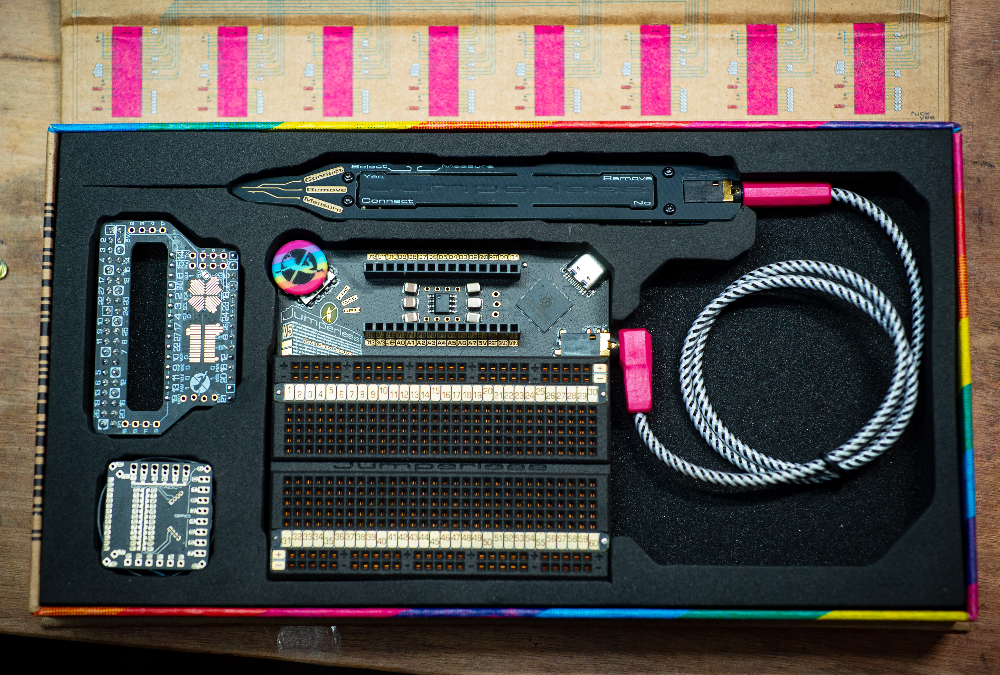
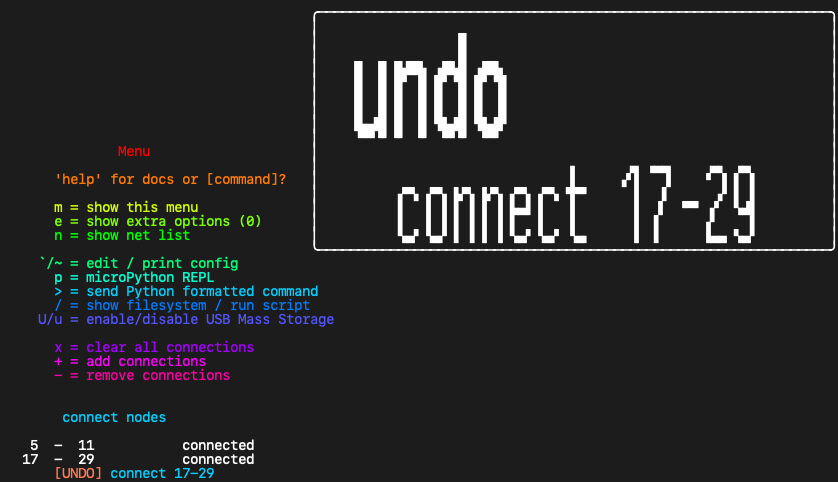
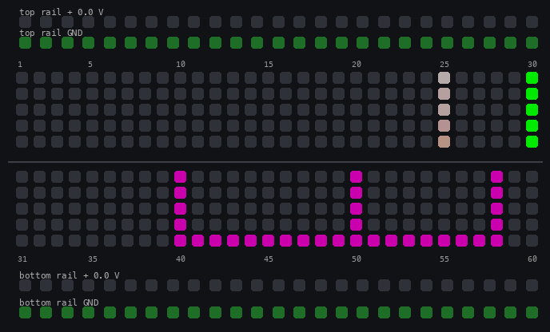
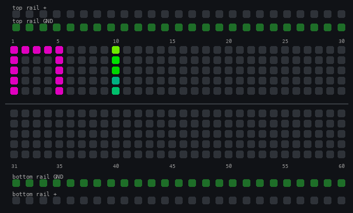

# Getting Started


This page walks you through the first hour with a Jumperless V5. Each section ends with a little `Try it` box you can follow along with on the board. If you'd rather just poke at it and come back when something confuses you, that works too.

----

## What's in the box



- **The Jumperless.** The breadboard with the RP2350 and 12 crossbar switches underneath it.
- **The probe.** Plugs into the socket on the right side of the board. It has a `Select` / `Measure` switch and two buttons, `Connect` (front) and `Remove` (rear).
- **The SBC adapter.** It plugs into the Nano header and turns it into a Raspberry Pi's 40 pin header (both adapters are on the [Adapter Boards](05.3-adapters.md) page).
- **The FPC adapter and a ribbon cable.** It brings the DACs, ADCs, GPIO and the UART out to pin headers so you can clip a scope or meter to them, plus 2 Qwiic ports and a spot for a Bus Pirate. It's optional, you don't need it for anything on this page.
- **A sheet of stick-on rubber feet.** These are for the [3D printed stand](10-3d-stand.md), which isn't in the box because it doesn't fit.

Two things that are *not* in the box but you'll probably want: a [stand](10-3d-stand.md) and an [OLED](04-oled.md). The OLED copies everything the breadboard LEDs say into actual text, and a few interactions are easier with one. On rev 7 boards it plugs straight into the pin headers on the Jumperless, on rev 5 boards (Crowd Supply and Mouser) it goes on the SBC adapter.

----

## Plug it in

Plug in the USB-C and it will do a startup animation on the LEDs. That's it, it's on.

It also shows up on your computer as four serial ports. The first one is the main terminal, where the menu shows up when you type `m` and where most of the typed commands on this site go. You don't *need* the terminal for anything on this page, but it's useful to have open because everything the board prints on the LEDs gets printed there too. The easiest way to open it is [the App](03-app.md), but any serial terminal works (the baud rate doesn't matter).

When it boots it loads the last `slot` you were using, so your circuit is still there after a power cycle.

??? tip "Try it"
    1. Plug in the Jumperless and watch the startup animation.
    2. Open the first serial port in [the App](03-app.md) or a terminal.
    3. Type `m` to print the menu, or `?` to see the firmware version.

----

## The probe

Keep the switch on the probe set to `Select`. That's the normal probing mode.


`Measure` turns the probe into a voltmeter: the `logo` goes purple, and touching any `row` reads its voltage on the OLED and in the terminal. It uses a temporary ADC connection that never gets saved, so you can poke around without changing your circuit.

**The probe is read by a resistive voltage divider**, so putting your fingers on the pads (or the back sides of the 4 risers that connect the `probe sense` boards to the main board) will give you weird readings. If taps land on the wrong row, run `Calibration` > `Probe Pads` from the click wheel menu and follow the prompts.

----

## Connecting rows

Click the `Connect` button on the probe.


The `logo` turns blue and the probe LEDs change.


Now tap two `row`s and they get connected. Connections are made in pairs (a `bridge`, see the [glossary](99-glossary.md)). When you've tapped the first `row`, the `logo` and the `Connect` text on the probe brighten to show you're `holding` it, and the next thing you tap connects to it. A wire shows up on the LEDs between them.

Anything can be an end of a bridge: breadboard rows, the rails (`+` and `-` pads at the ends of the rail strips), the Nano header pins, and the [special functions](#special-functions) pads by the logo.

- Click `Connect` while `holding` a row to drop it and start over.
- Click `Connect` while not `holding` anything to leave `Connect` mode and go back to `idle` (rainbow `logo`, all 3 probe LEDs on).
- Made a connection you didn't mean to? **Double-tap `Remove`** to undo it. See [Undo / Redo](#undo-redo).

??? tip "Try it"
    1. Click `Connect`. The logo turns blue.
    2. Tap `row 1`, then `row 5`. A wire appears between them.
    3. Tap `row 5` again, then the `-` pad on the bottom rail. Now rows 1 and 5 are both on `GND`, and the whole `net` shares one color.
    4. Click `Connect` again to get back to idle.

### Connecting with just the click wheel

You can also make connections without touching the probe to the board: `Click` > `Connect` > `Add` (or `Remove`), or just turn the wheel while you're already in `Connect` mode. Turning the wheel scrolls a cursor through every `node` (rows, Nano pins, rails, DACs, ADCs, GPIO, UART, current sense), `click` selects the one it's on, `hold` exits. The cursor hides itself after 5 seconds without a turn.

----

## Removing rows

Click the `Remove` button.


The `logo` goes red.


Now tap a `row` (or swipe along a few) and it gets disconnected. It only removes that `node` and what's connected directly to it, not everything on the `net`. So tapping a `row 25` that's on `GND` doesn't clear everything on `GND`, but tapping the `-` rail pad does.

The special function pads work the same way in `Remove` mode: tap the pad, pick the function, and it's gone. Click `Remove` again to leave.

??? tip "Try it"
    1. Click `Remove`. The logo turns red.
    2. Tap `row 1`. The wire to row 5 disappears, and row 5 is still on `GND`.
    3. Tap the `-` pad on the bottom rail. Row 5 comes off `GND` too.
    4. Click `Remove` to get back to idle.

----

## Undo / Redo

Every change to your circuit gets recorded, and there are two ways back through it.

**Double-tap `Remove` to undo, double-tap `Connect` to redo.** The `logo` flashes yellow and the OLED shows what got reverted.



**To walk back further,** `click` the wheel, find `History`, and `click` in. Now turning the wheel scrubs through every change, two detents a step: clockwise steps back in time, counterclockwise steps forward. The breadboard updates live as you go so you can see each state, and the OLED shows where you are (`3/12`) and what that change was. `Click` the wheel (or press `Connect`) to keep where you stopped, `hold` (or press `Remove`) to go back to where you started.

In the terminal, `^` is undo and `&` is redo.

The history is saved with your slots, so it's still there after a power cycle. Undo only ever touches the live circuit.

??? tip "Try it"
    1. Connect `row 10` to `row 15`, then `row 15` to `row 20`.
    2. Double-tap `Remove`. The last wire disappears.
    3. Double-tap `Connect`. It comes back.
    4. `Click` the wheel, scroll to `History`, `click`, and turn the wheel back and forth. `Hold` to leave it where it was.

----

## The click wheel


There are two kinds of presses: `click` (short) and `hold` (long). In general a `click` is `yes` / `go in`, and a `hold` is `no` / `back` / `get me out of here`.

When I say `click`, it's more of a diagonal push toward the center of the board ([these encoders](https://lcsc.com/product-detail/Rotary-Encoders_Mitsumi-Electric-SIQ-02FVS3_C2925423.html) were meant to poke out a little from the side of a tablet).

`Click` to open the menu, turn to scroll, `click` to go into a submenu, `hold` to back out one level. The menu draws on the breadboard LEDs, and it's copied to the terminal and the [OLED](04-oled.md) if you have one. If the text on the LEDs is hard to read, turn up the brightness: `Display Options` > `Bright` > `Menu`, scroll to a level you like, and `click`.

??? tip "Try it"
    1. `Click` the wheel. The menu shows up on the LEDs (and the terminal).
    2. Turn it to scroll through `Rails`, `Connect`, `Parts`, `GPIO`, `Output`, `Show`, `Apps` and the rest.
    3. Scroll to `Display Options` > `Bright` > `Menu` and pick a brightness. `Click` to set it.
    4. `Hold` a couple of times to get all the way out.

----

## Power: rails and DACs

There are four adjustable voltage sources: the `top rail`, the `bottom rail`, `DAC 0`, and `DAC 1`. All of them go from -8 V to +8 V.

**Rails** are the easiest. `Click` the wheel, pick `Rails`, then `Top`, `Bottom`, or `Both`. Turn the wheel to pick a voltage, `click` to set it, `hold` to cancel. The rail strips light up with the voltage (red for positive, blue for negative), and the `+` pads on the ends of the rails are now that voltage. The `-` pads are always `GND`.

**DACs** are the same idea but they're `node`s you connect to a row rather than a whole strip: `Output` > `Voltage` > `DAC 0` / `DAC 1`, pick the voltage, then pick a row. You can also tap the `DAC` pad by the logo while probing (see [special functions](#special-functions)). By default `DAC 0` is busy powering the probe, so `DAC 1` is the one to reach for.

**Shortcut:** in idle mode, tap a rail `+` pad to highlight it, then `click` the wheel to adjust that voltage right there. Same for a `DAC`, once it's connected to something. This shortcut is on by default only when an OLED is connected, because the OLED's `adjust?` hint is what makes it discoverable. To have it always on, put this in your [config](06-config.md):

Type it into the terminal, backtick and all (the backtick is the config command):

```jython
`[clickwheel] rail_click_adjust = always;
```

Rail and DAC voltages are saved with the `slot`, so each circuit keeps its own power settings.

??? tip "Try it"
    1. `Click` the wheel, pick `Rails` > `Top`, turn until it says `3.3`, and `click`. The top rail strip lights up.
    2. Click `Connect`, tap the top rail `+` pad, then `row 10`. Row 10 is now at 3.3 V.
    3. Flip the probe switch to `Measure` and touch row 10. The OLED / terminal reads about 3.3 V. Flip it back to `Select`.

----

## Special functions

The three pads next to the logo, `DAC`, `GPIO`, and `ADC`, are how you connect the internal stuff to your circuit. Tap one while probing and a chooser shows up on the breadboard LEDs (and the terminal / OLED), pick what you want, then tap the row to connect it to. If you were already `holding` a row, it connects there.


Think of them as `node`s that are in a folder, so there didn't need to be a dedicated pad for each one.

```jython
DAC Pad
 └─ 0 1 [Tap the pads below the selection]
  └─ -8V  !:.:!  +8V [Tap the bottom pads or turn the clickwheel to pick a voltage] > [click Connect to confirm]
   └─ [Tap a row to connect it to]
```

```jython
GPIO Pad
 └─ ⁱ1⁰ ⁱ2⁰ ⁱ3⁰ ⁱ4⁰
    ₁5₀ ₁6₀ ₁7₀ ₁8₀ [Tap a number: left side for input, right side for output]
     └─ [Tap a row to connect it to]
```

```jython
ADC Pad
 └─ 0 1 2 3 4 P [Tap an ADC, 0-3 are the general purpose ±8 V ones]
  └─ [Tap a row to connect it to, and its voltage shows on the LEDs]
```

The four `user pads` (the two little guys and the two buildings) are shortcuts to a fixed set: `top guy` is `UART Tx`, `bottom guy` is `UART Rx`, and the two `buildings` are the current sense inputs `I+` and `I-` (the `buildings` don't always register a tap, so get to `I+` / `I-` with the click wheel instead, see [Measuring](#measuring-things)). You can reassign them in the [config](06-config.md) under `[logo_pads]`.


??? tip "Try it"
    1. Click `Connect`, then tap the `GPIO` pad by the logo.
    2. Tap the right side of the `1` (output). Then tap `row 20`. `GPIO 1` is now driving row 20.
    3. Click `Connect` to go back to idle, and tap row 20 to highlight it. Now click `Connect` and watch the row toggle between high and low.
    4. Everything here is a normal connection, so `Remove` mode and undo work on it the same way.

----

## Measuring things

A few ways to see what your circuit is doing:

- **Just tap it.** Leave the switch on `Select` and tap a connected row, or scroll to it with the click wheel, and the OLED and terminal show the voltage on that net and the current flowing through that connection (the biggest one, if the net has a few wires). The board is measuring voltage and current on every net in the background, so there's nothing to set up.
- **The probe's `Measure` switch.** Touch a row, read the voltage. Nothing gets saved.
- **The `ADC` pad.** Connect an ADC to a row and it stays there, showing the voltage on that row's LEDs and, if you highlight it, on the OLED / terminal. The ADCs read -8 V to +8 V.
- **The `Show` menu.** `Show` > `Voltage` / `Digital` / `Current` picks a measurement and a row to put it on from the wheel instead of the probe.
- **Current sense.** In `Connect` mode, turn the wheel counterclockwise past `row 1`. A couple of detents and it wraps onto `Current`, the OLED reads `Current -` and the breadboard spells it out with `I-` lit. One more detent counterclockwise is `I+` (if you overshoot into `UART`, one detent clockwise comes back). `Click` within 5 seconds of the last turn, then tap the row it goes on. With `I+` and `I-` on two different `net`s, a virtual wire with "marching ants" should show the current flowing between them. Or `Show` > `Current` from the menu, which asks for `Pos`, its row, `Neg`, its row (rows and Nano pins only, it can't reach the rail pads). (The background scan puts ants on any wire with current flowing too, the `net_currents` key in the [config](06-config.md) turns it off, and the `current_flow` key set to `electron` makes them march the other way, the numbers stay conventional.)

!!! note "Idle mode currents are an estimate"
    They're read using the crossbar's own resistance as the shunt (about 40Ω per crosspoint) and one ADC is multiplexed across every net, so connecting current sense manually with `I+` / `I-` is a bit more accurate.

<video autoplay loop muted playsinline width="60%">
  <source src="https://github.com/user-attachments/assets/7fa478f0-bbdf-4d48-b6a3-dcb1a36f23d0" type="video/mp4">
  Your browser does not support the video tag.
</video>

!!! warning "`I+` and `I-` are shorted together internally"
    They're the two ends of a 2 Ω shunt resistor. You measure current in series so this is expected, but it's easy to forget. Treat this like your multimeter yelling at you when the probes are in the current holes and it's set to volts.

??? tip "Try it"
    1. Set the top rail to 3.3 V (`Rails` > `Top`, see [Power](#power-rails-and-dacs)), then put an LED and a resistor (anything 220 Ω to 1 kΩ) in series between `row 10` and `row 12`, LED long leg toward row 10.
    2. With the probe off the board, click `Connect`, tap the top rail `+`, then `row 10`. Turn the wheel counterclockwise past `row 1` until the OLED reads `Current -`, one more detent to `Current +`, `click`, and tap `row 12`. The cursor jumps back to `row 15` after that, so turn counterclockwise again until it reads `Current -`, `click`, and tap the `-` rail pad.
    3. The LED lights, and the ants march from `I+` to `I-`. The OLED shows the current as soon as `I+` and `I-` are connected (the net is called `I Sense`), and tapping row 12 in idle mode shows it on the terminal too.

----

## Idle mode

Most of the time the probe isn't in a mode (rainbow `logo`), and there's a lot you can do from here:


- **Tap a row to highlight its `net`.** The row you tapped gets a slightly different animation from the rest of the net.
- **Turn the click wheel** to walk the highlight along the rows, as if you tapped each one.
- **`Connect`** puts you in `Connect` mode already `holding` the row you tapped, and drops you back to idle once you've connected it to something. (If you got to the row by turning the wheel instead of tapping it, you start out holding nothing.)
- **`Remove`** flashes a warning on the highlighted net; press it again within a second or so and you're in `Remove` mode with that `node` already picked.
- The highlighted net's voltage and current print on the OLED and the terminal, whatever is on it. A `GPIO` input or an `ADC` on the net shows its reading too.
- If it has a **`GPIO` output** on it, `Connect` toggles it high / low.
- If it's a **rail or a DAC**, `click` the wheel to [adjust the voltage](#power-rails-and-dacs).
- If it's a **`GPIO`**, a quick `click` opens that pin's options. See [GPIO](05.7-gpio.md).
- If it's a pin of a **placed part**, the OLED shows the part and pin name. See [Parts](05.5-parts.md).

??? tip "Try it"
    1. Tap any connected row. Its whole net lights up.

    
    2. Turn the wheel a few detents each way. The highlight walks along the rows.
    3. Press `Connect`, tap another row, and you're back in idle with a new wire.

----

## Slots

There are 8 `slot`s (0-7), and each one is a saved circuit: connections, rail and DAC voltages, GPIO setup, colors. Everything you do with the probe saves into the active slot automatically, so you don't have to save anything. Switching slots switches the whole circuit.

- `Click` > `Slots` > `Load` picks a slot to switch to.
- `Slots` > `Save to` copies the current circuit into another slot.
- `Slots` > `Clear` empties a slot.
- In the terminal, `<` cycles to the next slot (it wraps from 7 back to 0), and `<3` jumps to slot 3.

On boot it loads the last slot you had active. If you'd rather always start on one particular slot, set `[slots] boot_mode = fixed_slot;` and `boot_slot` in the [config](06-config.md).

The slot files are plain YAML on the board's filesystem, so you can also read and edit them by hand. See [File Manager](08-file-manager.md).

??? tip "Try it"
    1. With a few connections made, `click` > `Slots` > `Save to` > `1`.
    2. `Slots` > `Load` > `2`. Empty board (or whatever was in slot 2).
    3. `Slots` > `Load` > `1`. Your circuit is back.

----

## From the terminal

Everything above can also be done by typing. Open the first serial port ([the App](03-app.md) does this for you) and type `m` to print the menu. A few to know:

```jython
m           show the menu again
n           show the net list (what's connected to what)
+ 1-5,10-gnd   add connections
- 1-5       remove a connection
x           clear all connections
<           next slot (or <3 for slot 3)
p           MicroPython REPL
/           file manager (or /python_scripts/examples/gpio_basics.py to run a script)
U           show up as a USB drive
```

`p` and `/` take over the terminal, `Ctrl+Q` gets you back out of both. A script you run leaves whatever it connected on the board, `x` clears it.

Case doesn't matter in the connection lists (`10-gnd` and `10-GND` are the same thing), and if you send it something that would obviously cause problems, like `TOP_RAIL-GND`, it'll just ignore it and move on. There's more on the netlist format in [this Crowd Supply update](https://www.crowdsupply.com/architeuthis-flux/jumperless-v5/updates/jumperless-probelessly).

Type `help` or `[command]?` for the onboard docs on any of them, and `e` to show more of the menu.

??? tip "Try it"
    1. Type `+ 1-5` and watch the wire appear on the board.
    2. Type `n` to see it in the net list.
    3. Type `- 1-5` to remove it.



----

## Where to go next

- **[Examples](08.5-examples.md)** - the MicroPython scripts and guided projects already on the board. A good next step is the 555 LED flasher project, which shows you where each part of a real circuit goes.
- **[The App](03-app.md)** - the terminal, Wokwi import, and Arduino flashing from one place.
- **[OLED](04-oled.md)** - add a screen. Cheap, and it makes a lot of this easier.
- **[Arduino Stuff](05-arduino.md)** - drop a Nano in the header, flash it through the Jumperless, and let it send commands back.
- **[Parts](05.5-parts.md)** - tell the Jumperless what chips are in the board and it wires and labels them for you.
- **[GPIO](05.7-gpio.md)** - direction, pulls, PWM, and a binary counter, all from the board.
- **[MicroPython](08-micropython.md)** - script the circuit itself. [JumperIDE](https://ide.jumperless.org/) is the easiest way in.
- **[Config File](06-config.md)** - every setting, including the ones mentioned on this page.
- **[Debug Views](07-debugging.md)** - the net list, bridge array, and crossbar views for when something isn't doing what you expect.
- **[Automation & LLM Tools](07.5-automation.md)** - drive the board from scripts, an MCP server, or an agent skill.
- **[Glossary](99-glossary.md)** - what I mean by `net`, `node`, `row`, `bridge`, and `slot`.

And if you get stuck, ask in the [Discord](https://discord.gg/bvacV7r3FP). Seriously, even the dumb questions help me figure out what to put here.
