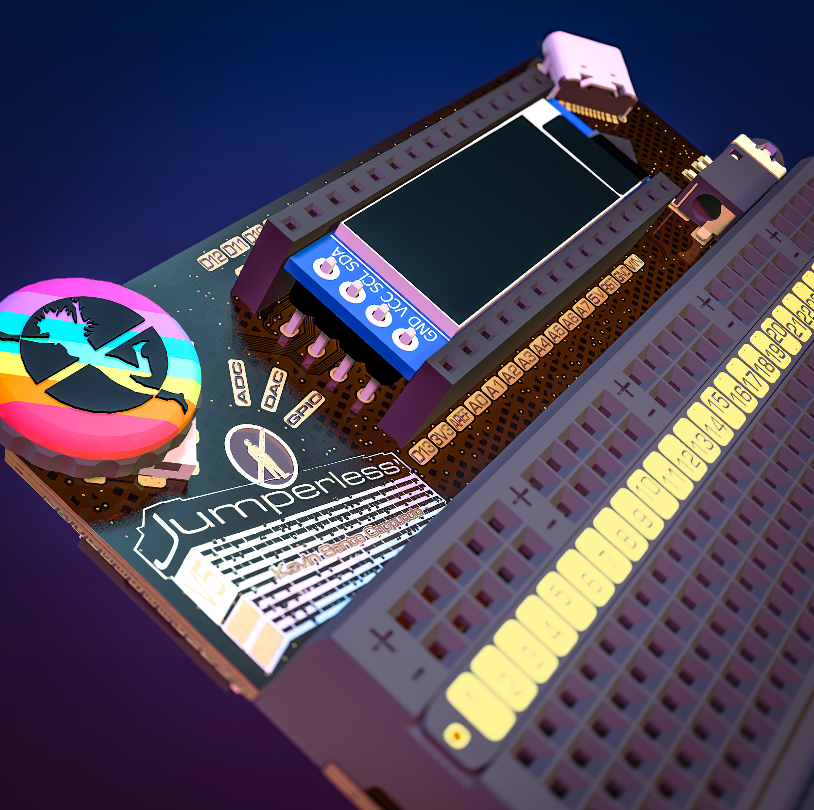
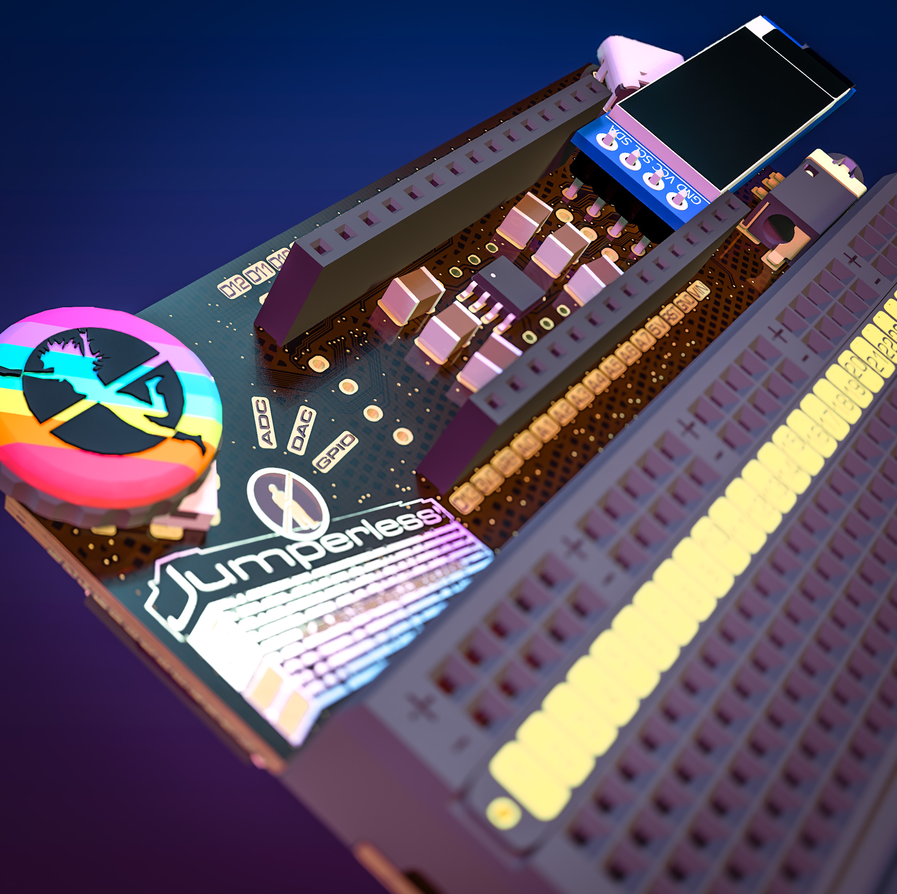
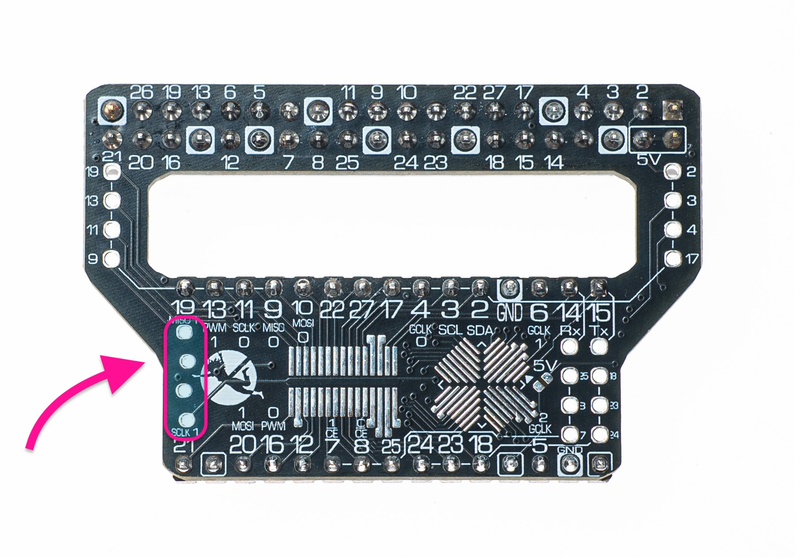
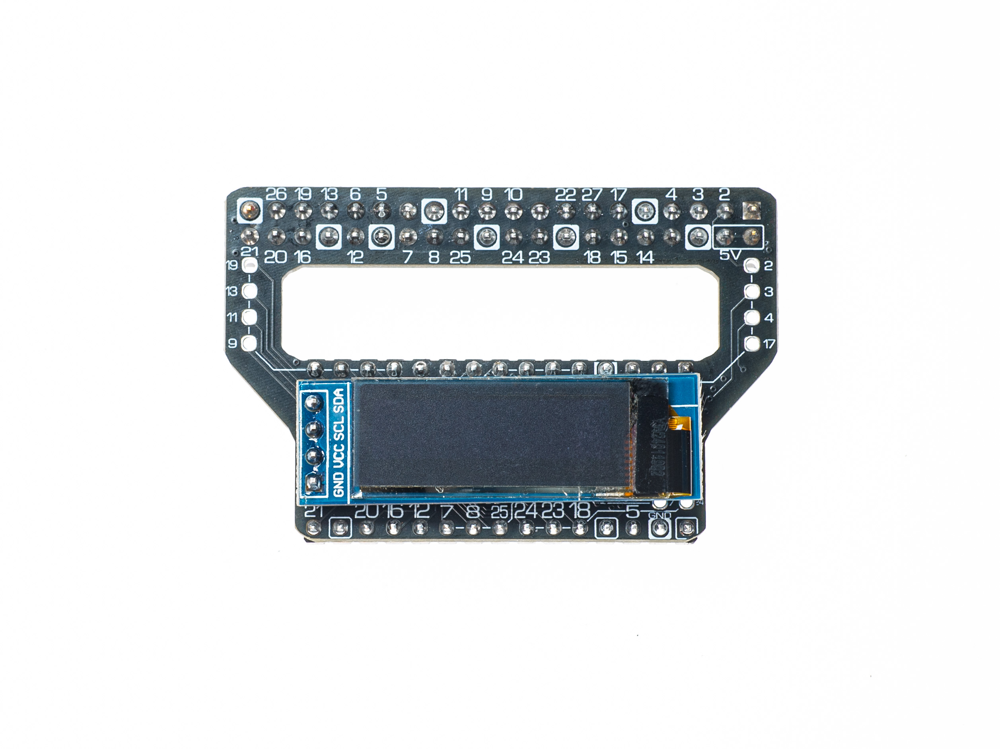

# OLED Support

First, get yourself one of these bad boys (literally any of these are fine.)

[](https://www.amazon.com/dp/B0CDWQ2RWY/)
https://www.amazon.com/MakerFocus-Display-SSD1306-3-3V-5V-Arduino/dp/B079BN2J8V


Ignore the really cool LEDs.

## Installation

They should friction fit into the SBC/SMD/OLED board included with your Jumperless V5.

That's how rev 5 boards (the Crowd Supply and Mouser ones) do it, and the OLED talks to GPIO 7 and 8 through the crossbar to rows `D2` and `D3`. Rev 7 boards have dedicated OLED headers on the internal I2C bus instead, so the firmware finds the display by itself at boot and no rows or routable GPIO get used up. If you have one of those, the `Connection`, `Lock Connection` and GPIO stuff below doesn't apply to you.

??? note "Where the OLED goes"
    Rev 7 boards have 2 OLED headers (4 pins each), one at each end of the Nano header between the two rows. Either one works, they're on the same bus.

    On the `D12` end it lies across the Nano header:

    

    On the `VIN` end it sticks out past the edge next to the USB-C:

    

    On rev 5 boards it goes in the 4 pin column at the bottom left of the SBC/SMD/OLED board (the [SBC adapter](05.3-adapters.md)), with that in the Nano header:

    

    

This should copy basically any text printed on the breadboard, some people have trouble reading text on the breadboard LEDs, which is why I added all this. 

## Connection

To connect the data lines to the Jumperless' GPIO 7 and 8, just use the menu option `.` (that's a period). Press it again to disconnect and free up GPIO 7 and 8, or use `.1` and `.0` to force it on or off. If no display answers, the routing stays put and the firmware keeps checking for one every few seconds.

In the click menu the same things live under `OLED`: `Connect`, `Connect On Boot`, `Lock Connect` and `Show in Term`. `Show in Term` (or the `k` command, or `` `[top_oled] show_in_terminal = port_1;``, which also takes `off`, `port_3`, `port_5`, `port_7` and `uart`) mirrors whatever's on the OLED into your terminal. `t` opens an OLED terminal where anything you type goes straight to the display.

## Auto-Connect on Boot

The OLED gets connected on startup by default. If you'd rather it didn't, paste this into the main menu:
Type it into the terminal, backtick and all (the backtick is the config command):

```
`[top_oled] connect_on_boot = 0;
```

The full list of `[top_oled]` keys with their current values is on the [config page](06-config.md).

## Lock Connection

Locking the connection to the OLED ensures that it stays connected even when you enter a complete `node` list. So if you're using Wokwi or manually adding connections in a file, you don't need to add `GPIO_7 - D2` and `GPIO_8 - D3` to keep the I2C connected to the OLED.

```
`[top_oled] lock_connection = 1;
```

This only matters when the OLED is on the crossbar (the `gpio_7_8` or `custom` connection types) - the hardwired RP6/RP7 and internal I2C connections have no routing to lose.
 
  
## Custom Startup Message

You can customize what appears on the OLED when your Jumperless boots up. There are two options: text messages or custom bitmap images.

### Text Message

Set a custom text message to display on the OLED at startup (max 32 characters):

```jython
`[top_oled] startup_message = Your Message Here;
```

This shows up instead of the Jumperless logo on boot, in big text. Once you start using the board, the usual idle logo comes back.

### Bitmap Image

Display a custom bitmap image at startup by just giving it a path on the filesystem.

```jython
`[top_oled] startup_message = /images/mylogo.bin;
```

**Requirements:**
- Image must be a bitmap file (`.bin` format), either with the 4-byte header (recommended) or raw at 512, 1024, 256 or 496 bytes
- Recommended size: 128×32 pixels (standard OLED size)
- Use the built-in [Bitmap Editor](#bitmap-editor) to create or edit images
- Store images in the `/images/` directory on the Jumperless filesystem


## Display Dimensions

If you have a different sized OLED (like 128x64), you can set the dimensions:

```jython
`[top_oled] width = 128;
`[top_oled] height = 64;
`[top_oled] rotation = 0;
```

`rotation` goes 0 to 3 in 90 degree steps. If your display sits at some other I2C address, set `` `[top_oled] i2c_address = 0x3C;`` to whatever it actually is. The click menu can do the size too: `OLED` > `Display Size` > `Width` or `Height`, with `32`, `64`, `128`, `256` and `Custom`.

## Advanced GPIO Configuration

You don't set the GPIO and row keys by hand - pick a connection type and the firmware fills them all in for you. The exception is the `custom` type, which uses whatever you put in `` `[top_oled] sda_pin = 26;`` and `` `[top_oled] scl_pin = 27;``. Those two are refused on the internal I2C bus, which is hardwired to GPIO 4 and 5.

## Connection type

There are four of them. `gpio_7_8` runs the OLED through the crossbar to rows `D2` and `D3` (the rev 5 default), `rp6_rp7` uses the hardwired GPIO 6 and 7, `i2c0` (also spelled `internal`) uses the internal I2C bus on GPIO 4 and 5 that rev 7 boards have their OLED headers on, and `custom` uses the `sda_pin`/`scl_pin` you set yourself.

```jython
`[top_oled] connection_type = rp6_rp7;
```

The `O` command cycles through GPIO 7/8, RP6/RP7 and internal I2C0, or you can jump straight to one with `O0` through `O3` or a name like `O i2c0`. In the click menu it's `OLED` > `Pins`, with `GPIO7/8`, `RP6/7` and `Intrnal`.

## Bitmap Editor

The built-in bitmap editor lets you create and edit OLED images directly on your Jumperless using your terminal and the clickwheel.


<video autoplay loop muted playsinline controls width="70%">
  <source src="https://github.com/user-attachments/assets/9c716bdf-33bc-4af8-b618-852852049017" type="video/mp4">
  Your browser does not support the video tag.
</video>


## Accessing the Bitmap Editor

### From File Manager

1. Open the file manager from the main menu
2. Navigate to a `.bin` bitmap file 
3. Select the file to open it in the editor

### Creating a New Image

You can create a new bitmap file from the file manager:
1. Navigate to where you want to create the file (e.g., `/images/`)
2. Press `n` for "new file"
3. Name it with a `.bin` extension (e.g., `mylogo.bin`)
4. Open the new file (Enter or `click`) - `n` only creates it, opening it is what starts the editor
5. The editor sees the empty file and makes a blank 128×32 bitmap (or whatever your OLED dimensions are set to in config)

`.bmp` files open in the editor too.

## Editor Interface

The bitmap editor displays your image in the terminal and on the OLED (if connected). You'll see:

- **Main canvas**: Your bitmap rendered using block characters
- **Status bar**: Filename, dimensions, cursor position, and save status
- **Menu bar**: Quick access to View, Encoder, Draw modes, Save, and Quit
- **Help panel**: Keyboard shortcuts and hardware control reference

### View Modes

Press `m` to cycle through three display modes:

1. **Full Block Mode** (1:1 pixel mapping)
   - Each character = 1 pixel

2. **Half Block Mode** (2:1 vertical compression)
   - Each character = 2 pixels vertically
   - Fits 128×32 images on smaller terminals

3. **Quarter Block Mode** (2×2 compression)
   - Each character = 2×2 pixels (4 pixels total)
   - Fits larger images on screen
   

## Navigation

### Moving the Cursor

**Keyboard:**
- Arrow keys or `W/A/S/D` keys
- Vim keys: `j` (down), `k` (up), `l` (right)

**Hardware:**
- **Clickwheel encoder**: Rotate to move cursor
- **Probe switch**: 
  - `Select` position → Horizontal movement
  - `Measure` position → Vertical movement
- Press `/` to toggle encoder direction (H/V) independently

## Editing Pixels


### Editing Methods

The editor has three draw modes (cycle with `.` key) to pick what happens when you press `enter`/`space`/`encoder click`:

1. **Toggle Mode** (default): Flips pixel state (ON↔OFF)
2. **Set Mode**: Always turns pixels ON (draw)
3. **Clear Mode**: Always turns pixels OFF (erase)

Or just use these keys to do it directly and not worry about the mode:

  - `z` = Set pixel (turn ON)
  - `x` = Clear pixel (turn OFF)
  - `c` = Toggle pixel


## Menu Bar Navigation

When the cursor reaches the bottom edge and you press down, you enter the menu bar:

**Navigation:**
- Left/Right arrows: Move between menu items
- Enter/Space: Activate selected item
- Up: Exit menu bar

**Menu Items:**
- **View**: Cycle display modes (Full/Half/Quarter)
- **Enc**: Toggle encoder direction (H/V)
- **Draw**: Cycle draw modes (Toggle/Set/Clear)
- **«Save»**: Save file and return to editing
- **«Quit»**: Exit editor (prompts if modified)

## Saving and Quitting

- **Ctrl+S**: Quick save
- **Ctrl+Q**: Quit (prompts to save if modified)
- **h or ?**: Show help screen

A new file gets the 4-byte header (width and height) when you save, and a file that already had one keeps it. A raw headerless file is saved back raw, which still works as a startup image at the common sizes.

## Example Workflow: Creating a Startup Logo

1. Open file manager, navigate to `/images/`
2. Create new file: `mylogo.bin`
3. Open it - the editor starts with a blank 128×32 canvas
4. Switch to Half Block mode (`m`) for better overview
5. Use clickwheel to navigate, Connect button to draw
6. Save with Ctrl+S
7. Set as startup image: 
    - By editing the config file: ``` `[top_oled] startup_message = /images/mylogo.bin;``` 
    - Or use the click menus `OLED` > `StartUp Messge` > `Bitmap` > (scroll through all the images and `click` to select)
8. Reboot to see your custom logo. Picking it in the menu previews it right away; after boot the idle screen goes back to the standard logo.

## Editor Screenshots

Full size view (1:1 pixel mapping):
```jython
                                                                                                                       ███████  
                                                                                              ██████      ███████    ██      ██ 
                                                                     ██████    █████        ███    ██   ██      ██  █         █ 
                                            ██████       ██████  ████     ██  ██   ██      ██       █  █         ███          ██
       █████         ███          ████  ████     ██  ████     █ █          ██ █     █     █          ██           ██           █
      ██   █ ████   █  ██  ███   ██  ███          ███          █            ██      ██   █           ██           █     ██     █
    ██      ██  ██ █    ███  ██  █    █           ███          █            ██      ██  ██          ██     ██     █    ████    █
   ██       █    ██     ██    █  █    █            █           █   █████     █      ██  █         ████    ████    █    ████   ██
   ██       █    ██      █    █  █    █    ████    █          ██    █████    █      ██  █     █████ ██    ████   ██    ████████ 
   ██       █    ██      █    █ ██    █   █████    █     ███████    █████    █      ██  █    ████    █    █████████     █████   
    ██      █    ██      █     ██     █   ██████   █    █████  █    █   ██   █     ███  █    ██      █     ████ ████      ███   
    ██      █    ███     █     ██     █   ██  ██   █    ███    ██   █    █   █     ██   █    ███████ ██     ███    █        ██  
     ██     █    ███     █      █     █   █    █   █    ██     ██    █   █   █     ██   ██   ██    ████       ███  ██        █  
     ██     █    ███     █            █   █    █   █    ██████ ██    █   █   █     ██   ██          █ ██        ██  ███      ██ 
     ██     █    ████    █            █   █    █   █    ██   ████    █  ██   █     ██   ██          █  ███       █   ████     ██
      █     █    ████    █            █    █  ██   █          █ █    ████   ███    █    ██         ██    ████    ██   ████     █
      █     ██    ███    █            █    ████    █          █ ██   ███    ███    █     █     █████      ████    █ ███████    █
      ██     █    ███    █        █   █    ███     █         ██ ██         ████    █     █    ████         ███    ███  ████    █
       █     █    ███    ██   █   █   ██          ██      ████  ██        ███ █    █     █    ███████  ███████    ██    ██     █
       █     █    ███    ██   █  ██   ██          ██     ███     █        ██  █    █  ████    ████  ████   ██     █            █
 ████  █     █     █     ██   ██ ██    █         ████    ██      █   ██    ██ █    ████  ██    ██    ██           █           ██
██  ██ █     ██          ██   █████    █    ██████ ██    ███████ █   ███    ███    ██     █          ██           █           █ 
█    ███     ██         ███    ████    █    █████  ██     ██   ███    ██     ██           █          ██          ███         ██ 
█     █      ██         ███    █ ██    █     ██    ██           ██    ███     █           █         ████         ████       ██  
█           ████        █ █    █  █    █     █     ██           ██    ███     ██         ███      ███████       ██ ██████████   
█           █ ██       ██ █    █  █    █     █      ██         ████   ████   ████      ██████████████ ███████████   █████████   
█          ██  ██      ██ █    █  ██  ███   ██      ███     ███████████ ██████████████████ ████████    █████████     ███████    
██         ██  ███    ██  ██  ██  ████████████       ███████████  █████  █████  █████████   ██████       ██████                 
 ██       ██    ████████  ██████  █████ █████        █████████     ███    ███    ██████                                         
 ███     ███     ██████    ████    ███   ███          █████                                                                     
  █████████       ████      ██                                                                                                  
   ███████                                                                                                                      
 /images/bubbleJump.bin   |   128x32   |   (64,16)   |   Saved                                                         
 View:Full   |   Enc:V   |   Draw:CLR   |   «Save»   |   «Quit»                                                        

⟨Clickwheel > ↺ / ↻: move H/V | Click: toggle pixel ⟩ ⟨ Probe Buttons >  Connect:set | Remove:clear  | Switch > Select:H | Measure:V ⟩
⟨Terminal >     [z]:set [x]:clear [c]:toggle pixel   | [m]:Cycle View | [/]: Enc H/V |  ctrl+S:Save  |    ctrl+Q:Quit    | [?]:Help  ⟩


```

Half Block view (2:1 vertical compression - each character is 2 pixels tall):
```jython
                                                                                              ▄▄▄▄▄▄      ▄▄▄▄▄▄▄    ▄▄▀▀▀▀▀▀█▄ 
                                            ▄▄▄▄▄▄       ▄▄▄▄▄▄  ▄▄▄▄▀▀▀▀▀█▄  ▄█▀▀▀█▄      ▄█▀▀    ▀█  ▄▀▀      ▀█▄▄▀         █▄
      ▄█▀▀▀█ ▄▄▄▄   ▄▀▀█▄  ▄▄▄   ▄█▀▀█▄▄▀▀▀▀     ▀█▄▄▀▀▀▀     ▀▄▀          ▀█▄▀     █▄   ▄▀          ██           █▀    ▄▄     █
   ▄█▀      █▀  ▀█▄▀    ██▀  ▀█  █    █           ▀█▀          █   ▄▄▄▄▄    ▀█      ██  █▀        ▄▄██    ▄██▄    █    ████   ▄█
   ██       █    ██      █    █ ▄█    █   ▄████    █     ▄▄▄▄▄██    █████    █      ██  █    ▄███▀▀ ▀█    ████▄▄▄██    ▀█████▀▀ 
    ██      █    ██▄     █     ██     █   ██▀▀██   █    ███▀▀  █▄   █   ▀█   █     ██▀  █    ██▄▄▄▄▄ █▄    ▀███ ▀▀▀█      ▀▀█▄  
     ██     █    ███     █      ▀     █   █    █   █    ██▄▄▄▄ ██    █   █   █     ██   ██   ▀▀    ▀█▀█▄      ▀▀█▄ ▀█▄▄      █▄ 
     ▀█     █    ████    █            █   ▀▄  ▄█   █    ▀▀   ▀█▀█    █▄▄█▀  ▄█▄    █▀   ██         ▄█  ▀▀█▄▄▄    █▄  ▀███▄    ▀█
      █▄    ▀█    ███    █        ▄   █    ███▀    █         ▄█ ▄█   ▀▀▀   ▄███    █     █    ▄███▀▀      ▀███    █▄█▀▀████    █
       █     █    ███    ██   █  ▄█   ██          ██     ▄██▀▀  ▀█        ██▀ █    █  ▄▄▄█    ████▀▀█▄▄█▀▀▀██▀    █▀    ▀▀     █
▄█▀▀█▄ █     █▄    ▀     ██   ██▄██    █    ▄▄▄▄▄█▀██    ██▄▄▄▄▄ █   ██▄   ▀█▄█    ██▀▀  ▀█    ▀▀    ██           █           █▀
█    ▀█▀     ██         ███    █▀██    █    ▀██▀▀  ██     ▀▀   ▀██    ██▄    ▀█           █         ▄██▄         ███▄       ▄█▀ 
█           █▀██       ▄█ █    █  █    █     █     ▀█▄         ▄██▄   ███▄   ▄██▄      ▄▄███▄▄▄▄▄▄███▀███▄▄▄▄▄▄▄█▀ ▀█████████   
█▄         ██  ██▄    ▄█▀ █▄  ▄█  ██▄▄███▄▄▄██      ▀██▄▄▄▄▄████▀▀█████ ▀█████▀▀█████████▀ ▀██████▀    ▀▀██████▀     ▀▀▀▀▀▀▀    
 ██▄     ▄██    ▀██████▀  ▀████▀  ▀███▀ ▀███▀        ▀█████▀▀▀     ▀▀▀    ▀▀▀    ▀▀▀▀▀▀                                         
  ▀███████▀       ▀▀▀▀      ▀▀                                                                                                  
 /images/bubbleJump.bin   |   128x32   |   (64,16)   |   Saved                                                         
 View:Half   |   Enc:V   |   Draw:CLR   |   «Save»   |   «Quit»                                                        

⟨Clickwheel > ↺ / ↻: move H/V | Click: toggle pixel ⟩ ⟨ Probe Buttons >  Connect:set | Remove:clear  | Switch > Select:H | Measure:V ⟩
⟨Terminal >     [z]:set [x]:clear [c]:toggle pixel   | [m]:Cycle View | [/]: Enc H/V |  ctrl+S:Save  |    ctrl+Q:Quit    | [?]:Help  ⟩


```

Quarter Block view (2×2 compression - each character is 4 pixels):
```jython
                                               ▄▄▄   ▄▄▄▖ ▗▞▀▀▜▖
                      ▄▄▄   ▗▄▄▖▗▄▞▀▀▙ ▟▀▜▖  ▗▛▘ ▝▌▗▀   ▜▄▘    ▙
   ▟▀▜▗▄▖ ▞▜▖▗▄ ▗▛▜▄▀▀  ▝▙▞▀▘  ▚▘    ▝▙▘  ▙ ▗▘    ▐▌     ▛  ▄  ▐
 ▗▛   ▛ ▜▞  █▘▝▌▐  ▌     ▜▘    ▐ ▗▄▄  ▜   █ ▛    ▄█  ▟▙  ▌ ▐█▌ ▟
 ▐▌   ▌ ▐▌  ▐  ▌▟  ▌ ▟█▌ ▐  ▗▄▄█  ██▌ ▐   █ ▌ ▗█▛▘▜  ██▄▟▌ ▝██▛▘
  █   ▌ ▐▙  ▐  ▐▌  ▌ █▀█ ▐  █▛▘▐▖ ▌ ▜ ▐  ▐▛ ▌ ▐▙▄▄▐▖ ▝█▌▀▜   ▀▙ 
  ▐▌  ▌ ▐█  ▐   ▘  ▌ ▌ ▐ ▐  █▄▄▐▌ ▐ ▐ ▐  ▐▌ █ ▝▘ ▝▛▙   ▀▙▝▙▖  ▐▖
  ▝▌  ▌ ▐█▌ ▐      ▌ ▚ ▟ ▐  ▀ ▝▛▌ ▐▄▛ ▟▖ ▐▘ █    ▗▌▝▜▄▖ ▐▖▝█▙  ▜
   ▙  ▜  █▌ ▐    ▖ ▌ ▐█▘ ▐    ▗▌▟ ▝▀ ▗█▌ ▐  ▐  ▟█▀   ▜█  ▙▛▜█▌ ▐
   ▐  ▐  █▌ ▐▌ ▌▗▌ █     █  ▗█▀ ▜    █▘▌ ▐ ▄▟  ██▀▙▟▀▜▛  ▛  ▀  ▐
▟▀▙▐  ▐▖ ▝  ▐▌ █▟▌ ▐  ▄▄▟▜▌ ▐▙▄▄▐ ▐▙ ▝▙▌ ▐▛▘▝▌ ▝▘ ▐▌     ▌     ▛
▌ ▝▛  ▐▌    █▌ ▐▜▌ ▐  ▜▛▘▐▌  ▀ ▝█  █▖ ▝▌     ▌    ▟▙    ▐█▖   ▟▘
▌     ▛█   ▗▌▌ ▐ ▌ ▐  ▐  ▝▙    ▗█▖ █▙ ▗█▖  ▗▟█▄▄▄█▛█▙▄▄▄▛▝████▌ 
▙    ▐▌▐▙  ▟▘▙ ▟ █▄█▙▄█   ▜▙▄▄██▀██▌▜██▀████▛▝███▘ ▝▜██▛  ▝▀▀▀  
▐▙  ▗█  ▜██▛ ▜█▛ ▜█▘▜█▘   ▝██▛▀  ▝▀  ▀▘ ▝▀▀▘                    
 ▜███▘   ▀▀   ▀                                                 
 /images/bubbleJump.bin   |   128x32   |   (64,16)   |   Saved                                                         
 View:Qtr   |   Enc:V   |   Draw:CLR   |   «Save»   |   «Quit»                                                         

⟨Clickwheel > ↺ / ↻: move H/V | Click: toggle pixel ⟩ ⟨ Probe Buttons >  Connect:set | Remove:clear  | Switch > Select:H | Measure:V ⟩
⟨Terminal >     [z]:set [x]:clear [c]:toggle pixel   | [m]:Cycle View | [/]: Enc H/V |  ctrl+S:Save  |    ctrl+Q:Quit    | [?]:Help  ⟩

```

The output of `?`

```jython
=== Bitmap Editor Help ===

Navigation:
  Encoder wheel       - Move cursor (H or V mode)
  Arrow keys / WASD   - Move cursor
  j/k/l (vim)         - Move cursor
  Down at bottom edge - Enter menu bar

Editing:
  Encoder click       - Apply current draw mode at cursor
  Enter / Space       - Apply current draw mode at cursor
  Connect button HOLD - Set pixels while held (draw lines)
  Remove button HOLD  - Clear pixels while held (erase lines)

Direct Pixel Actions (keyboard):
  z                   - Set pixel at cursor (draw)
  x                   - Clear pixel at cursor (erase)
  c                   - Toggle pixel at cursor

Draw Mode Control:
  .                   - Cycle draw modes (Toggle/Set/Clear)

Hardware Controls:
  Probe switch SELECT - Encoder horizontal movement
  Probe switch MEASURE- Encoder vertical movement

Display:
  m                   - Cycle view mode (Full/Half/Quarter)
  /                   - Toggle encoder H/V movement

Menu Bar (Down at bottom edge):
  Left/Right arrows   - Navigate menu items
  Enter / Space       - Activate menu item (cycle/Save/Quit)
  Up / Escape         - Exit menu bar

Menu Bar Items:
  View      - Cycle display mode (Full/Half/Quarter)
  Enc       - Toggle encoder direction (H/V)
  Draw      - Cycle draw mode (Toggle/Set/Clear)
  «Save»    - [Button] Save file and exit menu
  «Quit»    - [Button] Quit editor (prompts if modified)

File:
  Ctrl+S              - Save file
  Ctrl+Q / ESC        - Quit (prompts if modified)
  h / ?               - Show this help

Cursor Colors:
  Green background - Pixel is OFF
  Red background   - Pixel is ON

  
```


## Bitmap File Format

The editor works with `.bin` files in two formats:

**With Header (Recommended):**
- 2 bytes: Width (16-bit little-endian)
- 2 bytes: Height (16-bit little-endian)  
- Remaining: Bitmap data (MSB-first, row-major)
- Example: 128×32 = 4 header + 512 data = 516 bytes total

**Raw Format:**
- Just bitmap data, dimensions inferred from file size
- 512 bytes → 128×32, 1024 bytes → 128×64, etc.

The editor only writes a header if the file already had one, or if it's a new file - a raw file stays raw.

## Converting External Images

Want to use your own images? The JumperlOS repository includes Python scripts to convert PNG/JPG images to OLED bitmaps:

**Location:** `JumperlOS/scripts/image_to_oled_bitmap.py`

**Usage:**
```bash
python image_to_oled_bitmap.py input.png output.bin --width 128 --height 32
```

The script will:

1. Resize your image to fit the OLED dimensions
2. Convert to 1-bit (black/white) format
3. Save with proper header format
4. Output is ready to use as a startup image or edit in the bitmap editor

Then you can mount your Jumperless's filesystem as a mass storage device with `U` and drop it into the `/images/` folder. 

### Check out the [`/scripts` folder](https://github.com/Architeuthis-Flux/JumperlOS/tree/main/scripts) in the [JumperlOS repo](https://github.com/Architeuthis-Flux/JumperlOS/tree/main), there are a few other scripts related to dealing with bitmaps.

---

## Using the OLED from MicroPython

The OLED display has a comprehensive MicroPython API for programmatic control. You can display text with multiple fonts and sizes, show bitmaps, manipulate pixels directly, and even redirect Python's `print()` output to the OLED.

### Quick Start

```jython
import jumperless as j
import time

# Basic text display
j.oled_connect()
j.oled_print("Hello!", 2)
time.sleep(2)
j.oled_clear()
```

### Text Sizes and Scrolling

The OLED supports three text size modes:

- **Size 0**: Small scrolling text - perfect for terminal-like output with multiple lines
- **Size 1**: Normal centered text
- **Size 2**: Large centered text (default)

```jython
import jumperless as j
import time

# Set default text size
j.oled_set_text_size(0)  # Small scrolling text

# Display multiple lines
for i in range(10):
    j.oled_print(f"Line {i+1}")
    time.sleep(0.3)

# Switch to large text
j.oled_set_text_size(2)
j.oled_print("BIG TEXT")
```

### Print Redirection for Debugging

One of the most useful features is print redirection - all `print()` statements can automatically appear on both the serial console **and** the OLED:

```jython
import jumperless as j

# Enable print copying
j.oled_copy_print(True)

# These appear on both serial AND OLED
print("Starting test...")
voltage = j.adc_get(0)
print(f"Voltage: {voltage:.2f}V")
print("Test complete!")

# Disable when done
j.oled_copy_print(False)
```

Print copying and the default text size go back to their defaults (off, size 2) after a script finishes running. If you turned them on from the REPL they stay on until you run a script or reboot.

This is perfect for debugging projects where you don't have easy access to the serial console.

### Multiple Fonts

Choose from 11 different font families:

```jython
import jumperless as j

# List all available fonts
fonts = j.oled_get_fonts()
print(fonts)

# Set a fun font
j.oled_set_font("Jokerman")
j.oled_print("Fun!", 2)

# Switch to monospace for code
j.oled_set_font("Courier New")
j.oled_print("Monospace", 2)
```

### Display Bitmaps

Show bitmap images stored on the filesystem:

```jython
import jumperless as j

# One-liner to display a bitmap
j.oled_show_bitmap_file("/images/jogo32h.bin", 0, 0)

# Or load and display separately
j.oled_load_bitmap("/images/logo.bin")
j.oled_display_bitmap(0, 0, 0, 0)
```

### Graphics and Pixel Control

For custom graphics, you can manipulate individual pixels:

```jython
import jumperless as j

# Draw a box
j.oled_clear()
for x in range(20, 108):
    j.oled_set_pixel(x, 10, 1)  # Top
    j.oled_set_pixel(x, 22, 1)  # Bottom
for y in range(10, 23):
    j.oled_set_pixel(20, y, 1)  # Left
    j.oled_set_pixel(107, y, 1) # Right
j.oled_show()
```

### Advanced: Direct Framebuffer Access

For maximum control, you can read and write the entire framebuffer:

```jython
import jumperless as j

# Get display dimensions
width, height, size = j.oled_get_framebuffer_size()
print(f"Display: {width}x{height}, {size} bytes")

# Capture the screen
fb = j.oled_get_framebuffer()

# Save to file
with open("/screen_capture.bin", "wb") as f:
    f.write(fb)

# Restore later
with open("/screen_capture.bin", "rb") as f:
    fb_data = f.read()
j.oled_set_framebuffer(fb_data)
```

### Complete API Reference

For the full API documentation with all functions, parameters, and examples, see:

**[MicroPython API Reference - OLED Display Section](09.5-micropythonAPIreference.md#oled-display)**

The API includes:
- Text size control (`oled_set_text_size`, `oled_get_text_size`)
- Print redirection (`oled_copy_print`)
- Font system (`oled_get_fonts`, `oled_set_font`, `oled_get_current_font`)
- Bitmap functions (`oled_load_bitmap`, `oled_display_bitmap`, `oled_show_bitmap_file`)
- Framebuffer access (`oled_get_framebuffer`, `oled_set_framebuffer`, `oled_get_framebuffer_size`)
- Pixel manipulation (`oled_set_pixel`, `oled_get_pixel`)
- Retained screens and layouts (`oled_screen`, `oled_add_text`, `oled_add_shape`, `oled_set`, `oled_set_var`, `oled_screen_show`/`_hide`/`_save`/`_load`) - see the [OLED Layout / Screens section](09.5-micropythonAPIreference.md#oled-display)

### Example Projects

**Animated Sine Wave:**
```jython
import jumperless as j
import math
import time

width, height, _ = j.oled_get_framebuffer_size()

for offset in range(100):
    j.oled_clear(False)  # Don't show() after clear to avoid flashing
    for x in range(width):
        y = int(height//2 + 10 * math.sin((x + offset) / 10))
        if 0 <= y < height:
            j.oled_set_pixel(x, y, 1)
    j.oled_show()
    time.sleep(0.05)
```

**Sensor Monitor:**
```jython
import jumperless as j
import time

# Monitor voltage with print redirection
j.oled_copy_print(True)
j.oled_clear()

while True:
    voltage = j.adc_get(0)
    current = j.ina_get_current(0)
    print(f"V: {voltage:.2f}V")
    print(f"I: {current*1000:.1f}mA")
    time.sleep(1)
```
