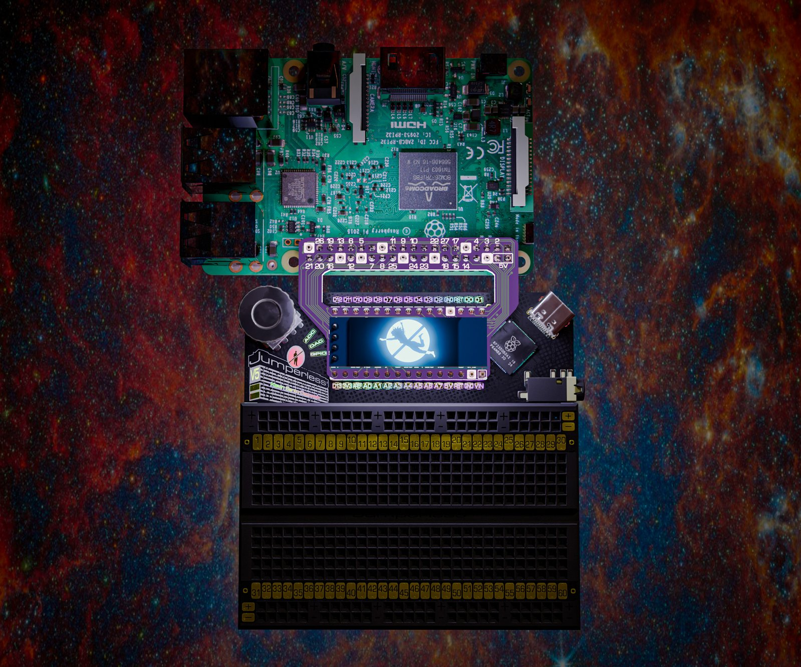
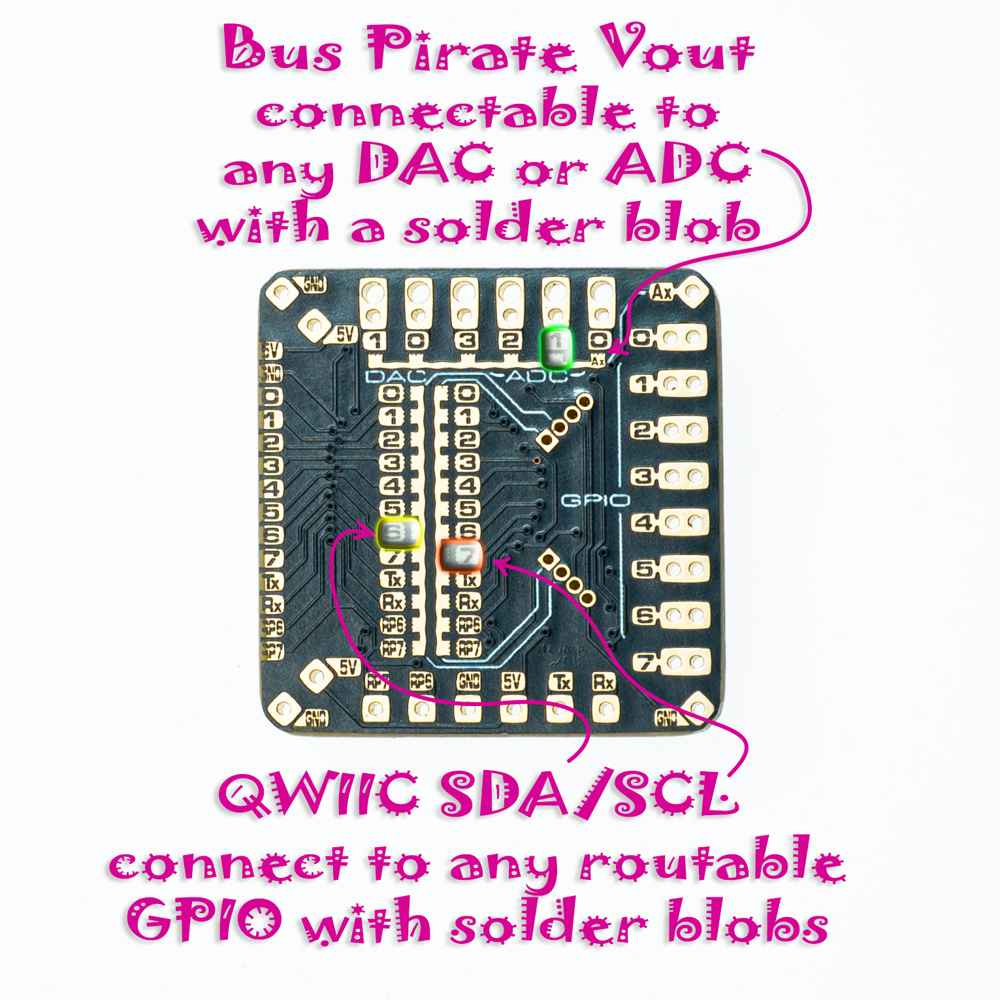

# Adapter Boards

There are two little boards in the box with your Jumperless, the SBC adapter and the FPC adapter (on rev 5 boards the OLED plugs into the SBC adapter, that's on the [OLED page](04-oled.md)).

That's the render from the campaign, the OLED spot moved on the real one.

## SBC Adapter

This one plugs into the Nano header and maps it to the GPIO pins on any Raspberry Pi, so the Pi's pins show up as `node`s you can route like anything else. The Pi's GPIO numbers are printed on it (the BCM ones, not the header positions). Yes, the Raspberry Pi's 40 pin GPIO port has some very silly pin numbering, so I had to kinda follow that.

The Pi's `TXD` and `RXD` (14 and 15 on the adapter, pins 8 and 10 on the Pi) land on `D0` and `D1`, so `A` connects them to the Jumperless's routable UART and you can have the Pi control the Jumperless over the UART lines for fully remote Jumperless-ing, the tags for that are on the [Arduino page](05-arduino.md#commands-from-routable-uart). Or don't press `A` and route them wherever you want on the breadboard.

There's a little 2 pad solder jumper on it by the `5V` label in the `Tx`/`Rx` corner (`JP3` in the KiCad files, it comes open) that you can bridge to connect the 5V busses together and power your Jumperless from the Raspberry Pi. This is kinda why I didn't want to mess with USB-C Power Delivery or anything, it's kinda cool to just be able to shove in 5V from wherever, as long as it can provide 500-1000mA.

The 4 pin column at the bottom left (with the Pi header at the top) is where the OLED goes, it's on `D2` and `D3`, which is the `gpio_7_8` connection on the [OLED page](04-oled.md). The OLED friction-fits onto the board with wiggly offset holes so you can always remove it to read the pin mappings for the Pi.

I also threw in some universal-ish SMD footprints on the top, between the header rows. Also note that the SMD pads with the blobby extensions aren't connected to anything, I'm really shoving a square peg in an Arduino Nano shaped hole here, so some weirdness was inevitable.

I talked about these in [my first update](https://www.crowdsupply.com/architeuthis-flux/jumperless-v5/updates/single-board-computer-fans-rejoice), and there are actual pictures instead of renders in [this one](https://www.crowdsupply.com/architeuthis-flux/jumperless-v5/updates/good-news-everyone-things-are-happening).

## FPC Adapter

The ribbon cable goes into the 20 pin FPC connector on the back of the Jumperless and brings the routable GPIO 1-8, the routable UART `Tx` and `Rx`, ADC 0-3, DAC 0 and 1, and 5V and GND out to pin headers on this board so you can clip a scope or meter to them. GPIO (or RP) 6 and 7 (`RP6` and `RP7` on the silkscreen) are on there too, but they're only connected to the RP2350B for sending commands to/from the Jumperless, not the crossbar.

It has 2 Qwiic / STEMMA QT ports. You hook their `SDA` and `SCL` to any of the routable GPIO (or `Tx`/`Rx`/`RP6`/`RP7`) with that weird, wiggly footprint in the middle, one column is `SDA` and the other is `SCL`, put a solder blob on each one where you want it (they don't go anywhere until you do). You can also connect each port to a different pair of GPIO by cutting it somewhere in the middle. They come with 3.3V power (there's a little regulator on the board for it), the three-way solder jumper with `3V` and `5V` next to it (`JP1` in the KiCad files) switches that, cut the `3V` side that comes bridged and blob the `5V` side.

The column of double pads on the right (in the photo above) fits a [Bus Pirate](https://buspirate.com/) cable, its IO pins land on the routable GPIO and its `Vout` on the `Ax` pad. Blob `Ax` to whichever ADC or DAC you want `Vout` on, same deal as the Qwiic lines.

(note: the GPIO numbers on the silkscreen start at 0, so 0 on the adapter is GPIO 1 on the Jumperless.)

The Jumperless can be powered from the 5V and GND pins on here instead of USB, same as the Nano header (that's on the [safety card](09.8-odds-and-ends.md#safety-info)). The pads along one edge are for daisy chaining a second Jumperless, there's no firmware for that yet.

This one's in [that same update](https://www.crowdsupply.com/architeuthis-flux/jumperless-v5/updates/good-news-everyone-things-are-happening) too.
