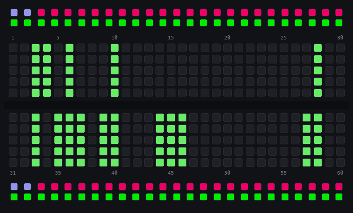
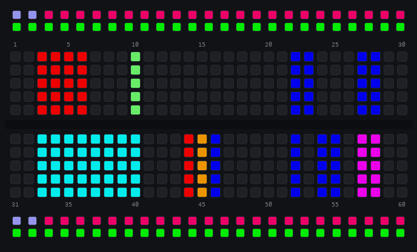
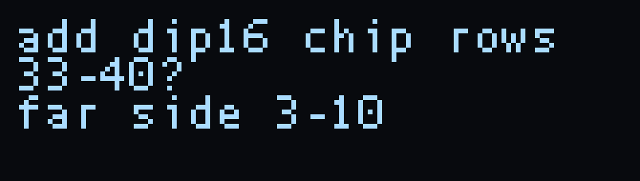
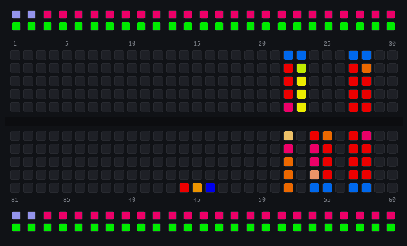

# Parts

Your Jumperless can know what's plugged into it. Tell it a chip, module, or passive is on the board and it becomes a `part`: its pins get labeled, its power gets wired for you, tapping a pin tells you what it is, and if something's wired dangerously wrong the board warns you. If the part is a little OLED, the Jumperless will even drive it.

You still wire your own circuit with the probe like always, parts just make the board smarter about what's on it.

The `Parts` menu has four things in it:

- [`Auto Scan`](#auto-scan) - it figures out what's plugged in by itself
- [`Place Part`](#placing-a-part) - tell it what's plugged in and where
- [`Test Part`](#test-part) - re-measure a placed part to check it's what it says it is
- [`Remove Parts`](#remove-parts) - take parts off, leg by leg or whole


## Placing a Part

`Parts` > `Place Part` gives you a class picker on the breadboard LEDs:

- `Logic` - 7400 / 4000 series ICs
- `Analog` - 555s, op-amps, regulators
- `Discrete` - resistors, caps, LEDs, diodes
- `Transistors` - BJTs and MOSFETs
- `Displays` - OLED panels and friends
- `Modules` - BME280, MPU6050, and other breakout boards
- `Remove parts` - [same thing as the menu entry](#remove-parts)

Scroll with the clickwheel, click to pick a class, then pick your part the same way.

### DIP chips: two taps

A DIP straddles the center line, but it can still face two ways (pin 1 bottom-left, or spun 180° with pin 1 top-right), so it gets two taps: tap the hole **pin 1** is actually in, then the corner pin diagonally opposite it. That locks the orientation, and if your second tap isn't where a chip of that size could put it, it asks again (which also catches picking the wrong size chip before anything gets placed.) Typing the row numbers in the terminal works too.

### Everything else: tap each signal

Modules and SIP-header parts have **no standard pin order** - one vendor's OLED is `GND VCC SCL SDA`, the next one's is `VCC GND SCL SDA`. So instead of guessing, the Jumperless asks you to tap each signal by name: the breadboard shows `TAP VCC`, then `TAP GND`, then `TAP SCL`, and so on. Wherever you tap is where that signal is - the part can be plugged in any orientation, or even spread across fly wires (any rows in the same half of the board work).

Every tap you land flashes that row green, and the rows you've already tapped stay lit so you can see your progress. Tapped the wrong row? It won't let you tap the same row twice for one part, and clicking the wheel backs you out to try again.

Two-legged passives (resistors, LEDs, diodes) get both ends tapped - one hole on the top half, the matching hole on the bottom half. For polarized parts, whichever signal you tap is where that signal *is*, so the anode/cathode labels always match reality.

### Power Pins

When a part is placed, its power pins get routed to a `Rail` automatically: `VCC`-class pins connect to the rail on their half of the board, `GND`-class pins connect to ground. So you don't have to wire them up yourself.

The rails still obey **you** - nothing is hot until you turn a rail on, and the voltage is whatever you set. (Also worth knowing: most I2C modules are happiest with rails at `3.3V` because the RP2350B can only pull the I2C lines up to 3.3V, if you add external pullups it should be fine at 5V)

If you tap a power pin onto a row that's already connected to the *opposite* thing (say, VCC onto a grounded row), the Jumperless just silently refuses to make the connection - it won't short a rail to ground for you (but be aware that it can still short through a wire or diode placed on the breadboard. Don't worry, this probably won't kill your Jumperless and you'll see the current ants go crazy.)

## Test Part

`Parts` > `Test Part` shows a picker of your placed parts. Pick one and it re-measures it in place: discretes and transistors get the same electrical check the scan uses (so you can tell if it still reads like what you said it was), a display gets pinged to see if it's alive, and a generic `IC` record runs the full [identify](#auto-scan) and offers to rename itself to whatever the vectors say it actually is.

## Remove Parts

`Parts` > `Remove Parts` works two ways. Tap a leg of a placed part and just that leg is removed - its bridge, its net name, its entry in the part - and removing the last leg removes the part itself. Or scroll the wheel through your placed parts (each one highlights on the board with its card on the panel) and a click removes the whole highlighted part. The scroll's last stop is `All`, which clears every part (it asks first - confirm with the probe's `Connect` button). Clearing the whole board (`x`) clears its parts too. Parts are saved with your slot, so they come back after a reboot.

## Auto Scan

Or skip all that and make it figure out what's on the board by itself. `Parts` > `Auto Scan` lifts all your wiring out of the way (it goes back exactly as it was when the scan exits), pokes every row, and measures anything that conducts. Any press stops it - either probe button, the wheel, or any key in the terminal.

You can watch it work, the row it's testing sweeps down the board in rainbow and anything that conducts stays lit green. The OLED says which phase it's in. A pretty full board takes about 30 seconds.




Stuff it can find:

- `RESISTOR 4.7k`, `LED 1.85V`, `DIODE 0.65V`, `CAPACITOR` - two-lead parts get typed and measured, with the anode lit red and the cathode blue
- `BJT_PNP 0.59V` (or NPN, or FETs) - lit emitter red, base amber, collector blue
- `a chip?` - it reads the chip's clamp diodes to find which rows are GND and VCC, then probes the rest of the pins against them (`row 35 answers - a pin`)
- `I2C 0x3C module` - it powers the cluster briefly and asks if anything answers on the bus (this is how an SSD1306 module shows up)
- `a 7-seg display?` - all the segments light from one common pin
- parts you already placed just get named (`7SEG52 (placed)`), and a lone noise row gets checked and ignored



When it's done it asks about each finding, one at a time. Same gestures as everywhere else, `click` or `Connect` = yes, `hold` or `Remove` = no (or `y`/`n` in the terminal, anything else bails out of the whole confirm pass). What the prompts do:



- `add RESISTOR rows 12-13?` - places it as a part, same as if you did it through `Place Part`
- `add dip16 chip rows 33-40?` - places a chip (it already paired the span with its mirror across the middle, that's the `far side 3-10` on the second line)
- `identify dip16 chip rows 33-40? powers it briefly` - offered after you add a chip, if the scan found its power pins. It fingerprints each pin's clamp diodes, then actually powers the chip and runs the truth tables of everything in the part database that could fit. Whatever passes shows up in a `Which?` picker - pick one and it places with real pin names and no tap, the vectors already proved which way it's facing. Or pick `Generic IC` and it places as `IC33` with unnamed pins (`Test Part` runs the same identify on it later and offers to rename it.)
- `wire 8-seg display (common 58) to GPIOs?` - routes each segment to its own GPIO and the common to the rail it wants, names the nets `7SEG52_S1` through `S8`, then blinks each segment in order so you can see which GPIO got which. After that you can drive it from MicroPython without touching a wire.

The identify run on my 7447 looks like this:


```jython
identify? dip16 chip rows 33-40  powers it briefly  (y/n)
  vectors: trying 7447 (rotated 180)
  vectors: trying 74595 (rotated 180)
identify fp=GGGGGGG-GGGBGGG- tried=2 pass=7447(r)
```

New parts' labels light up along the board edge for a few seconds after the scan:



If it refuses to scan: `board reads powered` means something is feeding the matrix and charged rows look like parts, unpower whatever it is and rescan. `no clean ADC lane` means every free ADC is being driven and there's nothing left to measure with.

## Living with placed parts

**Labels.** Right after you place a part, its pins light up along the board edge in their class colors for a few seconds, then go dark. An idle board stays clean - labels come back when they're relevant (you tap the part, its net gets highlighted, or a warning is active).

**Tap a pin to ask about it.** With the probe switch on `Select`, tap any row a part lives on and the OLED shows the part name, the pin's label, and its class - `NE555 pin 3 OUT`, that kind of thing.

**Highlighting.** Highlight a net that lands on a part pin and the OLED says `SSD1306 SDA` instead of `Net 12`. Highlight a GPIO that's genuinely configured as I2C (checked against the actual RP2350 pin function register, not guessed) and it says `GPIO 7 SDA`.

**Warnings.** If a part's power pin ends up on a grounded net, or its ground pin on a hot rail, the part's pins light up in warning colors and the OLED tells you why (`VCC_TO_GND!`). It won't undo your wiring or block anything, it just makes sure you know.

## Breadboard Displays

Place a small I2C OLED (the 0.91" 128x32 SSD1306 is the well-tested one) through `Parts` > `Displays`, tapping each of its pins as prompted. Then:

1. The Jumperless routes the display's `SDA`/`SCL` to two of its own GPIOs through the crossbar - you never wire data lines.
2. Power rides the rails you already wired during placement - turn a rail on (3.3V is the happy voltage).
3. The moment the panel powers up, the board finds it and the boot animation starts playing on it, ambient - it keeps running while you use menus, probe around, and measure things.

The serial monitor narrates the lifecycle: `DISPLAY routed`, then `DISPLAY alive` when the panel answers. If you steal its GPIOs from a MicroPython script the display pauses (`DISPLAY paused`) and resumes when you release them.

## Terminal twins

Everything above works over serial too: the part pickers echo what they're showing, any "tap a row" prompt accepts a typed row number + enter, and placements print machine-readable lines (`PARTDB place ok=NE555 row=42`, `PARTPICK sig=SDA row=8`, `PARTPIN`/`PARTWARN` for inspects and warnings) so scripts and tools can follow along.
