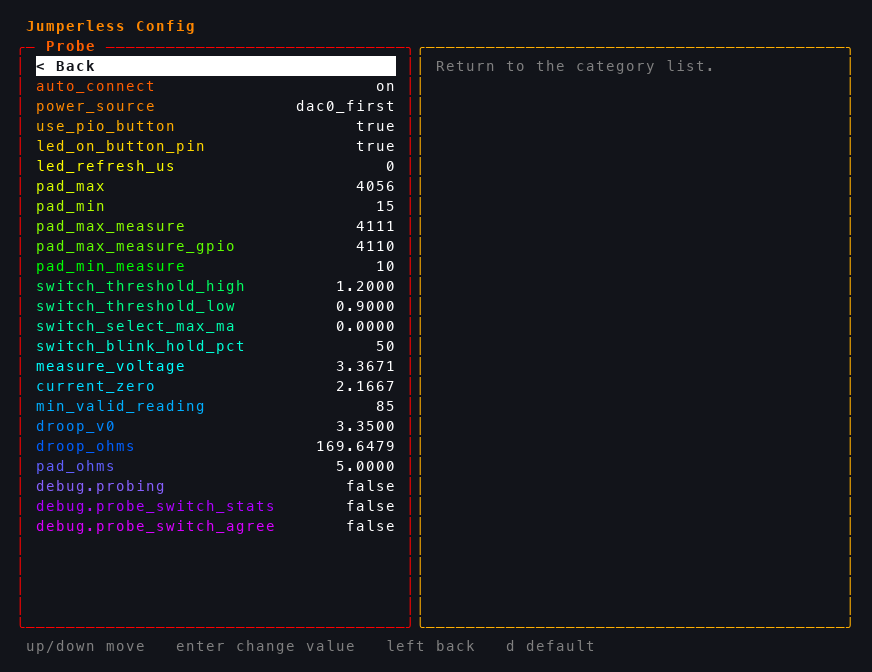

# Calibration

Everything under `Calibration` in the click wheel menu, and which one to run when something's off. The numbers they produce live in `config.txt`, survive `` `reset `` and firmware updates, and are shown on the OLED and in the terminal while each one runs - so it's worth having a terminal or the app open when you calibrate.

**Fingers off the pads.** The probe is read through a resistive voltage divider, so a finger on the pads, or on the back of the four risers that connect the probe sense boards to the main board, changes the readings. That goes double while calibrating.

## Which one do I need?

<div class="wrap-table" markdown="1">

| If... | Run |
|---|---|
| Taps light the row next to the one you touched, or the same row sometimes lights its neighbor | [`Probe Pads`](#probe-pads) |
| Taps are right with the switch on `Select` but off on `Measure`, or the other way round | [`Probe Pads`](#probe-pads), with the switch in **both** positions |
| The logo is the wrong color for where the switch is, `Measure` mode won't start, or the board flips modes by itself | [`Switch Thresh`](#switch-thresh) |
| A rail or DAC set to `3.3V` measures something else, or ADC readings are off | [`DACs Calib`](#dacs-calib) |
| The probe LED is dark, or the buttons only work sometimes | [`Probe Cable`](#probe-cable) |
| A connection you made doesn't conduct | [`Xbar Route`](#xbar-route) |
| Something's wrong and you don't know what | [`Full Test`](#full-test) |

</div>

## Probe Pads

Open `Calibration` > `Probe Pads` **with the tip in the air** (it measures the no-touch reading in the first second). The breadboard shows `Adjust` on the left (that's the wheel) and `Tap` on the right (that's the probe).

<!-- shot: probe-pads-start_board.png - board LEDs right after opening Probe Pads ("Adjust" / "Tap") -->

**Switch on `Select`** (towards the tip):

1. Tap row 1. The row the board *thinks* you tapped lights up blue. If it's not row 1, turn the wheel until it is. You don't have to keep the tip on the pad - it keeps re-decoding your last tap as you turn, so tap, lift, turn.
2. Tap `A5` on the nano header, then a row somewhere in 20-40. Go back and forth between the three, nudging the wheel, until all of them are spot on.
3. Check the `ADC`, `DAC` and `GPIO` pads and the logo - each lights its own LEDs. If rows are right but those are off, lift the tip and reopen the app so it re-measures the no-touch reading.

<!-- shot: probe-pads-select-row1_board.png - Select position, tip on row 1, row 1 lit blue -->
<!-- shot: probe-pads-select_oled.png - the SELECT status screen -->

**Switch on `Measure`** (away from the tip). The highlight turns purple:

1. **Hold** the tip on a row somewhere in 20-40 for about half a second and leave it there. The OLED goes `hold row` → `match..` → `ok` (the row may blink once or twice while it does this).
2. Now tap row 1, then `A5` on the nano header, then back to your row in 20-40. Go between them turning the wheel until all three are spot on. A short click of the wheel redoes step 1 if you want.

<!-- shot: probe-pads-measure_oled.png - the MEASURE status screen after matching ("MEASURE ok") -->
<!-- shot: probe-pads-measure-row_board.png - Measure position, a row lit purple -->

**Hold the wheel** to save. The terminal prints what got written:

```jython
Probe calibration saved!
Returning to menu

floor (both positions): probe_min              = 21
select:                 probe_max              = 4055
measure (DAC0 feed):    probe_max_measure      = 4134
measure (GPIO feed):    probe_max_measure_gpio = 4061  (matched)
select switch current (DAC0 feed, INA1): 1.42 mA   thresholds 0.90 / 1.20
tip drive (fixed):      measure_mode_output_voltage = 3.310 V
Saving config...
```

If it adds `NOTE: that is not above the SELECT threshold - run Switch Calib.`, run [`Switch Thresh`](#switch-thresh) next.

!!! note "What's going on"
    Every row and pad has a little contact next to it, and all of them are strung together into one long resistor ladder. The probe tip drives a voltage into whichever contact it's touching, and the voltage that comes out the bottom of the ladder says how far along the ladder you are. One ADC reading, mapped linearly onto 101 positions: rows 1-60, the rails, the nano header, the logo pads, the `ADC`/`DAC`/`GPIO` pads.

    A linear map needs two endpoints, and that's the whole calibration:

    - **The bottom** (`pad_min`) is what the ADC reads with nothing touched. It's an offset of the sense circuit itself, the same in both switch positions, and the board measures it at boot and again when you open this app. That's why the tip has to be in the air for the first second - and why the small pads at the bottom of the ladder are the ones that go wrong if it isn't.
    - **The top** (`pad_max` on `Select`; `pad_max_measure` and `pad_max_measure_gpio` on `Measure`) is where row 1 lands. This is what the wheel moves. Row 1 is where it has the most leverage, `A5` is near the bottom of the ladder where the no-touch reading matters most, and a row in 20-40 checks the middle.

    `Select` and `Measure` have separate tops because the tip is driven by different things: on `Select` it's wired straight to a pin on the RP2350; on `Measure` it's the probe's buffer, fed through the crossbar by either `DAC0` or a spare GPIO (the board uses whichever is free). The GPIO feed sags a little more under load, so `Measure` keeps one top per feed. The half-second hold is the app reading your row under both feeds and setting the GPIO top so they agree; after that the wheel moves both together so they stay agreed.

    On `Select` the app also pins the buffer to `DAC0` and shows its current as `sw:` - that's the number [`Switch Thresh`](#switch-thresh) uses to tell the switch position.

## Switch Thresh

`Calibration` > `Switch Thresh`, then two prompts:

1. `Switch to MEASURE (AWAY from TIP)`, click the wheel. It takes 20 readings - you can watch them fill in on the breadboard.
2. `Switch to SELECT (TOWARDS TIP)`, click the wheel. Same again.

<!-- shot: switch-thresh-measure_oled.png - the "Switch to MEASURE" prompt -->
<!-- shot: switch-thresh-reading_board.png - the 20 readings filling in on the breadboard -->
<!-- shot: switch-thresh-done_oled.png - "Calibration Done! Low: 0.xx mA High: 1.xx mA" -->

```jython
=== Calibration Results ===
MEASURE mode median: 0.012 mA   (tip H ok)
SELECT mode median:  1.412 mA   (tip L ok)

Low threshold:  0.642 mA (switch to MEASURE)
High threshold: 0.782 mA (switch to SELECT)
```

Any key in the terminal aborts without saving. It also refuses to save if the switch wasn't where the prompt asked, or if the two readings are too close together (`this may mean a bad probe cable!`) - in which case run [`Probe Cable`](#probe-cable).

!!! note "What's going on"
    The probe's slide switch has no wire to the board - the board works out where it is by what the probe *draws*. On `Select` the probe LED is powered from the buffer supply, so the buffer's current (through an INA219 in the `DAC0` path) jumps by about 1.4 mA. `Switch Thresh` measures that current in both positions and puts the decision thresholds halfway between, with a little hysteresis. It also calibrates a second, faster detector that watches how the tip line behaves when the feed blinks off for a few microseconds (the LED's capacitor holds it up on `Select`; nothing does on `Measure`). The firmware runs this once by itself after an update from a version that didn't have it.

## DACs Calib

**Unplug anything connected to the rails first.** Then `Calibration` > `DACs Calib` (or `$` in the terminal). It runs on its own for about a minute and narrates in the terminal, ending in a table like this:

```jython
	Calibration Values

            DAC Zero	DAC Spread	ADC Zero	ADC Spread
DAC 0       1650	20.51		8.12		18.28
DAC 1       1651	20.49		8.09		18.30
Top Rail    1647	20.55		8.21		18.27
Bottom Rail 1652	20.50		8.15		18.31
```

<!-- shot: dacs-calib-zero_board.png - "Zero DAC 0" on the breadboard with the progress dots -->

`ADC calibration failed - insufficient valid points` means something was on a rail, or the USB audio stream was holding the ADC (close the microphone on the host, or `M` to turn it off) - fix that and run it again. It runs by itself on first boot.

!!! note "What's going on"
    The four DAC channels (`DAC0`, `DAC1`, the top rail, the bottom rail) go through a scale-and-shift stage to get their ±8 V range, and every board's is slightly different. `DACs Calib` sets each one to a series of voltages, reads them back with the INA219 (which can only see positive voltages, hence the series), and solves for the zero and full-scale numbers that make "set 3.3 V" come out as 3.3 V. Then it does the same for the ADCs, using `DAC1` as the reference: `ADC0`-`ADC3`, `ADC4` (the 0-5 V one) and `ADC7` (the probe tip). A load on a rail while it runs turns into a wrong calibration.

## Full Test

`Calibration` > `Full Test` (or `` `self_test `` in the terminal) runs every hardware check: the probe cable, crossbar routing, the probe tip voltage, PSRAM and the on-board chips. Each one paints a band on the breadboard - green passed, red failed - and the terminal gets a report (`` `self_test_report `` prints it again later). Anything that fails is re-run until it passes, or until you touch something during the countdown between rounds. At the end it holds the result on the LEDs until you touch a probe button, the wheel, or a key, then restarts.

<!-- shot: full-test-result_board.png - the five result bands on the breadboard -->

The two entries below it run one check each and don't restart afterwards - the result stays on the LEDs until you touch something.

### Probe Cable

Checks the TRRS cable and jack: that the two pins a good cable shorts together really are shorted (both ways, eight times, with an intermittent-contact wiggle in between), that the button line floats when nothing's pressed, and that the LED data reaches the probe. This is the one to run when the probe LED is dark or the buttons are flaky.

### Xbar Route

Puts a known voltage through every breadboard row, the routable GPIOs and both rails via the crossbar and measures it on the other side. The crossbar chips can't be read back, so this is the only way to know a connection actually closed - a row that doesn't conduct is named in the report.

## Where the numbers live

All of it is in `config.txt`, editable with `` ` `` or the [config editor](06-config.md). `` `reset `` keeps these; `` `reset_calibration `` puts them back to defaults, and `` `force_first_start `` wipes everything and re-runs the first-boot calibration.

- `[probe]` - `pad_min` (no-touch reading), `pad_max`, `pad_max_measure`, `pad_max_measure_gpio` from `Probe Pads`; `switch_threshold_low` / `_high`, `switch_select_max_ma`, `switch_blink_hold_pct` from `Switch Thresh`; `measure_voltage`, `droop_v0`, `droop_ohms` from the self test
- `[calibration]` - `dac_0_zero` / `dac_0_spread`, `dac_1_*`, `top_rail_*`, `bottom_rail_*`, `adc_0_*` through `adc_4_*` and `adc_7_*`, all from `DACs Calib`


