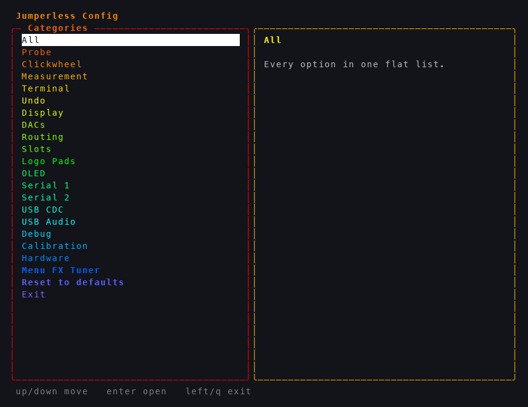
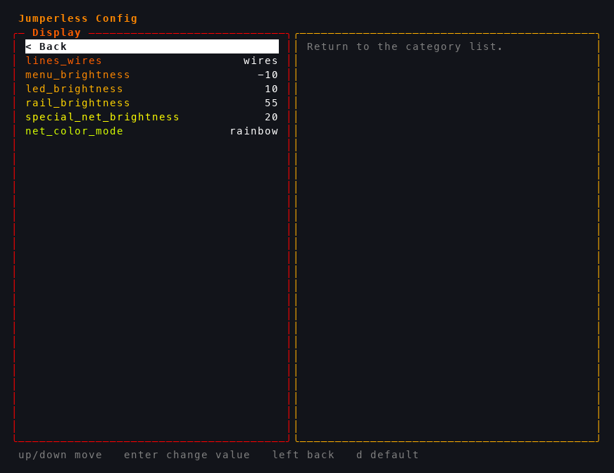

# Config File

To change any persistent settings that apply to the Jumperless as a whole, there's a `config` file. There are three ways to poke at it, pick whichever fits your mood:

1. **The interactive editor** - enter a bare `` ` `` (backtick) and get a full menu with arrow keys, descriptions, and live-updating values
2. **Copy / paste** - print the config with `~`, copy a line, change the value, paste it back
3. **Edit the file** - it's just `config.txt` on the filesystem, edit it however you like

## The Interactive Editor

Enter a single `` ` `` (backtick, nothing else) into the terminal and you get a config menu instead of a config file:



The categories are organized by what you're actually trying to mess with (`Probe`, `Clickwheel`, `Measurement`, `Display`...), with the plumbing (`Calibration`, `Hardware`) further down, and `All` at the top if you'd rather scroll one flat list of everything.

The keys:

- `up` / `down` - move (the pane on the right describes whatever you're on: what it does, its range, its default)
- `enter` - open a category, or change the highlighted value (numbers and strings get inline editing, on/off options just toggle)
- `left` / `right` - step a value up/down, or cycle through its choices
- `d` - reset the highlighted option to its default
- `left` or `q` - back / exit


**Changes apply live.** Every edit goes through the same machinery as the paste path, so the board reacts while you're still in the menu - hold `right` on `led_brightness` and the breadboard gets brighter under your finger, change the OLED font and it redraws, tweak the menu FX and the next transition wears it.



There's also a `Menu FX Tuner` category at the bottom that opens a live tuner for the click-menu frame transitions (it drives the real breadboard menu while you play with it), and a `Reset to defaults` that resets everything except calibration and hardware identity.

## Viewing Config.txt

If you'd rather see the whole thing at once, enter `~` to print the config. 

```jython
~

copy / edit / paste any of these lines 

into the main menu to change a setting

Jumperless Config:

`[config] firmware_version = 5.7.8.1;

`[hardware] generation = 5;
`[hardware] revision = 7;
`[hardware] probe_revision = 5;
`[hardware] psram_installed = false;
`[hardware] psram_app_size_kb = 2048;

`[probe] auto_connect = on;
`[probe] power_source = dac0_first;
`[probe] use_pio_button = true;
`[probe] led_on_button_pin = true;
`[probe] led_refresh_us = 0;
`[probe] pad_max = 4056;
`[probe] pad_min = 15;
`[probe] pad_max_measure = 4111;
`[probe] pad_max_measure_gpio = 4110;
`[probe] pad_min_measure = 10;
`[probe] switch_threshold_high = 1.2000;
`[probe] switch_threshold_low = 0.9000;
`[probe] switch_select_max_ma = 0.0000;
`[probe] switch_blink_hold_pct = 50;
`[probe] measure_voltage = 3.3671;
`[probe] current_zero = 2.1667;
`[probe] min_valid_reading = 85;
`[probe] droop_v0 = 3.3500;
`[probe] droop_ohms = 169.6479;
`[probe] pad_ohms = 5.0000;

`[clickwheel] encoder_pio = auto;
`[clickwheel] rail_click_adjust = oled_only;
`[clickwheel] fx_type = glow;
`[clickwheel] fx_duration_ms = 160;
`[clickwheel] fx_tint = 0x00;
`[clickwheel] fx_density = 128;

`[measurement] net_currents = 1;
`[measurement] current_flow = conventional;
`[measurement] show_probe_current = 0;
`[measurement] crosspoint_resistance = 40.0000;

`[terminal] colors = true;
`[terminal] line_buffering = true;

`[undo] persist = true;
`[undo] max_saved_actions = 256;

`[dacs] limit_max = 8.00;
`[dacs] limit_min = -8.00;

`[debug] file_parsing = false;
`[debug] net_manager = false;
`[debug] nets_to_chips = false;
`[debug] nets_to_chips_alt = false;
`[debug] probing = false;
`[debug] arduino = 0;
`[debug] show_node_errors = true;
`[debug] probe_switch_stats = false;
`[debug] probe_switch_agree = false;
`[debug] net_voltage_scan = false;
`[debug] net_scan_pair_taps = 1;

`[routing] stack_paths = 2;
`[routing] stack_rails = 3;
`[routing] stack_dacs = 0;

`[slots] boot_mode = last_active;
`[slots] boot_slot = 0;

`[calibration] top_rail_zero = 1655;
`[calibration] top_rail_spread = 18.4000;
`[calibration] bottom_rail_zero = 1639;
`[calibration] bottom_rail_spread = 19.0000;
`[calibration] dac_0_zero = 1655;
`[calibration] dac_0_spread = 18.2300;
`[calibration] dac_1_zero = 1629;
`[calibration] dac_1_spread = 19.0300;
`[calibration] adc_0_zero = 8.9969;
`[calibration] adc_0_spread = 18.0563;
`[calibration] adc_1_zero = 8.9903;
`[calibration] adc_1_spread = 18.0659;
`[calibration] adc_2_zero = 8.9993;
`[calibration] adc_2_spread = 18.0637;
`[calibration] adc_3_zero = 8.9826;
`[calibration] adc_3_spread = 18.0345;
`[calibration] adc_4_zero = 0.0000;
`[calibration] adc_4_spread = 4.9151;
`[calibration] adc_7_zero = 8.8184;
`[calibration] adc_7_spread = 17.7676;

`[logo_pads] top_guy = uart_tx;
`[logo_pads] bottom_guy = uart_rx;
`[logo_pads] building_pad_top = isense_pos;
`[logo_pads] building_pad_bottom = isense_neg;
`[logo_pads] top_guy_idle = off;
`[logo_pads] bottom_guy_idle = off;
`[logo_pads] building_pad_top_idle = off;
`[logo_pads] building_pad_bottom_idle = off;

`[display] lines_wires = wires;
`[display] menu_brightness = -10;
`[display] led_brightness = 10;
`[display] rail_brightness = 55;
`[display] special_net_brightness = 20;
`[display] net_color_mode = rainbow;

`[serial_1] function = passthrough;
`[serial_1] baud_rate = 115200;
`[serial_1] print_passthrough = 0;
`[serial_1] connect_on_boot = 0;
`[serial_1] lock_connection = 0;
`[serial_1] autoconnect_flashing = 1;
`[serial_1] async_passthrough = true;
`[serial_1] tag_parsing = enabled;
`[serial_1] flash_reset_type = avr;

`[serial_2] function = micropython;
`[serial_2] baud_rate = 115200;
`[serial_2] print_passthrough = 0;
`[serial_2] connect_on_boot = 0;
`[serial_2] lock_connection = 0;

`[top_oled] enabled = 1;
`[top_oled] i2c_address = 0x3C;
`[top_oled] width = 128;
`[top_oled] height = 32;
`[top_oled] rotation = 0;
`[top_oled] connection_type = i2c0;
`[top_oled] sda_pin = 4;
`[top_oled] scl_pin = 5;
`[top_oled] gpio_sda = 134;
`[top_oled] gpio_scl = 135;
`[top_oled] sda_row = -1;
`[top_oled] scl_row = -1;
`[top_oled] connect_on_boot = 1;
`[top_oled] lock_connection = 0;
`[top_oled] show_in_terminal = off;
`[top_oled] font = Eurostl;
`[top_oled] startup_message = images/bubbleJumpThin.bin;

`[usb_cdc] ignore_dtr = false;

`[usb_audio] enabled = false;
`[usb_audio] left = 0;
`[usb_audio] right = 1;
`[usb_audio] rate = 16000;
`[usb_audio] full_scale = 8.00;
`[usb_audio] dc_block = true;
```


This is just a file on your filesystem called `config.txt` and just editing that file directly works too.


## Config Help

There's also a `help` you can get to by entering `~help`

```jython
~help

                              Read config 
                          ~ = show current config
                     ~names = show names for settings
                   ~numbers = show numbers for settings
                 ~[section] = show specific section (e.g. ~[routing])

                              Write config 
`[section] setting = value; = enter config settings (pro tip: copy/paste setting from ~ output and just change the value)
                          ` = open the interactive config menu (arrow keys)

                              Reset config
                     `reset = reset to defaults (keeps calibration and hardware version)
            `reset_hardware = reset hardware settings (keeps calibration)
         `reset_calibration = reset calibration settings (keeps hardware version)
                 `reset_all = reset to defaults and clear all settings
         `force_first_start = clears everything to factory settings and runs first startup calibration
                 `self_test = run the hardware self test (non-destructive)
          `self_test_report = re-print the stored self test report

                              Help
                         ~? = show this help
```

(Small quirk: `~?` currently shows a shorter one-line command card instead; `~help` is the one that prints all of the above.)

## State File

## States vs Config

States are now saved as YAML and we did away with the old text file format. `globalState` holds all connections, paths, and other circuit configuration in a single object that most of the code uses now. 

**State vs Config - What's the Difference?**

- **State** stores things relevant to the currently loaded slot - connections, wire colors, rail voltages, GPIO settings. These change when you switch slots.
- **Config** (config.txt) contains hardware-wide settings that apply to the entire Jumperless regardless of which slot is active.

Rail voltages, GPIO settings, and other circuit-specific parameters now go with the state (in the YAML file) rather than config, so each slot can have its own power supply and GPIO configuration.

## State File Structure

For things specific to the current `state` of the Jumperless, there's a YAML file that contains all the connections, colors (optional), `rail` / `DAC` voltages, `GPIO` directions and pulls, stuff like that. The idea is this defines a complete setup of a particular circuit that can be switched between in different `slots`. 

The Jumperless always boots at `Slot 0`, and you can switch to other `slots` with `<` (cycle through them) or selecting one with the `click menu` with `Slots` > `Load` > `0-7` (it will show a preview of each one.) To save a copy of the currently `active slot`; 
`Slots` > `Save` > `0-7` will save a copy of the `active slot` to another `slot` and also make that target slot the `active`.


```jython

╭────────────────────────────────────╮
│      Current YAML State (RAM)     │
╰────────────────────────────────────╯

Active Slot: 0
Dirty Flag: NO (saved)

─── YAML Output ───

version: 2
sourceOfTruth: bridges

bridges:
  - {n1: 38, n2: 44, dup: 2}
  - {n1: 21, n2: 28, dup: 2}
  - {n1: 48, n2: 55, dup: 2}
  - {n1: 4, n2: 2, dup: 2}
  - {n1: BUFFER_IN, n2: DAC0, dup: 1}

nets:
  - {num: 4, nodes: [DAC_0, BUF_IN], name: "DAC 0", anim: true}
  - {num: 6, nodes: [38, 44], color: pink}
  - {num: 7, nodes: [21, 28], color: blue}
  - {num: 8, nodes: [48, 55], color: green}
  - {num: 9, nodes: [4, 2], color: amber}

power:
  topRail: 3.30
  bottomRail: 2.50
  dac0: 3.30
  dac1: 0.00

config:
  routing: {stackPaths: 2, stackRails: 3, stackDacs: 0, railPriority: 1}
  gpio:
    direction:    [1,1,1,1,1,1,1,1,1,1]
    pulls:        [0,0,0,0,0,0,0,0,0,0]
    pwmFrequency: [1.00,1.00,1.00,1.00,1.00,1.00,1.00,1.00,1.00,1.00]
    pwmDutyCycle: [0.50,0.50,0.50,0.50,0.50,0.50,0.50,0.50,0.50,0.50]
    pwmEnabled:   [0,0,0,0,0,0,0,0,0,0]
  uart: {txFunction: 0, rxFunction: 1}
  oled: {connected: false, lockConnection: false}


─── Memory Usage ───
Connections: 5
State RAM: ~58048 bytes


```

## Source of Truth

Because the information in here is *sort of* redundant (the connections could be computed from just the `bridges` or the `nets` section on their own), there's a field called `sourceOfTruth` which is the section that actually gets parsed and then the other section is written with the computed values. (I haven't done much testing on changing this to `nets` so I'd probably just leave it on `bridges` for now.)

There's some weirdness with how colors are applied, since the `source of truth` is the bridges, and the things that actually get colored are the `nets`, it'll take the colors from the `bridges` (if specified) and try to apply them to the `nets`. But since nets always have a single color (to show that they're connected), if you have `bridges` with different colors in the same `net`, it'll just pick one (don't ask me exactly how the logic chooses, idk.) 

If you specify a color to a `net` even with `sourceOfTruth: bridges` it should respect the `net` assignment over the `bridge` assignment.

## Switching Between Saved Circuits (Slots)

The Jumperless has **8 slots** (0-7) where you can save different circuit configurations. Think of them like presets or save files.

**Quick slot cycling:**
- Type `<` in the terminal to cycle to the next slot

**Other slot commands:**
- `l 5` - Load slot 5 specifically
- `Q` - Query which slot is currently active
- `s` - Show a list of all saved slots

When you make connections with the probe, they're automatically saved to whichever slot is currently active. See the [Glossary](99-glossary.md) for more details about slots.

## Editing State Files

You can edit the YAML slot files and the board will pick up your changes! If you're editing the active slot in the onboard `eKilo` editor, it reloads when you quit the editor; if the Jumperless is mounted as a USB MSC device on your computer, changes are applied when you eject/unmount the drive.
