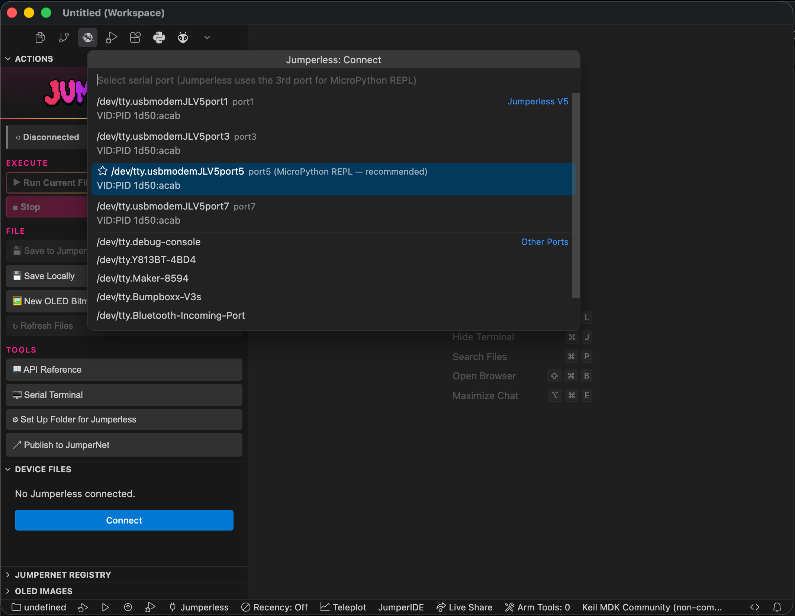
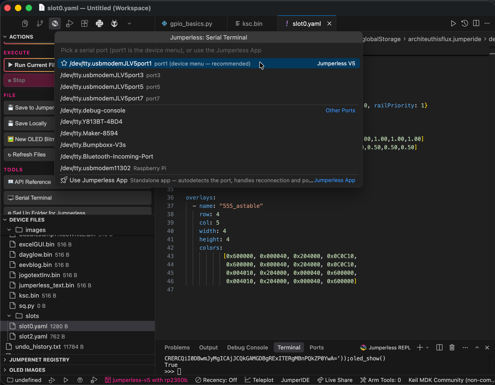
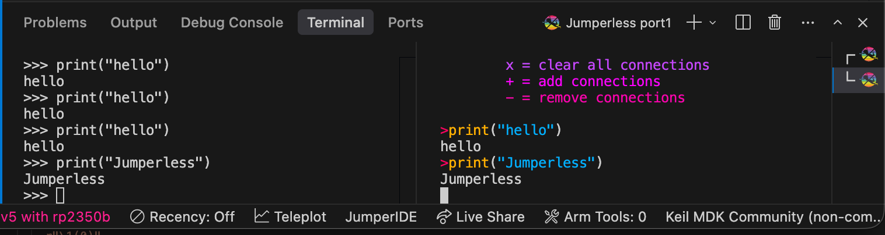
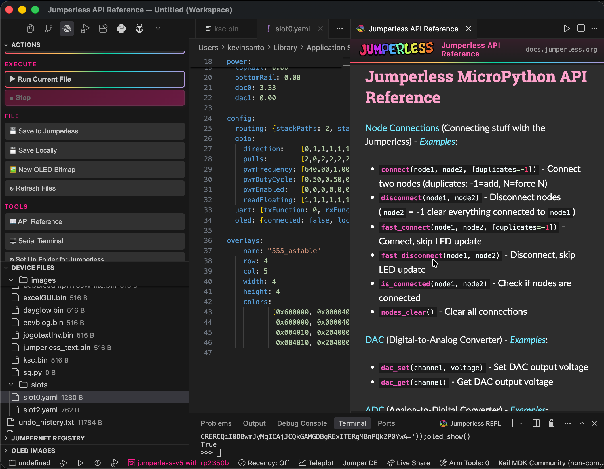
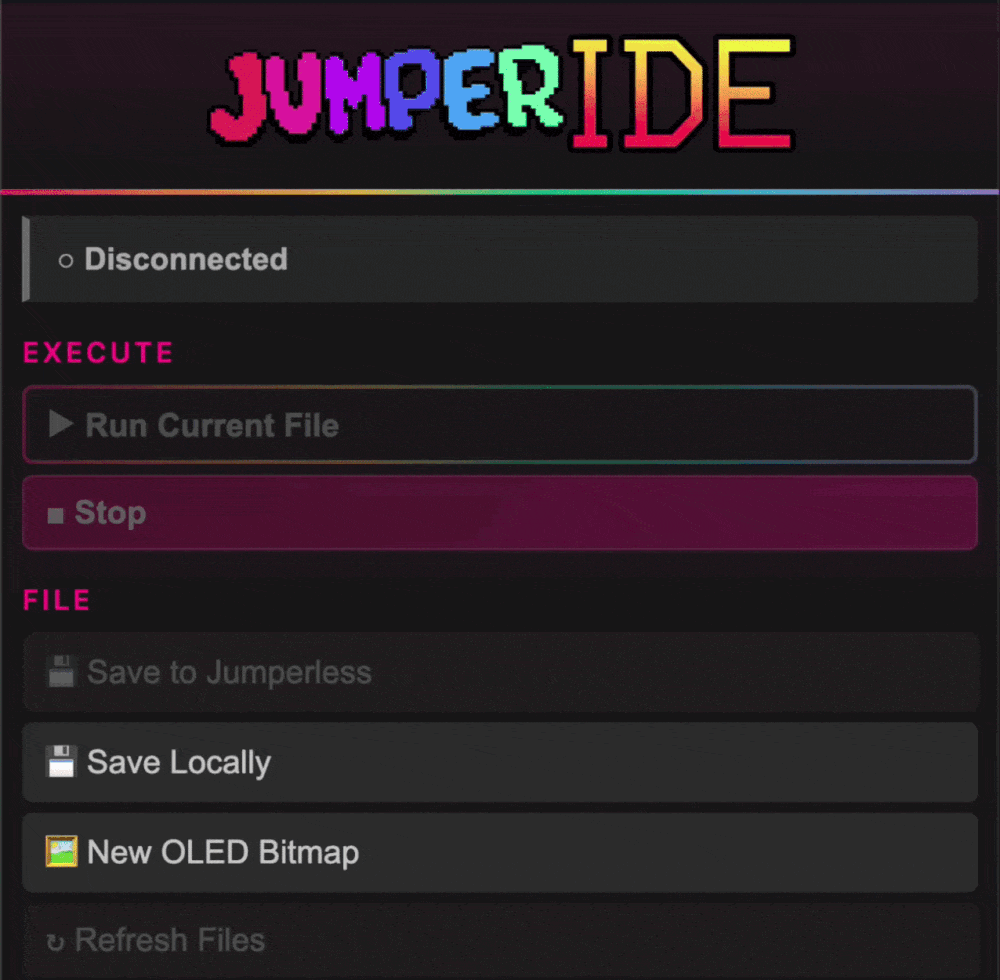

# MicroPython

This guide covers how to write, load, and run Python scripts that control Jumperless hardware using the embedded MicroPython interpreter.

<!-- ## Table of Contents

1. [Quick Start](#quick-start)
2. [Hardware Control Functions](#hardware-control-functions)
3. [Writing Python Scripts](#writing-python-scripts)
4. [Loading and Running Scripts](#loading-and-running-scripts)
5. [REPL (Interactive Mode)](#repl-interactive-mode)
6. [File Management](#file-management)
7. [Examples and Demos](#examples-and-demos)
8. [Troubleshooting](#troubleshooting) -->

If you just want an overview of all the available calls, check out the [**MicroPython API Reference**](09.5-micropythonAPIreference.md)

For stuff that's not Jumperless-specific, check out the [MicroPython Docs](https://docs.micropython.org/en/latest/index.html)

## Now you can live code with [JumperIDE](https://ide.jumperless.org/)!
Holy shit I should have done this years ago

Seriously, this is *such* a better experience than using the onboard text editor and REPL, you should play with it right now

Go to [https://ide.jumperless.org/](https://ide.jumperless.org/) and press the connect button.


Choose the 3rd Jumperless port in that list (Windows may not put them in order, so if nothing happens, try the other ones) and click Connect


Then open some examples (this update should overwrite the examples with the new ones) and hit the Run / Stop button


Press it again to Stop. If you make changes, hit the green Save button next to it (it takes a second and the script should be stopped.)


### If you write something cool, send it to me and I'll add it to the default examples (I'll put a page on this site soon where you can share them.)


This is using [MicroPython's built-in Raw REPL](https://docs.micropython.org/en/latest/reference/repl.html#raw-mode-and-raw-paste-mode), so anything that can interact with that will work here. I've only tested with Viper IDE but I'm pretty sure just about anything else would work.


There's also `jumperless.py` and `jumperless.pyi` module with stubs for all the built-in functions so syntax highlighting and autocomplete  will work in your favorite code editor (sorry, autocomplete for jumperless functions doesn't work in ViperIDE.) You can grab them here:

### [jumperless.py](https://github.com/Architeuthis-Flux/JumperlOS/blob/main/scripts/jumperless.py)
### [jumperless.pyi](https://github.com/Architeuthis-Flux/JumperlOS/blob/main/scripts/jumperless.pyi)

---

## JumperIDE for VS Code


[](https://marketplace.visualstudio.com/items?itemName=ArchiteuthisFlux.jumperide)
[](https://open-vsx.org/extension/ArchiteuthisFlux/jumperide)
[](https://github.com/Architeuthis-Flux/JumperIDE-VSCode/releases/latest)
[](https://github.com/Architeuthis-Flux/JumperIDE-VSCode/blob/main/LICENSE)

---

#### Walkthrough


**Connect** — the board's serial ports are auto-detected by USB ID, with the MicroPython REPL port pre-selected:




**Serial terminal** — pick any port (port1 is the device menu), or hand the port to the standalone Jumperless App:



**REPL + device menu side by side** — the MicroPython REPL and the board's interactive menu, each on its own port:



**OLED bitmap editor** — draw pixels and watch them appear on the board's OLED live:


**API reference panel** — the full MicroPython API docs beside your code:



---

#### Install

Either search `JumperIDE` in the Extensions view ([Open VSX](https://open-vsx.org/extension/ArchiteuthisFlux/jumperide)) or just download the `.vsix` from the [latest release](https://github.com/Architeuthis-Flux/JumperIDE-VSCode/releases/latest) (install command included in the release notes).


#### Features

##### **Actions panel** 
Everything in one sidebar panel: a connection button that doubles as live status (hover to connect or disconnect), **Run/Stop**, **Save to Jumperless**, **Save Locally** (export a device file to your computer), **OLED Bitmap**, the **Serial Terminal**, and quick access to the **API reference** and **JumperNet publishing**.


##### **Serial connection**
    
The V5 exposes four USB serial ports; the extension detects them by USB ID and pre-selects the MicroPython REPL port (the 3rd). Set `jumperless.connectOnStartup` to connect automatically.

##### **Run / Stop**
`Run` executes the file in the current editor on the board, output streams to the REPL terminal.
`Stop` interrupts.



##### **Device file browser**

The board's filesystem in the sidebar. Files open as local working copies (so the language server works on them); saving pushes back to the board. Files that didn't come from the board ask for a device path on first save, then remember it. Create, delete, and upload files and folders.

##### **REPL terminal**
A terminal connected to the board's MicroPython prompt. Handles MicroPython line endings and batches output so fast prints don't stall the UI.

##### **Serial terminal** 
Pick any serial port (port1, the board's menu/CLI, is recommended) for a direct raw-passthrough terminal — the full-color menus and ANSI art render exactly as the board sends them. Or pick `Use Jumperless App` to run the standalone [Jumperless App](https://github.com/Architeuthis-Flux/Jumperless-App) instead (auto-installs from PyPI; autodetects the port and handles reconnection).

###### **Autocomplete & hover docs** 
Signatures and descriptions for every Jumperless function, sourced from the [API reference](https://docs.jumperless.org/09.5-micropythonAPIreference/) and refreshed automatically. Jumperless calls and constants are highlighted in Python files.

##### **OLED bitmap editor**
A pixel editor for OLED `.bin` files. While connected, edits push live to the board's OLED as you draw. **Jumperless: New OLED Bitmap** creates a blank 128×32 canvas on the device or locally.

##### **JumperNet registry** 
Browse community scripts and OLED images, open them, save them to the board, or publish your own (**Jumperless: Publish Script to Registry**). Feel free to publish whatever work in progress scripts, you or (anyone else) can update the same script and keep version history.

##### **API reference panel**
`Jumperless: Open API Reference` opens the [MicroPython API docs](https://docs.jumperless.org/09.5-micropythonAPIreference/) beside your code.

#### Zero-import autocomplete

On the board, scripts run with the full API preloaded (`from jumperless import *` happens before your code). The editor matches that automatically: on first activation the extension installs typed stubs and points your Python analyzer at them, so files opened from the device resolve the whole API with no imports and no setup. (Controlled by `jumperless.setup.autoSetUpGlobally`, on by default.)

- `typings/jumperless.pyi` — typed stub, synced from [JumperlOS](https://github.com/Architeuthis-Flux/JumperlOS)
- `typings/builtins.pyi` — standard-library builtins with Jumperless globals layered on top (typo detection still works)
- `typings/time.pyi` — MicroPython `time` extras (`ticks_ms`, `sleep_ms`, …)

To get the same thing in one of your own project folders (checked into that repo instead of user settings), run **Jumperless: Set Up This Folder for Jumperless Python** — it writes the `typings/` folder and a `pyrightconfig.json` into the workspace.

---

## Quick Start (Built-in REPL)

<!-- ### Starting MicroPython REPL -->
From the main Jumperless menu, press `p` to enter the MicroPython REPL:


## REPL Navigation

Up / Down arrow keys on a blank prompt will scroll through history, any other key will break out of history mode and enter multiline editing. So you can use arrow keys to navigate and edit the script. 

In history mode, the `>>>` prompts will be pink, when you're editing, they'll be blue.


## Hardware Control Functions

All Jumperless hardware functions are automatically imported into the global namespace - no prefix is actually necessary, but it's probably good to use `import jumperless as j` when using Viper IDE or something so it doesn't complain about not undefined names.

---


## Basic Script Structure
```jython
"""
My Jumperless Script
Description of what this script does
"""

print("Starting my script...")

# Connect some nodes
connect(1, 5)
connect(2, 6)

# Set up GPIO
gpio_set_dir(1, True)  # Output
gpio_set_dir(2, False) # Input

# Main loop
for i in range(10):
    gpio_set(1, True)
    time.sleep(0.5)
    gpio_set(1, False)
    time.sleep(0.5)
    
    # Read input (gpio_get returns truthy for HIGH, falsy for LOW)
    if gpio_get(2):
        print("Button pressed!")

# Cleanup
nodes_clear()
print("Script complete!")

```
   


## Loading and Running Scripts


### Method 1 (Recommended): [Viper IDE](https://viper-ide.blackhart.dev/)
See [above](#now-you-can-live-code-with-viper-ide) for instructions. It's at the top of the page for a reason, it's awesome.

### Method 2: File Manager
From the REPL (enter `p` in the main menu), then type `files` to open the file manager:

```jython
>>> files
```

Navigate to your script and press Enter to load it for editing, then press `Ctrl+P` to load it into the REPL for execution.

**Note:** The standard Python `exec(open(...).read())` method is not supported in the Jumperless MicroPython environment. Always use the file manager and `Ctrl+P` to run scripts.

### Method 3: REPL Commands
From the MicroPython REPL, you can use the following commands to manage scripts:

```jython
# Load script into editor for modification
load my_script.py

# Save current session as script
save my_new_script.py
```

### Method 4: Direct Execution
From the main Jumperless menu, you can execute single commands:

```jython
> gpio_set(1, True)
> adc_get(0)
> connect(1, 5)
```

## REPL (Interactive Mode)

### Starting REPL
From main menu: Press `p`

### REPL Commands
```jython
CTRL + q           - Exit REPL
history            - Show command history and saved scripts
save [name]        - Save last executed script
load <name>        - Load script by name or number
files              - Open file manager
new                - Create new script with eKilo editor
helpl              - Show REPL help
help()             - Show hardware commands
```

### Navigation
```
↑/↓ arrows         - Browse command history
←/→ arrows         - Move cursor, edit text
TAB                - Add 4-space indentation
Enter              - Execute (empty line in multiline to finish)
Ctrl+Q             - Force quit REPL or interrupt running script
```

### Multiline Auto-Indent Mode
The REPL automatically detects when you need multiple lines after a `:`

```jython
>>> def blink_led():
...     for i in range(5):
...         gpio_set(1, True)
...         time.sleep(0.5)
...         gpio_set(1, False)
...         time.sleep(0.5)
... 
>>> blink_led()
```

If you want to use *real* multiline mode, use the Kilo file editor. 

### Command History
- Use ↑/↓ arrows to browse previous commands
- Commands are automatically saved
- Type `history` to see all saved scripts


## Connection Context Switching

The MicroPython REPL now supports **connection contexts** that determine how connections persist:

- **`global` context**: Changes persist to global state - connections remain after exiting Python
- **`python` context**: Connections are restored to how they were when exiting REPL (saved to `slots/slotPython.yaml`)

**To toggle contexts:** Type `context` in the REPL

**How it works:**
- In `global` mode: Any connections you make become permanent, just like using the normal command interface
- In `python` mode: The connection state when you entered the REPL is saved, and restored when you exit
- The current context is displayed in the REPL prompt


## Built-in Examples
The system includes several example scripts. To run an example:

1. Type `files` in the REPL.
2. Navigate to the `examples/` directory.
3. Select the desired script and press Enter to edit/view it.
4. Press `Ctrl+P` to load it into the REPL for execution.

Example scripts include:

- `dac_basics.py`
- `adc_basics.py`
- `gpio_basics.py`
- `node_connections.py`
- `led_brightness_control.py`
- `stylophone.py`
- `uart_basics.py`
- `uart_loopback.py`
- `interaction_demo.py`
- `test_neopixel.py`
- `fake_gpio.py`


**REPL not responding:**
- Press Ctrl+Q to force quit
- Unplug / replug your Jumperless (don't worry, almost everything is persistent)


## Formatted Output and Custom Types
The Jumperless module returns custom types that print nicely but also work in conditionals:

```jython
# GPIO functions return custom types that print as readable strings
state = gpio_get(1)           # Prints "HIGH", "LOW", or "FLOATING"
direction = gpio_get_dir(1)   # Prints "INPUT" or "OUTPUT"
pull = gpio_get_pull(1)       # Prints "PULLUP", "PULLDOWN", or "NONE"

# These types are also truthy/falsy for use in conditionals:
if gpio_get(1):               # True if HIGH, False if LOW or FLOATING
    print("Pin is HIGH")
if gpio_get_dir(1):           # True if OUTPUT, False if INPUT
    print("Pin is output")

# Connection status works the same way
connected = is_connected(1, 5) # Prints "CONNECTED" or "DISCONNECTED"
if connected:                  # True if connected, False if not
    print("Nodes are connected")

# Voltage and current readings are floats
voltage = adc_get(0)          # Returns float (e.g., 3.300)
current = ina_get_current(0)  # Returns float in A (e.g., 0.0123)
power = ina_get_power(0)      # Returns float in W (e.g., 0.4567)

# All functions work with both numbers and string aliases
gpio_set_dir("GPIO_1", True)  # Same as gpio_set_dir(1, True)
connect("TOP_RAIL", "GPIO_1") # Same as connect(101, 131)
```


