# MicroPython

This guide covers how to write, load, and run Python scripts that control Jumperless hardware using the embedded MicroPython interpreter.

<!-- ## Table of Contents

1. [Quick Start](#quick-start)
2. [Hardware Control Functions](#hardware-control-functions)
3. [Writing Python Scripts](#writing-python-scripts)
4. [Loading and Running Scripts](#loading-and-running-scripts)
5. [REPL (Interactive Mode)](#repl-interactive-mode)
6. [File Management](#file-management)
7. [Examples and Demos](#examples-and-demos)
8. [Troubleshooting](#troubleshooting) -->

If you just want an overview of all the available calls, check out the [**MicroPython API Reference**](09.5-micropythonAPIreference.md)

For stuff that's not Jumperless-specific, check out the [MicroPython Docs](https://docs.micropython.org/en/latest/index.html)

## Now you can live code with [JumperIDE](https://ide.jumperless.org/)!
Holy shit I should have done this years ago

Seriously, this is *such* a better experience than using the onboard text editor and REPL, you should play with it right now

Go to [https://ide.jumperless.org/](https://ide.jumperless.org/) and press the connect button.

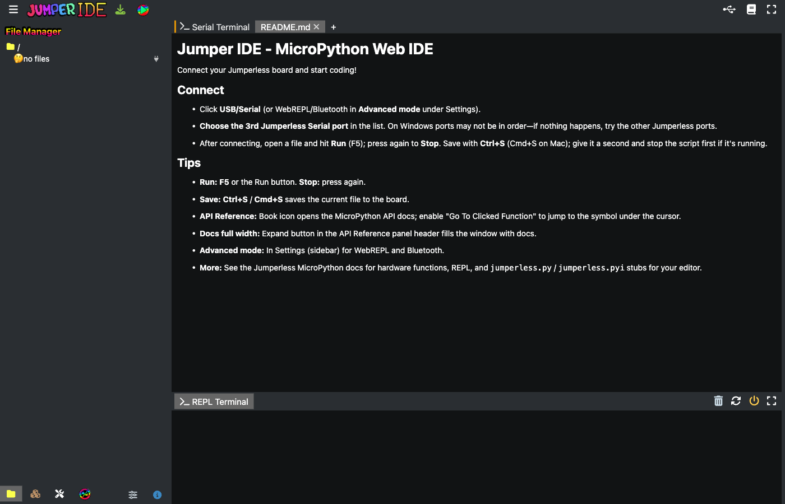

Choose the 3rd Jumperless port in that list (Windows may not put them in order, so if nothing happens, try the other ones) and click Connect


Then open some examples (this update should overwrite the examples with the new ones) and hit the Run / Stop button

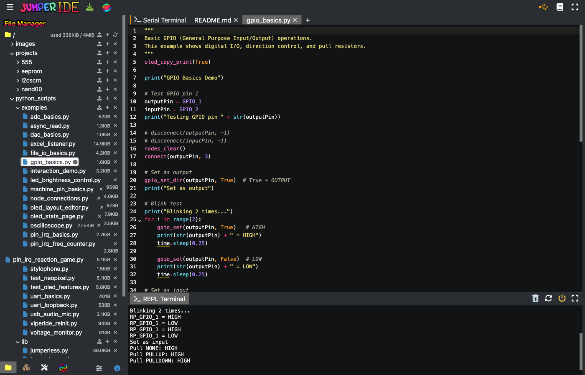

Press it again to Stop. If you make changes, hit the green Save button next to it (it takes a second and the script should be stopped.)

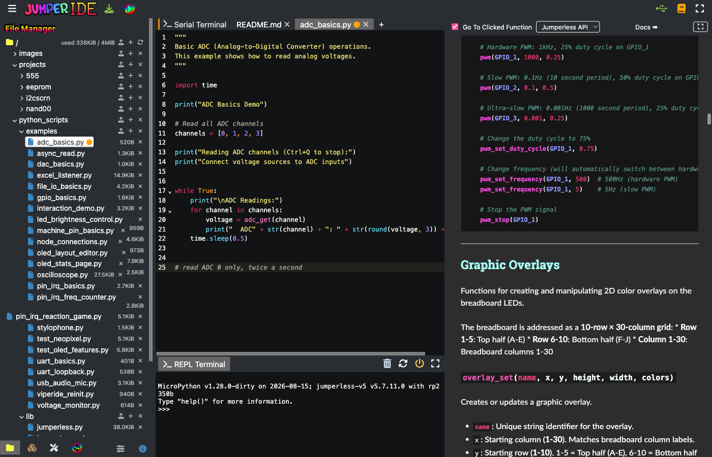

**Serial terminal.** The `Serial Terminal` tab is port 1, the board's main menu, so you get the REPL and the menu side by side. Click `Connect` in that tab, choose the 1st Jumperless port this time, and type `m`.

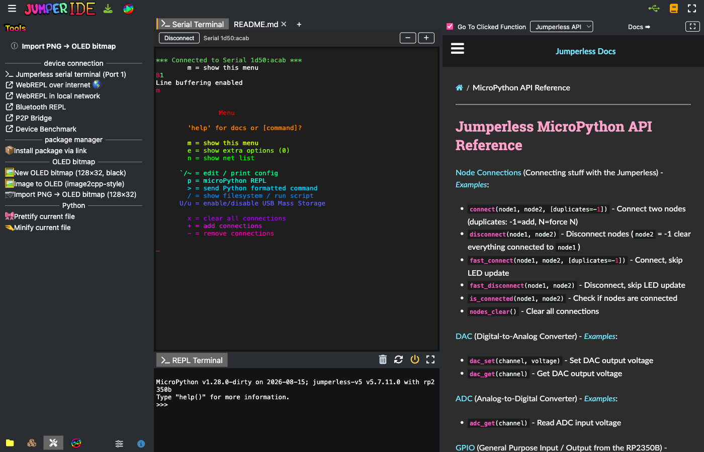

**API reference.** The book icon opens the MicroPython API docs on the right, and if you have `Go To Clicked Function` checked, the docs should jump to whatever function you click in your code.

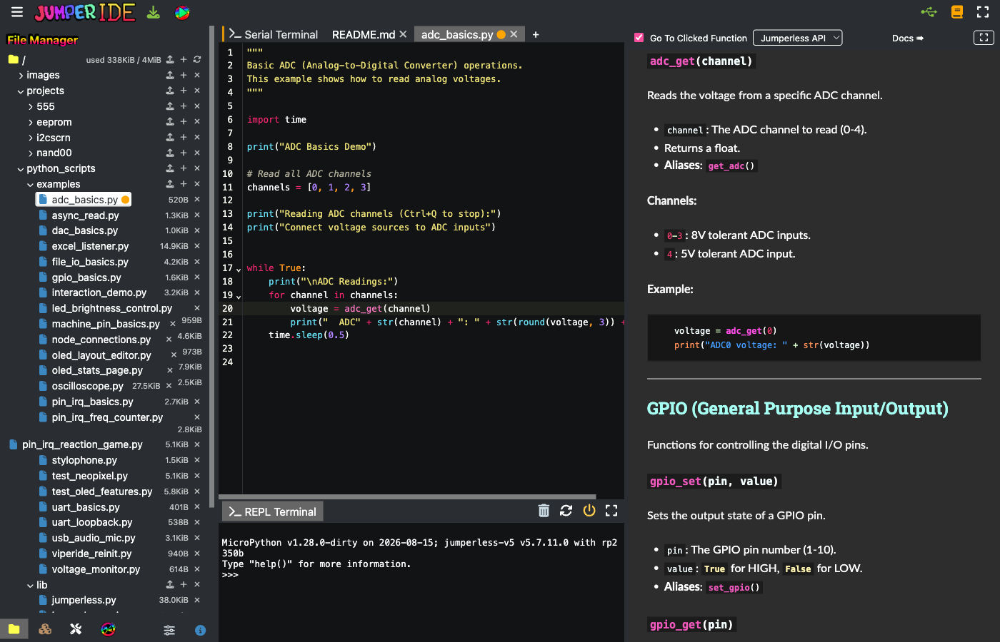

**JumperNet Registry.** The Jumperless icon in the sidebar is the JumperNet Registry, scripts people have shared from their own boards. It's one list, everybody sees the same one, and there's no account. Click a script and it opens in a tab, `Run` runs it on your board.

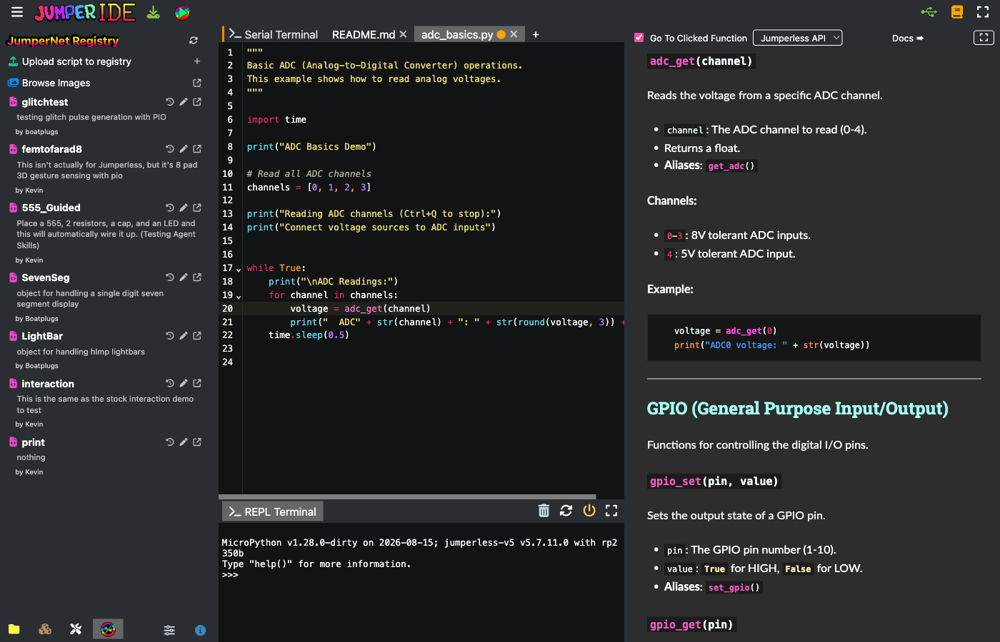

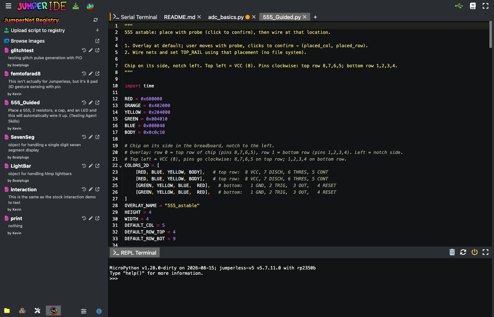

To share yours, have it open in a tab and click `Upload script to registry` at the top of the list. It asks for a name, your name, and a line about what it does (the code box is already filled in from the tab), and `Upload` puts it in the list for everyone right away, there's no review step. Work in progress scripts are fine, that's what it's for.

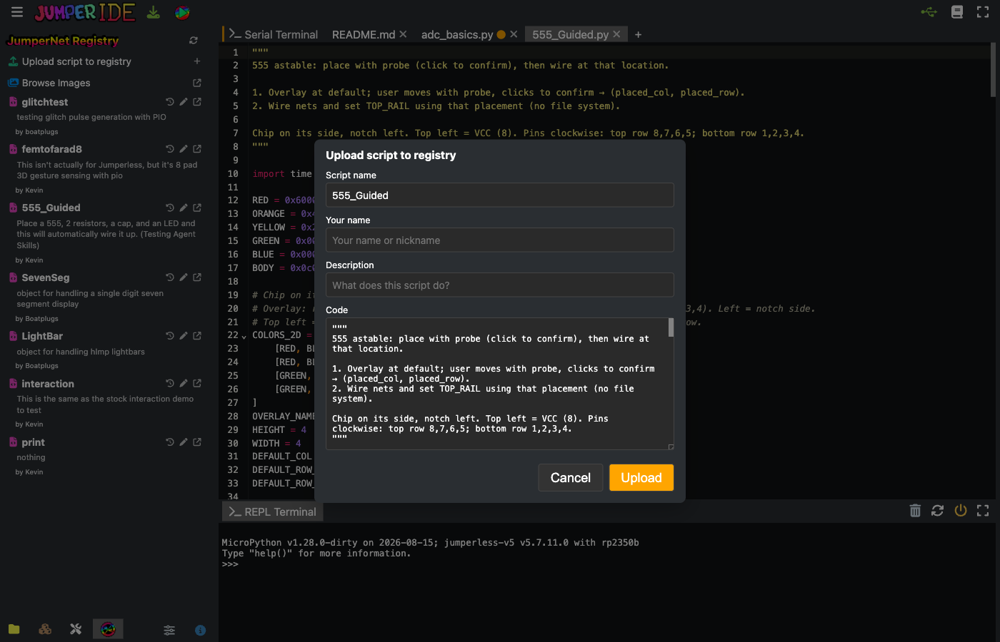

The three little icons on a row are open, edit and history. Anyone can edit anyone's script (it's wiki style, so fix the typos you find, and replace the prefilled `Your name` with yours or the edit gets filed under the last author), every version stays in the history, and `Load` opens an old one in its own tab without touching the current one.

To delete a script, edit it and set the name to `delete`. Nothing checks who you are, so only delete your own. OLED images work the same way for uploading and deleting (`Upload OLED image` shows up when a `.bin` is the open tab, `Browse Images` is the gallery), except only the original author can edit one, and an image's history is the last 50 versions. Every script uploaded gets synced into the [JumperIDE repo](https://github.com/Architeuthis-Flux/JumperIDE/tree/main/cloudflare/script-registry-worker/scripts) on its own, so the scripts are all on GitHub too, images live only in the registry.

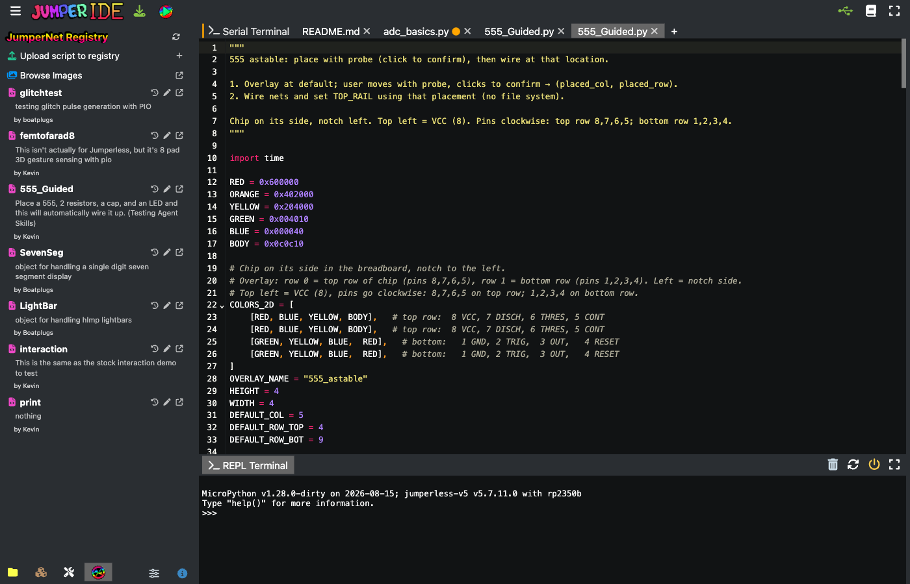

**OLED bitmaps.** `Tools` > `New OLED bitmap` gives you a 128x32 canvas, click or drag to draw, and with `Live to device` checked it should show up on the board's OLED as you draw ([more about the OLED here](04-oled.md)). `Download .bin` saves it and `Upload to registry` shares it. `Browse Images` in the registry shows everyone else's.

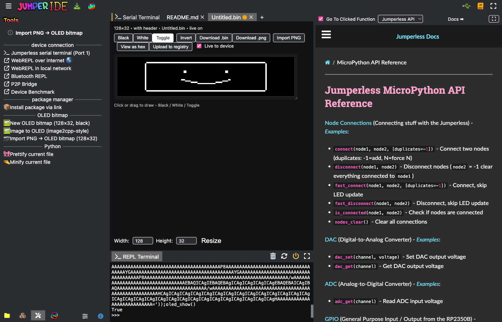


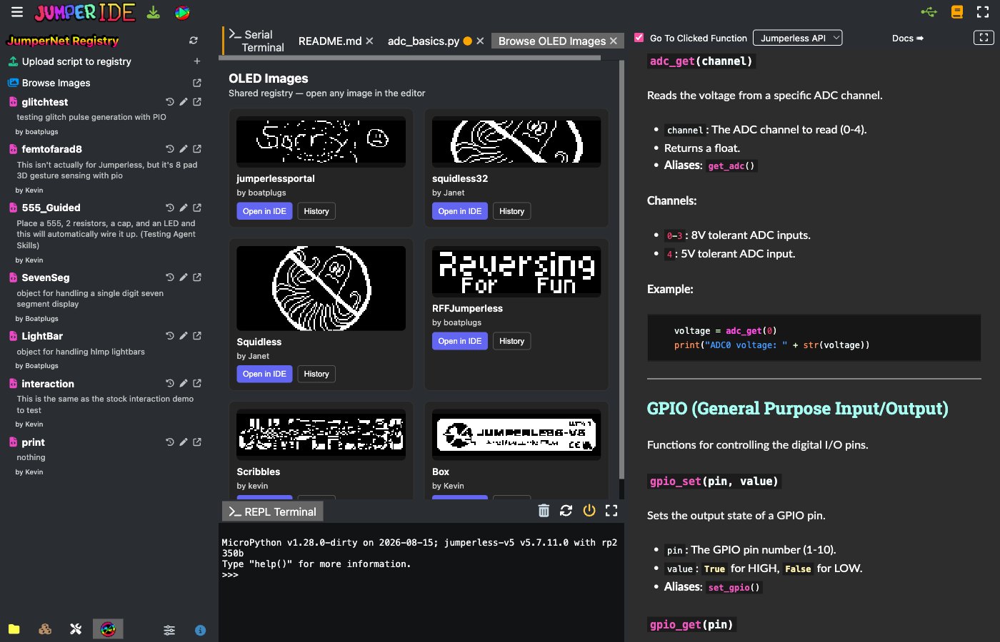

### If you write something cool, publish it to the JumperNet registry from JumperIDE for VS Code (**Jumperless: Publish Script to Registry**) and I'll add the good ones to the default examples.


This is using [MicroPython's built-in Raw REPL](https://docs.micropython.org/en/latest/reference/repl.html#raw-mode-and-raw-paste-mode), so anything that can interact with that will work here. I've tested it with JumperIDE, both the web one and the VS Code extension, but anything that speaks the raw REPL (like `mpremote`) should work on that 3rd port.


There's also `jumperless.py` and `jumperless.pyi` module with stubs for all the built-in functions so syntax highlighting and autocomplete  will work in your favorite code editor (sorry, autocomplete for jumperless functions doesn't work in the web IDE. JumperIDE for VS Code installs these stubs for you.) You can grab them here:

### [jumperless_module.py](https://github.com/Architeuthis-Flux/JumperlOS/blob/main/scripts/jumperless_module.py)
### [jumperless.pyi](https://github.com/Architeuthis-Flux/JumperlOS/blob/main/scripts/jumperless.pyi)

They're also already on the board as `/python_scripts/lib/jumperless.py` and `/python_scripts/lib/jumperless.pyi`, so you can just copy them off it.

---

## JumperIDE for VS Code


[](https://marketplace.visualstudio.com/items?itemName=ArchiteuthisFlux.jumperide)
[](https://open-vsx.org/extension/ArchiteuthisFlux/jumperide)
[](https://github.com/Architeuthis-Flux/JumperIDE-VSCode/releases/latest)
[](https://github.com/Architeuthis-Flux/JumperIDE-VSCode/blob/main/LICENSE)

Same idea as the web IDE, but it runs in VS Code (or Cursor, or VSCodium), so you get Pylance, git, and everything else you already have. Everything is in one sidebar, and the board shows up as a terminal.


#### Install

Search `JumperIDE` in the Extensions view, it's on the [VS Code Marketplace](https://marketplace.visualstudio.com/items?itemName=ArchiteuthisFlux.jumperide) and [Open VSX](https://open-vsx.org/extension/ArchiteuthisFlux/jumperide) (that's the one Cursor and VSCodium search). Or download the `.vsix` from the [latest release](https://github.com/Architeuthis-Flux/JumperIDE-VSCode/releases/latest) and run `code --install-extension jumperide-1.0.2.vsix` from the folder it's in.

The first time it loads it sets up autocomplete for the whole Jumperless API in every workspace (the stubs go in `~/.jumperless/typings`) and asks you to reload the window. The hover docs need Python and Pylance, `Set Up This Folder for Jumperless` offers to install them if you don't have them.

#### Connect

Click the Jumperless icon in the activity bar. The `Actions` view is the whole thing: a connection button that shows the state, `Run` and `Stop`, saving, the OLED editor, the terminal, the API reference, and publishing.

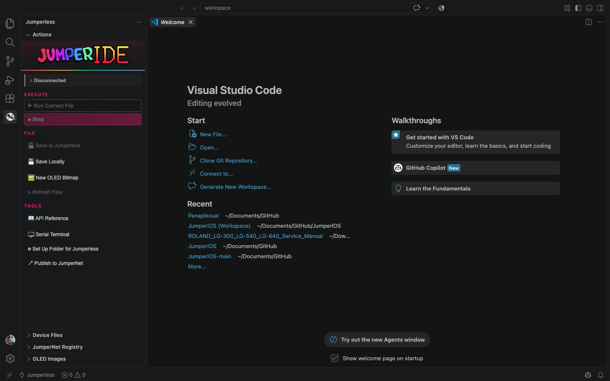

Click `Disconnected` (or `Jumperless` in the status bar, or `Jumperless: Connect` from the command palette) and pick the starred port, the one whose description ends in `MicroPython REPL — recommended`. On a Mac it reads `port5`. It's the 3rd Jumperless port and it isn't pre-selected, so don't just hit `Enter`, that gets you `port1`, the menu, which can't run scripts, and you end up in terminal-only mode with an empty file tree.

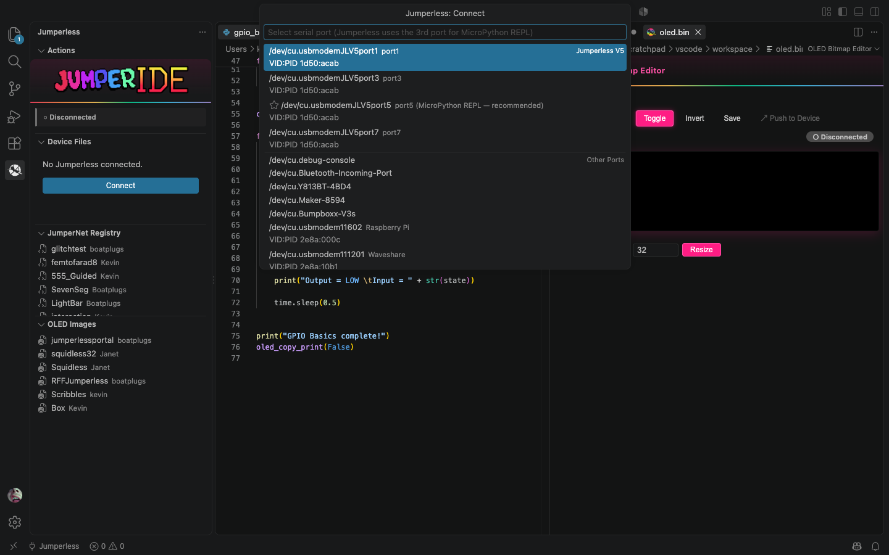

The status bar should turn pink with the board's name, `Device Files` fills in, and a `Jumperless REPL` terminal opens at the `>>>` prompt.

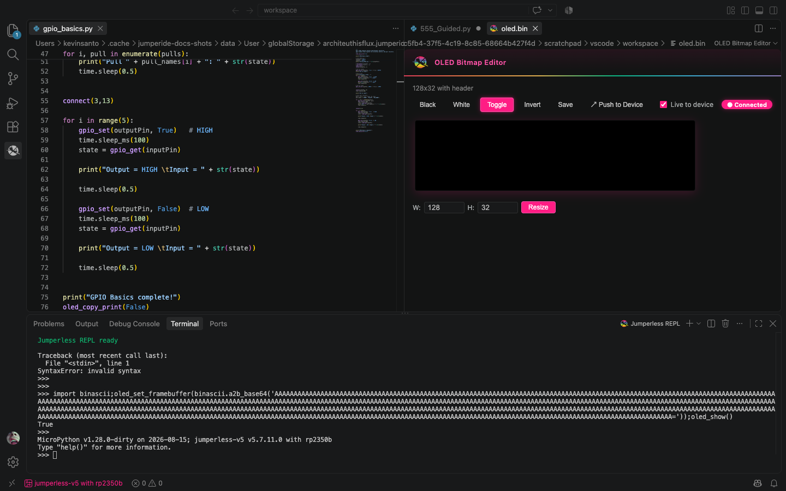

#### Files, run, stop

Click a file in `Device Files` and it opens as a local working copy, so Pylance sees it and hovering a Jumperless function gives you its docs. `Cmd+S` / `Ctrl+S` pushes it back to the board. The icons in the view's header are disconnect, refresh, new file, new folder and a new OLED bitmap, `Delete from Device` is on the right-click menu.

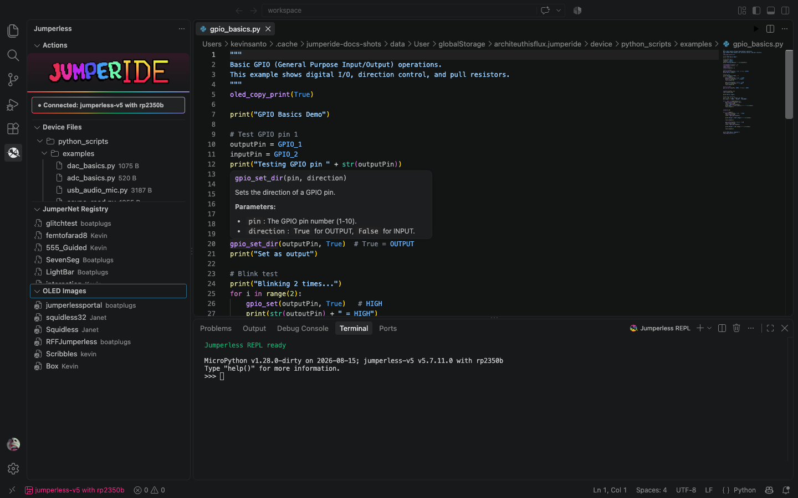

`F5` (or `Run Current File`) runs whatever is in the editor, as is, it doesn't save first. The output goes to the `Jumperless REPL` terminal. `Shift+F5` (or `Stop`) sends a `Ctrl+C`.

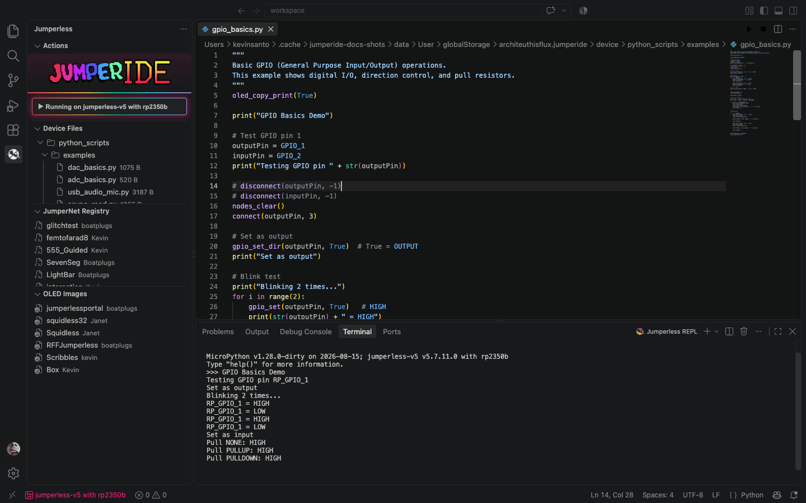

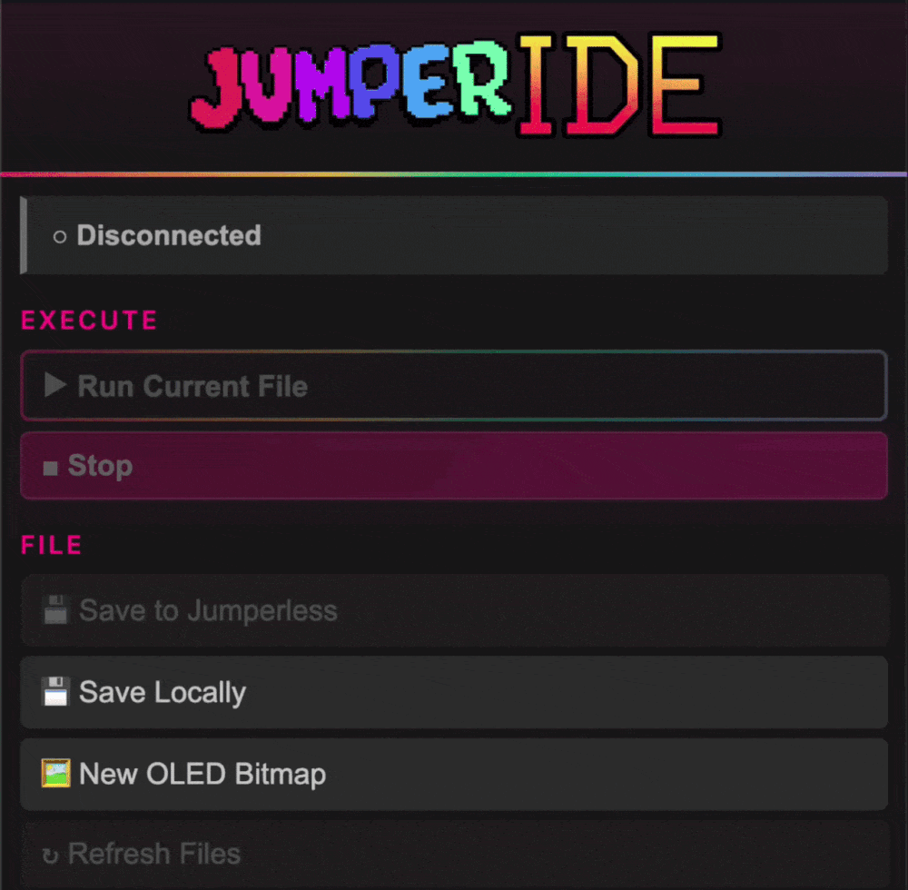

`Save to Jumperless` pushes the current file to the board (a file that didn't come from the board asks for a device path, prefilled with last time's answer), `Save Locally` saves a copy on your computer.

#### Serial terminal

`Serial Terminal` (or `Jumperless: Open Serial Terminal`) opens a second terminal on any port. `port1` is the starred one, that's the board's menu, and it types `m` for you so the menu comes up.

`Ctrl+Q` goes through to the board in these terminals instead of to VS Code. Or pick `Use Jumperless App` and it runs the [standalone app](https://github.com/Architeuthis-Flux/Jumperless-App) in a terminal instead.

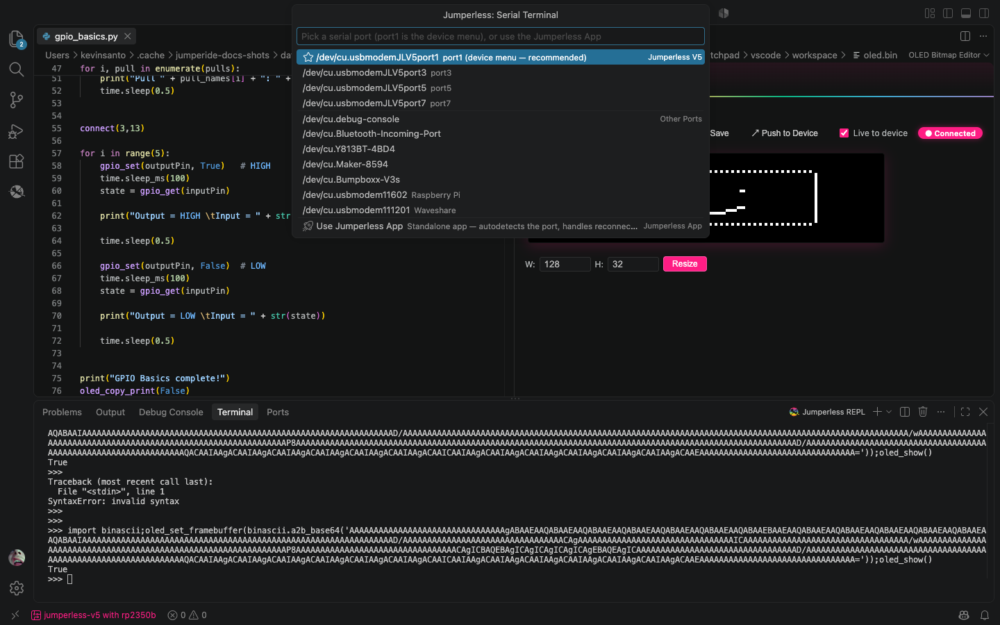

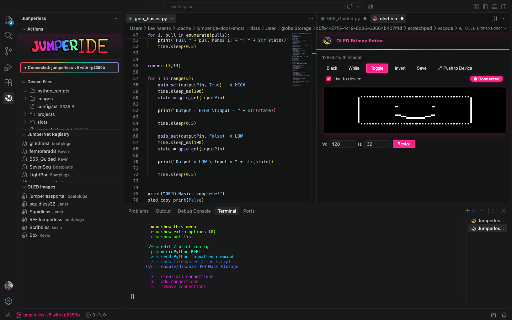

#### OLED bitmaps

`New OLED Bitmap` asks whether the file lives on the Jumperless or on this computer (if you're not connected it just saves locally), then opens a 128x32 pixel editor, and any `.bin` in `Device Files` opens in it too. `Black`, `White` and `Toggle` are the pens, and with `Live to device` checked every stroke should show up on the board's OLED as you draw (it `Ctrl+C`s a running script to do it). `Save` writes the `.bin`, `Push to Device` sends the whole thing once.

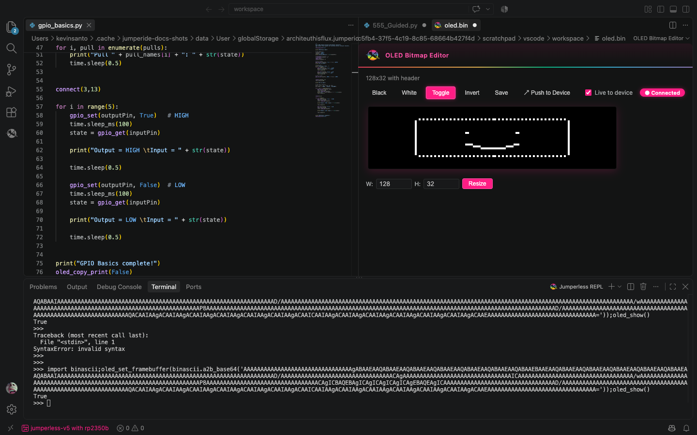


#### API reference

`API Reference` opens the [MicroPython API docs](09.5-micropythonAPIreference.md) beside your code. The hover docs and autocomplete come from the same place.

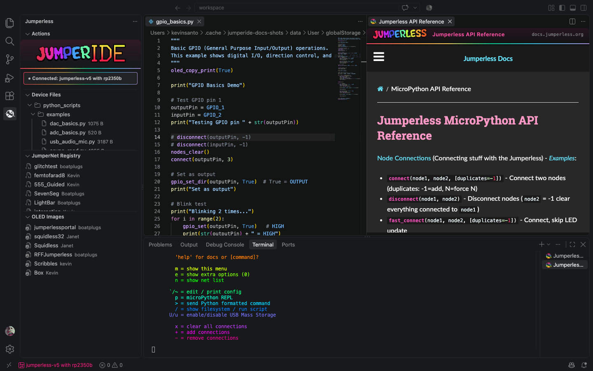

#### JumperNet

`JumperNet Registry` and `OLED Images` in the sidebar are the shared registry, the same one the web IDE shows. Click a script and it opens, right-click for `Save to Device`.

`Publish to JumperNet` (or `Jumperless: Publish Script to Registry`) uploads the file in the editor, it asks for a name, a description and your name. Editing and history are in the web IDE only.

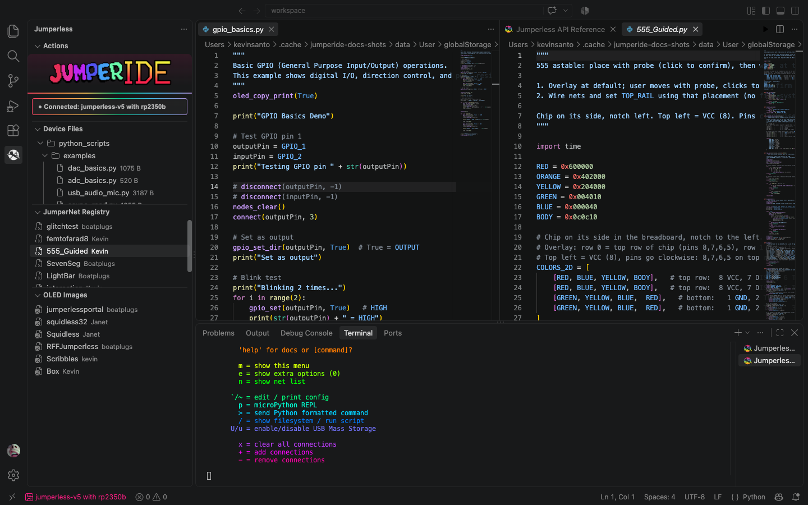

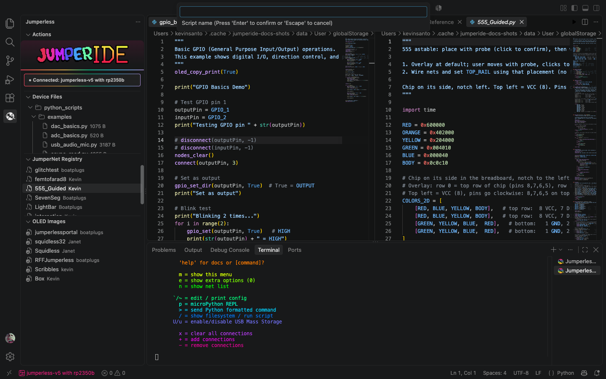

#### Settings

`jumperless.serial.preferredPortIndex` is which Jumperless port gets the star (2, the 3rd one), `jumperless.serial.baud` is 115200, `jumperless.registry.baseUrl` is the registry, and `jumperless.connectOnStartup` opens the port picker when VS Code starts.

#### Zero-import autocomplete

On the board, scripts run with the full API preloaded (`from jumperless import *` happens before your code). The editor matches that automatically: on first activation the extension installs typed stubs and points your Python analyzer at them, so files opened from the device resolve the whole API with no imports and no setup. (Controlled by `jumperless.setup.autoSetUpGlobally`, on by default.)

- `typings/jumperless.pyi` — typed stub, synced from [JumperlOS](https://github.com/Architeuthis-Flux/JumperlOS)
- `typings/builtins.pyi` — standard-library builtins with Jumperless globals layered on top (typo detection still works)
- `typings/time.pyi` — MicroPython `time` extras (`ticks_ms`, `sleep_ms`, …)

To get the same thing in one of your own project folders (checked into that repo instead of user settings), run **Jumperless: Set Up This Folder for Jumperless Python** — it writes the `typings/` folder and a `pyrightconfig.json` into the workspace.

---

## Quick Start (Built-in REPL)

<!-- ### Starting MicroPython REPL -->
From the main Jumperless menu, press `p` to enter the MicroPython REPL:


## REPL Navigation

Up / Down arrow keys on a blank prompt will scroll through history, any other key will break out of history mode and enter multiline editing. So you can use arrow keys to navigate and edit the script. 

In history mode, the `>>>` prompts will be pink, when you're editing, they'll be blue.


## Hardware Control Functions

All Jumperless hardware functions are automatically imported into the global namespace - no prefix is actually necessary. JumperIDE for VS Code already resolves them with its stubs, but in an editor without those it's probably good to use `import jumperless as j` so it doesn't complain about undefined names.

---


## Basic Script Structure
```jython
"""
My Jumperless Script
Description of what this script does
"""

print("Starting my script...")

# Connect some nodes
connect(1, 5)
connect(2, 6)

# Set up GPIO
gpio_set_dir(1, True)  # Output
gpio_set_dir(2, False) # Input

# Main loop
for i in range(10):
    gpio_set(1, True)
    time.sleep(0.5)
    gpio_set(1, False)
    time.sleep(0.5)
    
    # Read input (gpio_get returns truthy for HIGH, falsy for LOW)
    if gpio_get(2):
        print("Button pressed!")

# Cleanup
nodes_clear()
print("Script complete!")

```
   


## Loading and Running Scripts


### Method 1 (Recommended): [JumperIDE](https://ide.jumperless.org/)
See [above](#now-you-can-live-code-with-jumperide) for instructions. It's at the top of the page for a reason, it's awesome.

### Method 2: File Manager
From the REPL (enter `p` in the main menu), then type `files` to open the file manager:

```jython
>>> files
```

Navigate to your script and press Enter to load it for editing, then press `Ctrl+P` to load it into the REPL for execution.

**Note:** The standard Python `exec(open(...).read())` also works - the filesystem is mounted as a MicroPython VFS, so the built-in `open()` and the `os` module operate on the same files as `jfs`.

### Method 3: REPL Commands
From the MicroPython REPL, you can use the following commands to manage scripts:

```jython
# Put a saved script on the REPL input line to edit or run
# (bare `load` lists the saved scripts with numbers)
load my_script.py

# Save the last executed script (auto-named if you leave the name off)
save my_new_script.py
```

### Method 4: Direct Execution
From the main Jumperless menu, you can execute single commands. The `>` is the command, type it with the line, and use `print()` to see a value:

```jython
> gpio_set(1, True)
> print(adc_get(0))
> connect(1, 5)
```

## REPL (Interactive Mode)

### Starting REPL
From main menu: Press `p`

### REPL Commands
```jython
CTRL + q           - Exit REPL
quit               - Exit REPL
history            - Show command history and saved scripts
save [name]        - Save last executed script
load <name>        - Load script by name or number
files              - Open file manager
new                - Create new script with eKilo editor
edit               - Open the last input in the eKilo editor
multiline on|off|auto - Force multiline mode on or off, or go back to automatic (not in `helpl`, but it works)
context            - Toggle connection context
helpl              - Show REPL help
help()             - Show hardware commands
```

### Navigation
```
↑/↓ arrows         - Browse command history
←/→ arrows         - Move cursor, edit text
TAB                - Add 4-space indentation
Enter              - Execute (empty line in multiline to finish)
Ctrl+Q             - Force quit REPL or interrupt running script
```

### Multiline Auto-Indent Mode
The REPL automatically detects when you need multiple lines after a `:`, and it indents for you, so type the lines without the leading spaces.

```jython
>>> def blink_led():
...     for i in range(5):
...         gpio_set(1, True)
...         time.sleep(0.5)
...         gpio_set(1, False)
...         time.sleep(0.5)
... 
>>> blink_led()
```

If you want *real* multiline mode, type `multiline on` and then `run` to execute what you typed. `new` and `edit` open the eKilo editor straight from the REPL. 

### Command History
- Use ↑/↓ arrows to browse previous commands
- Commands are automatically saved
- Type `history` to see all saved scripts


## Connection Context Switching

The MicroPython REPL now supports **connection contexts** that determine how connections persist:

- **`global` context**: Changes persist to global state - connections remain after exiting Python
- **`python` context**: Connections you make in the session are undone when you exit, and the state from when you entered comes back

**To toggle contexts:** Type `context` in the REPL

**How it works:**
- In `global` mode: Any connections you make become permanent, just like using the normal command interface
- In `python` mode: The connection state when you entered the REPL is saved, and restored when you exit
- The current context is shown in the REPL banner when you enter, and by `helpl`. Typing `context` prints it too. The default is `global`


## Built-in Examples
The board comes with a pile of example scripts in `/python_scripts/examples/`. Every one of them is described on the [Examples](08.5-examples.md) page.

There are three ways to run one. From the REPL, type `files`, open the script, and press `Ctrl+P`. From the main menu, `/` opens the file manager and `/python_scripts/examples/adc_basics.py` runs a script directly. From the clickwheel, `Files` lists the filesystem and clicking a `.py` file runs it.


## Troubleshooting

**REPL not responding:**
- Press Ctrl+Q to force quit on the main menu port (port 1), or Ctrl+C on the 3rd port that JumperIDE uses
- Unplug / replug your Jumperless (don't worry, almost everything is persistent)


## Formatted Output and Custom Types
The Jumperless module returns custom types that print nicely but also work in conditionals:

```jython
# GPIO functions return custom types that print as readable strings
state = gpio_get(1)           # Prints "HIGH", "LOW", or "FLOATING"
direction = gpio_get_dir(1)   # Prints "INPUT" or "OUTPUT"
pull = gpio_get_pull(1)       # Prints "PULLUP", "PULLDOWN", or "NONE"

# These types are also truthy/falsy for use in conditionals:
if gpio_get(1):               # True if HIGH, False if LOW or FLOATING
    print("Pin is HIGH")
if gpio_get_dir(1):           # True if OUTPUT, False if INPUT
    print("Pin is output")

# Connection status works the same way
connected = is_connected(1, 5) # Prints "CONNECTED" or "DISCONNECTED"
if connected:                  # True if connected, False if not
    print("Nodes are connected")

# Voltage and current readings are floats
voltage = adc_get(0)          # Returns float (e.g., 3.300)
current = ina_get_current(0)  # Returns float in A (e.g., 0.0123)
power = ina_get_power(0)      # Returns float in W (e.g., 0.4567)

# All functions work with both numbers and string aliases
gpio_set_dir("GPIO_1", True)  # Same as gpio_set_dir(1, True)
connect("TOP_RAIL", "GPIO_1") # Same as connect(101, 131)
```


