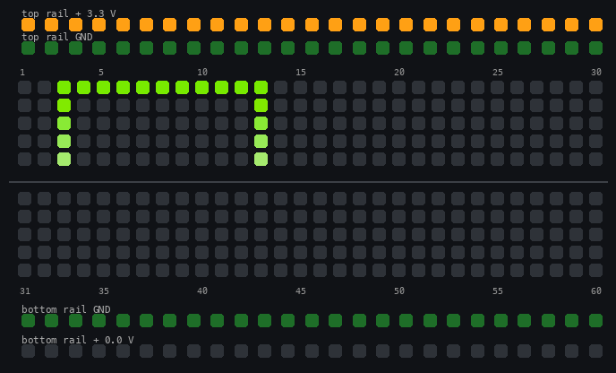
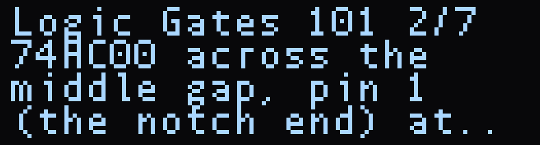
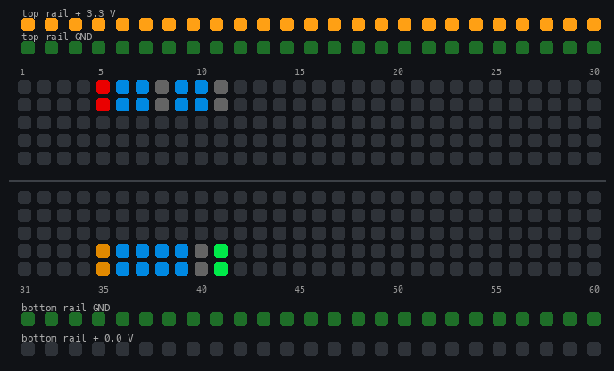
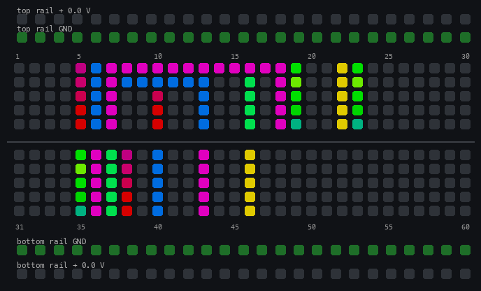

# Examples

Every Jumperless ships with a set of MicroPython example scripts in `/python_scripts/examples/` and four guided projects in `/projects/`. This page says what each one does, what you need to plug in, and what you'll see, so you can pick one instead of opening them one at a time. The sources are in the [JumperlOS repo](https://github.com/Architeuthis-Flux/JumperlOS/tree/main/scripts/ex) if you want to read them without a board.

If you're new to this, start with the [555 LED Flasher](#555-led-flasher) project. It shows you where each part of a real circuit goes and measures each one once it's in.

## Running an example

Three ways, pick whichever is closest to hand:

- **Click wheel:** `click` > `Files` > `examples` > pick a script and `click`. It runs, and the output goes to the terminal (and the OLED where the script uses it).
- **Terminal:** type its path, like `/python_scripts/examples/gpio_basics.py`. (`/` opens the file manager, but picking a script there opens it in the editor, and `Ctrl+P` from the editor is flaky right now, so just type the path.)
- **MicroPython REPL:** type `p` to get into the REPL, then `files`, open a script, press `Ctrl+P` to paste it into the REPL, and `Enter` to run it. Or from [JumperIDE](https://ide.jumperless.org/), open the file from the device browser and hit run.

To stop one that loops forever, press `Ctrl+Q` in the terminal (or `Ctrl+C` from the REPL or JumperIDE). It prints a `KeyboardInterrupt` traceback, that's normal. If it doesn't take, hold the click wheel for a few seconds. If you started it from the file manager or the REPL, `Ctrl+Q` backs you out one layer at a time.

A few of these call `nodes_clear()` when they start, which wipes whatever you had connected. They're marked below. Your slots aren't touched, so you can just load the slot again afterward.

??? tip "Try it"
    1. Open the terminal and run `/python_scripts/examples/gpio_basics.py` (it clears the board first). Rows 3 and 13 light up green as `GPIO 1` and `GPIO 2` get wired to them, and the terminal prints what it reads back.
    2. Run `/python_scripts/examples/adc_basics.py`. It prints the four ADC voltages twice a second. Press `Ctrl+Q` to stop it.

    

On the board they all live in `/python_scripts/examples/`. The links go to the source on GitHub.

## The basics

Short scripts, one idea each, no parts needed unless it says so.

- **[dac_basics.py](https://github.com/Architeuthis-Flux/JumperlOS/blob/main/scripts/ex/dac_basics.py)** - Steps `DAC 1` and both rails through 0 V, 1.5 V and 3.3 V, reading each one back with `dac_get()`. You'll see the rail LEDs change with it. It skips `DAC 0` because that one normally powers the probe. Runs once. It leaves the rails at 0 V when it's done, so set them again after.
- **[adc_basics.py](https://github.com/Architeuthis-Flux/JumperlOS/blob/main/scripts/ex/adc_basics.py)** - Prints the voltage on `ADC 0`-`3` twice a second, forever. It doesn't connect anything, so route a voltage to an ADC first (the `ADC` pad on the probe, or `connect(ADC0, 20)`) or you'll just see noise. `Ctrl+Q` to stop.
- **[gpio_basics.py](https://github.com/Architeuthis-Flux/JumperlOS/blob/main/scripts/ex/gpio_basics.py)** - Wires `GPIO 1` to `row 3` and `GPIO 2` to `row 13`, blinks the output, cycles the input's pull resistor through none / up / down, then bridges the two rows so the input reads the output back. Everything prints to the terminal and the OLED. Runs once. *Clears the board first.*
- **[node_connections.py](https://github.com/Architeuthis-Flux/JumperlOS/blob/main/scripts/ex/node_connections.py)** - `connect()`, `is_connected()`, `disconnect()` and `print_bridges()` on four pairs of nodes (rows, `DAC0`, `GPIO_1`). The LEDs are the show here: each pair lights as its own net for half a second and then goes out. Runs once. *Clears the board first and last.*
- **[machine_pin_basics.py](https://github.com/Architeuthis-Flux/JumperlOS/blob/main/scripts/ex/machine_pin_basics.py)** - The same GPIO driven two ways: the Jumperless `gpio_*()` calls with node names, and stock MicroPython `machine.Pin` (`GPIO_1`-`8` are RP2350 pins 20-27). Routes `GPIO 1` to `GPIO 2` through the crossbar so one drives and the other reads, and ends with a `pin.irq()` edge count. Runs once, no parts.
- **[file_io_basics.py](https://github.com/Architeuthis-Flux/JumperlOS/blob/main/scripts/ex/file_io_basics.py)** - A tour of the [jfs](09.6-jfs.md) filesystem framed as a little data logger: write, append, seek, list, rename, delete, and what happens when you open too many files. Terminal only, runs once.
- **[uart_basics.py](https://github.com/Architeuthis-Flux/JumperlOS/blob/main/scripts/ex/uart_basics.py)** - Opens `machine.UART` at 115200 and routes `UART Tx`/`Rx` to the Nano header's `D0`/`D1`, then sends a message every 1.5 seconds. You need something in the Nano header listening; the script itself prints nothing after the banner. `Ctrl+Q` to stop.
- **[uart_loopback.py](https://github.com/Architeuthis-Flux/JumperlOS/blob/main/scripts/ex/uart_loopback.py)** - Connects `UART Tx` and `Rx` to the same node so the board talks to itself, and prints what it reads back every half second. A good "is the UART alive" check with no parts. (At the moment it mostly prints `None`, the loopback needs a fix.) `Ctrl+Q` to stop.
- **[voltage_monitor.py](https://github.com/Architeuthis-Flux/JumperlOS/blob/main/scripts/ex/voltage_monitor.py)** - Connects `ADC 0` to `row 12` and shows the voltage on the OLED and the terminal, refreshed constantly. It clears row 12 when it starts, so put your 0 to 3.3 V on row 12 (a pot wiper, a rail, a DAC) after it's running. `Ctrl+Q` to stop.

## Interrupts

These use `machine.Pin.irq()`, which fires the instant a pin changes instead of whenever a loop gets around to checking.

- **[pin_irq_basics.py](https://github.com/Architeuthis-Flux/JumperlOS/blob/main/scripts/ex/pin_irq_basics.py)** - Routes `GPIO 1` to `GPIO 2`, pulses one, and catches the rising and falling edges on the other with a handler. Prints the running counts and a `PASS` line. No parts, runs once.
- **[pin_irq_freq_counter.py](https://github.com/Architeuthis-Flux/JumperlOS/blob/main/scripts/ex/pin_irq_freq_counter.py)** - A frequency counter. PWM on `GPIO 1`, routed to `GPIO 2` and to `row 20` so you can scope it, and a hard interrupt counting the edges. Turn the wheel to change the frequency and watch the measurement follow it. `Click` the wheel to quit. No parts.
- **[pin_irq_reaction_game.py](https://github.com/Architeuthis-Flux/JumperlOS/blob/main/scripts/ex/pin_irq_reaction_game.py)** - A reaction timer. Wait for the green block on the LEDs, then tap as fast as you can; a hard interrupt timestamps the tap to the microsecond. Five rounds, then a best / average. Needs a tact switch across rows `28` and `30` (or a jumper wire in row 30 that you tap into row 28). If you never tap, it just ends after five misses.

## Interactive

- **[interaction_demo.py](https://github.com/Architeuthis-Flux/JumperlOS/blob/main/scripts/ex/interaction_demo.py)** - Reads every control at once from one loop: tap a pad to move a bridge there, turn the wheel to slide it, press the probe buttons to shift its color, and flip the probe switch to `Measure` to have it walk up the board on its own. It prints nothing, watch the board. No parts. `Ctrl+Q` to stop.
- **[led_brightness_control.py](https://github.com/Architeuthis-Flux/JumperlOS/blob/main/scripts/ex/led_brightness_control.py)** - Touch a pad and `DAC 0` goes to that pad number's share of 5 V (pad 30 is 2.5 V), dimming an LED on `row 15`. The OLED shows the voltage and the current it draws. Put an LED (with a resistor) from row 15 to `GND`. (This one crashes with a `NameError` on its first loop unless the probe is already on a pad, I'm fixing it.) `Ctrl+Q` to stop.
- **[stylophone.py](https://github.com/Architeuthis-Flux/JumperlOS/blob/main/scripts/ex/stylophone.py)** - Touch a pad and `GPIO 1` plays a tone at 40 Hz times the pad number. The probe buttons lengthen and shorten the sustain. Put a speaker or piezo between `row 25` and `row 55`. `Ctrl+Q` to stop.
- **[oled_layout_editor.py](https://github.com/Architeuthis-Flux/JumperlOS/blob/main/scripts/ex/oled_layout_editor.py)** - Lay out two lines of text on the OLED with the board itself: tap a top-row pad to put the selected text on the top line at that position, a bottom-row pad for the bottom line, rail pads to nudge it up and down, the wheel to change the size, `Connect` to change the font, and type the text in the terminal. `Remove` saves it to `/screens/layout.json` so you can read the numbers off for your own scripts. Needs an OLED. `Ctrl+C` to stop.

## OLED

These need an [OLED](04-oled.md).

- **[oled_stats_page.py](https://github.com/Architeuthis-Flux/JumperlOS/blob/main/scripts/ex/oled_stats_page.py)** - Builds a screen with the four ADC voltages and the uptime, and makes it the idle page in place of the logo. The numbers keep updating after the script ends, and the page steps aside for menus and comes back after. To get rid of it, run `import oledgui; oledgui.hide()` in the REPL.
- **[test_oled_features.py](https://github.com/Architeuthis-Flux/JumperlOS/blob/main/scripts/ex/test_oled_features.py)** - Runs through the OLED functions one section at a time: text sizes, print mirroring, fonts, bitmaps, the framebuffer, scrolling. About 30 seconds. (Right now the terminal output stops partway, at the small text scrolling test.). Handy as a copy-paste reference for each call.
- **oledgui.py** (in `/python_scripts/lib/`) - Not a script you run. It's the library the two above import: `Screen`, `Text`, `Line` and `Rect` objects on top of the retained-screen OLED calls, with `{adc:0}`-style tokens that update themselves. See the [API reference](09.5-micropythonAPIreference.md).

## Tools

Bigger scripts that turn the board into an instrument.

- **[oscilloscope.py](https://github.com/Architeuthis-Flux/JumperlOS/blob/main/scripts/ex/oscilloscope.py)** - A scope on the OLED. Tap a row with the probe to put `ADC 0` there, turn the wheel to change the selected setting, `click` to cycle through timebase, volts per division, trigger level, trigger edge and auto-range. The front probe button resets the settings; the rear one exits. Signals need to be 0 to 3.3 V. Needs an OLED. (Too big to load on a board without PSRAM right now, it says `out of memory`.)
- **[usb_audio_mic.py](https://github.com/Architeuthis-Flux/JumperlOS/blob/main/scripts/ex/usb_audio_mic.py)** - Makes the Jumperless show up on your computer as a 2-channel 16 kHz microphone called `JL Audio In` (the rate is a `[usb_audio]` key in [config](06-config.md)), with `row 20` as the left channel and `row 40` as the right (±8 V full scale). Run it once to turn the device on (the serial port drops and comes back after a couple of seconds), then run it again to watch the levels. Record with anything: Audacity, QuickTime, a browser. `Ctrl+Q` to stop the script, `JL Audio In` stays on your computer until you unplug the board.
- **[excel_listener.py](https://github.com/Architeuthis-Flux/JumperlOS/blob/main/scripts/ex/excel_listener.py)** - The board side of the Excel GUI workbook: it takes connection and voltage commands over serial and answers with measurements. Needs `[usb_cdc] ignore_dtr = 1;` in your [config](06-config.md), and it tells you so if it's missing. *Clears the board first.* (Same problem as the oscilloscope, it doesn't load without PSRAM.)

## Utilities

- **[async_read.py](https://github.com/Architeuthis-Flux/JumperlOS/blob/main/scripts/ex/async_read.py)** - Nothing Jumperless-specific, just how to check for keyboard input without blocking (`select.poll()` on `stdin`). Type something and it prints an `ack` and echoes it. Its banner says `Ctrl+C`, but `Ctrl+Q` is what stops it from the terminal.
- **[test_neopixel.py](https://github.com/Architeuthis-Flux/JumperlOS/blob/main/scripts/ex/test_neopixel.py)** - Drives a WS2812 strip from `GPIO 1` with six animations; the wheel picks the speed and its button picks the mode. Data on `row 15`, ground on `row 14`, power from the top rail on `row 16` (set the rail to 5 V yourself, `Rails` > `Top` on the wheel or `dac_set(TOP_RAIL, 5)` in the REPL). Until the `neopixel` package is installed it stops at `ImportError: no module named neopixel`. It also shows how to install a module from the ViperIDE package manager, which you have to do first or `import neopixel` fails. *Clears the board first.*
- **[viperide_reinit.py](https://github.com/Architeuthis-Flux/JumperlOS/blob/main/scripts/ex/viperide_reinit.py)** - The handshake an IDE runs when it connects: board info, flash usage and a file listing in a machine-readable format. Not really an example, but it's there if you're writing your own host tool.

## Guided projects

The four projects in `/projects/` are the "hello world" circuits. Each one is a wiring file, a README, and a `main.py`. The first time you open one it loads as your circuit: the top rail gets set (5 V for the 555, 3.3 V for the others), the parts' pins light up along the board edge so you can see where they go, and the OLED walks you through them one at a time. You push the parts in, and the Jumperless can measure each one to tell you it's seated right.

To open one, type `z` and its name in the terminal (`z 555`), or from the wheel go to `Files` > `projects` > the project's folder and `click` `wiring.yaml`. Then:

- The OLED shows the step (`555 LED Flasher 3/9`) and the rows for that step's part light up (they stay lit while the steps are showing).

    

    
 Turn the wheel to move between steps, `hold` to put the steps away. In the terminal, `z steps` prints the current step, and `z steps next`, `z steps prev`, `z steps 3`, `z steps off` and `z steps on` do what they say.
- Push the part in where the step says. Tap one of its rows with the probe and the OLED tells you which pin that is.
- `z check R1` (any part name, or `z check step 3`) measures the part and prints what it read: a resistor's value, an LED's forward voltage, whether a chip answers. A resistor that reads `open` has a leg out of the hole, `short` means both legs are on the same side of the gap. The 555's resistor steps only measure, any value passes. The other projects check the value, so a resistor far from the one in the wiring file gets a `fail` and a `wrong part?`.
- Opening a project doesn't make the connections between the parts. In this version you make those yourself, with the probe or the `+` command, from the wiring file's `connect:` lines. The 555's are all in the box below.
- `z 555` runs `main.py` as soon as the project opens, `z 555 noscript` opens it without. From the Files browser, run `main.py` yourself from the project's folder. `Hold` the wheel for a few seconds to stop it. `Ctrl+Q` works too, as long as you haven't typed anything else into the terminal since it started.
- What you build is saved in the project's own run file (`/projects/555/555_run.yaml`), so it's still there next time you open it. `z 555 new`, or clicking `wiring.yaml` in Files, starts over from the shipped wiring. `x` clears a project's parts along with its connections, so if a project opens with no parts and only a couple of steps, that's what happened to its run file. `z 555 new` brings it back.

??? tip "The 555's connections"
    With the chip's pin 1 at `row 35` and the other parts where the steps put them, this one line makes every connection in the wiring file:

    ```
    + 35-gnd,36-7,38-top_rail,5-top_rail,10-top_rail,40-6,13-6,43-7,18-7,19-gnd,23-gnd,16-37,46-22
    ```

    That's the 555's `GND`, `TRIG`, `RESET` and `VCC`, R1 from the rail to `DIS`, R2 from `DIS` to `THR`, the cap and the LED to ground, and R3 from `OUT` (row 37) to the LED.

    

### 555 LED Flasher

An NE555 blinking an LED. `z 555`. Parts: an NE555 (DIP-8, pin 1 at `row 35`, across the middle gap), two resistors around 10k and 47k, a 10 µF capacitor, an LED, and a 330 Ω resistor for it. The exact values don't matter, anything in the right order of magnitude works, because `z check R1` measures each resistor and `main.py` uses those readings to work out the blink rate *your* parts should give. Then it counts the actual blinks and prints both next to each other, and even solves backward for the capacitor's real value from the blink it sees. [Source and full README.](https://github.com/Architeuthis-Flux/JumperlOS/tree/main/scripts/projects/555)

### Logic Gates 101

One gate of a 74HC00 quad NAND. `z nand00`. The Jumperless drives both inputs from GPIO, reads the output back on a third, and lights an LED from the same output. `main.py` prints the truth table with an `ok` / `WRONG` per row, then lets you type input pairs (`00`, `01`, `10`, `11`) and see what comes out. Parts: a 74HC00 (DIP-14, pin 1 at `row 35`), an LED, and a 330 Ω resistor. [Source.](https://github.com/Architeuthis-Flux/JumperlOS/tree/main/scripts/projects/nand00)

### Type to Screen

An I2C OLED module pushed into the breadboard anywhere you like, wired to the Jumperless's I2C pins by the crossbar. `z i2cscrn`. `main.py` asks where you put `GND`, `VCC`, `SCL` and `SDA` (tap each with the probe), lets you pick the driver (SSD1306 128x32 or 128x64, SH1106), and then whatever you type in the terminal shows up on the module. Parts: any 4-pin SSD1306 or SH1106 module. Turn the Jumperless's own top OLED off while you use this, they share the I2C pins. [Source.](https://github.com/Architeuthis-Flux/JumperlOS/tree/main/scripts/projects/i2cscrn)

### EEPROM Dumper

A 24C02 or 24C16 serial EEPROM read over I2C and hex-dumped to the terminal, with the write-protect pin held by the board's own wiring. `z eeprom`. Parts: the EEPROM (DIP-8, pin 1 at `row 35`) and two 4.7k pull-up resistors. Same note as above about the top OLED. [Source.](https://github.com/Architeuthis-Flux/JumperlOS/tree/main/scripts/projects/eeprom)

## Where to go next

- **[MicroPython](08-micropython.md)** - the REPL, JumperIDE, and how scripts are structured.
- **[MicroPython API Reference](09.5-micropythonAPIreference.md)** - every function these scripts call.
- **[JFS](09.6-jfs.md)** - reading and writing files on the board.
- **[Parts](05.5-parts.md)** - the part placement and Auto Scan the guided projects are built on.

If you write something cool, send it to me and I'll add it to the examples.
