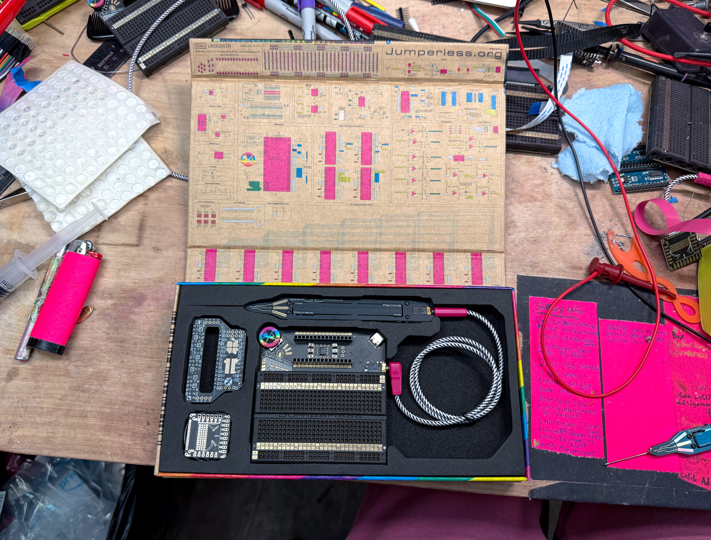

# Odds and Ends

<!-- 
## What's New in JumperlOS

JumperlOS is now a proper operating system with a priority-based task scheduler! This is a huge refactor from the original firmware:

- **Viper IDE and Micropython raw REPL** - Live code on the Jumperless' file system in your browser
- **Priority-based task scheduler** - Each component has a `service()` routine that checks whether it should do anything, replacing the old busy-wait loop
- **Auto-reloading state files** - Edits to the YAML state files are applied automatically - when you quit the onboard editor, or when you eject the USB MSC drive if you edited them from your computer
- **Better fonts** - New fonts available: `Berkeley`, `Iosevka`, `Pragmat[ism]`
- **YAML connection files** - More permissive of malformed syntax
- **Unified syntax highlighting** - Works consistently in `eKilo`, `python`, and normal input after `>`
- **Encoder-based connections** - Use the clickwheel to scroll through and select nodes without touching the probe
- **Current sensing marching ants** - Animated visual feedback showing current flow direction between I+ and I- connections
- **Python context switching** - Toggle between `global` and `python` connection contexts in the MicroPython REPL

The JumperlOS firmware repo is at [https://github.com/Architeuthis-Flux/JumperlOS](https://github.com/Architeuthis-Flux/JumperlOS)

--- -->

## Safety Info

Here's an image of the little card that should have been inside your box

![Safety info Never put voltages above +9V or below -9V anywhere on this board. Don't use unpowered, the crossbars need power to block voltage too. Don't power externally, use the internal power supplies (rails / DACs). It can be powered from the 5V and GND pins on the Nano header or the FPC adapter instead of USB. External signals are okay, as long as the board remains powered.This board gets fairly warm in normal operation from the LEDs, if it ever gets hot, unplug it immediately and let me know. When the switch on the probe is set to Select Mode,
it should only be used on the gold probe sense pads.The probe tip in Select Mode is always at 3.3V. Don't stab yourself or others with the probe, unless it's in self-defense. Do not eat your Jumperless V5. When in doubt, don't hesitate to ask!](https://github.com/user-attachments/assets/d7f13c5b-da36-488d-81e4-cf43be6adb30)

- Never put voltages above +9V or below -9V anywhere on this board.

- Don't use unpowered, the crossbars need power to block voltage too.

- Don't power externally, use the internal power supplies (rails / DACs).

- It can be powered from the 5V and GND pins on the Nano header or the FPC adapter instead of USB.

- External signals are okay, as long as the board remains powered.

- This board gets fairly warm in normal operation from the LEDs, if it ever gets hot, unplug it immediately and let me know.

- When the switch on the probe is set to Select Mode, it should only be used on the gold probe sense pads.

- The probe tip in Select Mode is always at 3.3V.  

- Don't stab yourself or others with the probe, unless it's in self-defense.

- Do not eat your Jumperless V5.

- When in doubt, don't hesitate to [ask!](https://discord.gg/bvacV7r3FP)

There are a lot of exceptions to these if you know what you're doing. It's pretty hard to permanently damage this board.

Some things (usually external power with the Jumperless off) can cause lockup on the [analog CMOS switches](https://tinyurl.com/24xrspea), but the current limiting resistors on their power supply pins generally keep them from drawing so much current that they permanently break. In situations where one chip is getting crazy hot, the first thing to try is to unplug the Jumperless, let it cool down, and try it again (obviously, change whatever you think was causing it). Most of the time they go back to normal after some rest.

Don't let any of this scare you, I'd rather you just pretend it's indestructible and use it with reckless abandon. So if you manage to break anything, just let me know and I'll send out a fresh one and a return label, no questions asked*.

*Actually, a ton of questions asked, so we can figure out how it happened and maybe prevent it from happening to someone else. But the point is I don't care if it's clearly your fault and not some manufacturing defect, I will make sure you have a working Jumperless.

It's even printed on the box

---

## Adapter Boards

There are two little boards in the box with your Jumperless, the SBC adapter and the FPC adapter (on rev 5 boards the OLED plugs into the SBC adapter, that's on the [OLED page](04-oled.md)). Neither of these are particularly importany

### SBC Adapter

This one plugs into the Nano header and maps it to the GPIO pins on any Raspberry Pi, so the Pi's pins show up as `node`s you can route like anything else. The Pi's GPIO numbers are printed on it (the BCM ones, not the header positions). Yes, the Raspberry Pi's 40 pin GPIO port has some very silly pin numbering, so I had to kinda follow that.

The Pi's `TXD` and `RXD` (14 and 15 on the adapter, pins 8 and 10 on the Pi) land on `D0` and `D1`, so `A` connects them to the Jumperless's routable UART and you can have the Pi control the Jumperless over the UART lines for fully remote Jumperless-ing, the tags for that are on the [Arduino page](05-arduino.md#commands-from-routable-uart). Or don't press `A` and route them wherever you want on the breadboard.

There's a little 2 pad solder jumper on it by the `5V` label in the `Tx`/`Rx` corner (`JP3` in the KiCad files, it comes open) that you can bridge to connect the 5V busses together and power your Jumperless from the Raspberry Pi. This is kinda why I didn't want to mess with USB-C Power Delivery or anything, it's kinda cool to just be able to shove in 5V from wherever, as long as it can provide 500-1000mA.

The 4 pin column at the bottom left (with the Pi header at the top) is where the OLED goes, it's on `D2` and `D3`, which is the `gpio_7_8` connection on the [OLED page](04-oled.md). The OLED friction-fits onto the board with wiggly offset holes so you can always remove it to read the pin mappings for the Pi.

I also threw in some universal-ish SMD footprints on the top, between the header rows. Also note that the SMD pads with the blobby extensions aren't connected to anything, I'm really shoving a square peg in an Arduino Nano shaped hole here, so some weirdness was inevitable.

I talked about these in [my first update](https://www.crowdsupply.com/architeuthis-flux/jumperless-v5/updates/single-board-computer-fans-rejoice), and there are actual pictures instead of renders in [this one](https://www.crowdsupply.com/architeuthis-flux/jumperless-v5/updates/good-news-everyone-things-are-happening).

### FPC Adapter

The ribbon cable goes into the 20 pin FPC connector on the back of the Jumperless and brings the routable GPIO 1-8, the routable UART `Tx` and `Rx`, ADC 0-3, DAC 0 and 1, and 5V and GND out to pin headers on this board so you can clip a scope or meter to them. GPIO (or RP) 6 and 7 (`RP6` and `RP7` on the silkscreen) are on there too, but they only go to the RP2350, they're not on the crossbar (they're the `rp6_rp7` OLED connection on the [OLED page](04-oled.md)).

  

  

(note: the GPIO numbers on the silkscreen start at 0, so 0 on the adapter is GPIO 1 on the Jumperless.)

It has 2 Qwiic / STEMMA QT ports. You hook their `SDA` and `SCL` to any of the routable GPIO (or `Tx`/`Rx`/`RP6`/`RP7`) with that weird, wiggly footprint in the middle of the back side, one column is `SDA` and the other is `SCL`, put a solder blob on each one where you want it (they don't go anywhere until you do). You can also connect each port to a different pair of GPIO by cutting it somewhere in the middle. They come with 3.3V power (there's a little regulator on the board for it), the three-way solder jumper with `3V` and `5V` next to it (`JP1` in the KiCad files) switches that, cut the `3V` side that comes bridged and blob the `5V` side.

The column of double pads (on the left from the front, on the right in the back-side photo) fits a [Bus Pirate](https://buspirate.com/) cable, its IO pins land on the routable GPIO and its `Vout` on the `Ax` pad. Blob `Ax` to whichever ADC or DAC you want `Vout` on, same deal as the Qwiic lines.
If you want to see exactly where all those traces go before you start blobbing or cutting, here's the layout from KiCad with each copper layer highlighted:

  
  

The Jumperless can be powered from the 5V and GND pins on here instead of USB, same as the Nano header (that's on the [safety card](#safety-info) above). The pads along one edge are for daisy chaining a second Jumperless, there's no firmware for that yet.

This one's in [that same update](https://www.crowdsupply.com/architeuthis-flux/jumperless-v5/updates/good-news-everyone-things-are-happening) too.

---

## Joom

You can get the .uf2 file here:

[https://github.com/Architeuthis-Flux/joom/releases/download/0.0.1/joom_full.uf2](https://github.com/Architeuthis-Flux/joom/releases/download/0.0.1/joom_full.uf2)

You'll need to put the Jumperless in bootloader mode (unplug it, press the button on the back side of the USB port, plug it back in, then drag this UF2 file onto the drive called `RP2350` that pops up)

Connect a speaker between the lower `RST` pin (the one closer to the breadboard) on the Nano header and `GND` for sound.

<iframe width="700" height="400" src="https://www.youtube.com/embed/xWYWruUO0F4?si=5NP4FGQRS_ZFxBnC" title="YouTube video player" frameborder="0" allow="accelerometer; autoplay; clipboard-write; encrypted-media; gyroscope; picture-in-picture; web-share" referrerpolicy="strict-origin-when-cross-origin" allowfullscreen></iframe>

When you're done playing Doom in a blindness simulator, just reload the regular firmware the same way as above.

[https://github.com/Architeuthis-Flux/JumperlessV5/releases/latest](https://github.com/Architeuthis-Flux/JumperlessV5/releases/latest)

---

## Bandwidth

Michael has done some [awesome work characterizing the bandwidth of the Jumperless](https://codeberg.org/multiplex/jumperless-wigglyvolts).

The TL;DR is just the physical breadboard puts the 3dB roll-off at ~13MHz, and a signal passing through the crossbar matrix brings it down to around ~8MHz. 

It makes sense these are pretty high, these CH446Qs were originally made for switching video signals so bandwidth was pretty important when they were designing them. Keep in mind this isn't a hard limit, it's just where the signal gets attenuated by the (arbitrarilyish) defined 3dB, so your signal's amplitude is reduced by √2.

---

## Animations

The Jumperless uses LED animations to show the state of different components on the breadboard.

### Rail Animations

If it's a rail, those are animated and should be a continuous slow pulsing toward the top or bottom depending on the rail. They pulse red when the rail is set positive and blue when it's set negative.

### ADC Animations

`ADCs` are green at 0V, and go through the spectrum to red at +5V, and get whiter hot pink toward +8V. Negative voltages are kinda blue/icy and do that same thing with the "cold" colors towards -8V.

### GPIO Animations

### Input Mode
`GPIO` as inputs are a dim blue/white when floating, red for high, green for low

### Output Mode
`GPIO` outputs will be either green or red depending on their state 

---

## What's that `BUFFER_IN - DAC_0` bridge that's always there?

That gets added to power the `probe LEDs`, it's kinda weird, but to multiplex 3.3V, GND, LED data, 2 buttons, and a +-9V tolerant analog line over the 4 wires on a TRRS cable, the line powering those LEDs is shared.

The `connect`/`measure` switch is a Dual Pole Dual Throw (DPDT) switch. The probe tip needs to be at a steady 3.3V to be read by the `probe sense pads` which is a big resistive divider sensed by a single `ADC`.

When you have it in `select` mode, the probe tip is getting 3.3V from a `GPIO` on the RP2350B driven `high`, and the LEDs get their power from the analog line, which is `ROUTABLE_BUFFER_IN` connected to `DAC 0` set to 3.3V.

When you switch to `measure` mode, those roles get swapped, the LEDs are powered by that `GPIO`, and the probe tip is now `ROUTABLE_BUFFER_IN`. So in `measure` mode the tip is just a buffered analog line: tap a node and the Jumperless shows you that node's voltage on the OLED and in the terminal. The `probe sense pads` still work in that mode too, because the pad readings get scaled to whatever the tip is actually sitting at.

##### A side effect of needing a crossbar connection to light the probe is that the LEDs in `Select` Mode act as a test of whether the Jumperless is properly making connections.

### Why am I using one of the precious two DACs and not another GPIO?

The answer is switch position sensing. You may notice there's no obvious way for the Jumperless to know where the switch is set, so I had to get creative on this one. `DAC 0`'s output is hardwired to go through a `current sense` shunt resistor, so when `DAC 0` is powering the `probe LEDs`, they'll be drawing some current I can measure with `INA1`, and therefore I can be reasonably confident that the switch is in the `select` position.

If you need both `DAC`s, you don't have to do anything. Connect `DAC 0` to something (or set it outside 2.8V - 3.9V) and the firmware drops that feed and re-powers the probe from a free `GPIO` instead, starting at `GPIO 8` and working down. Switch sensing still works on a `GPIO` feed. If you'd rather it never touch `DAC 0` at all, set `[probe] power_source` to `gpio_first`, and `[probe] auto_connect` to `off` turns the probe feed off entirely.

---

## AI Generated Wiki

If you want to read a wiki generated by AI and ask it questions about how this thing works and how to use it, [**DeepWiki**](https://deepwiki.com/Architeuthis-Flux/JumperlessV5/1-overview) was surprisingly accurate (enough.) 

The docs on this site are more about how to *use* your Jumperless, this is more geared toward helping understand the circuitry and code.

---

## Onboard Help 

Use `help` (or just `h`) for onboard documentation, `help [category]` for one section (the overview lists the categories), and `[command]?` for a single command's help.

---

## [GitHub Releases](https://github.com/Architeuthis-Flux/JumperlessV5/releases)

If you want more info about each feature when I was particularly excited about it, I usually write about the new features in the [Release notes on Github](https://github.com/Architeuthis-Flux/JumperlessV5/releases).

---

## Schematic

Here's the schematic that's printed on the inner flap of the box

(the story of the box is in [this Crowd Supply update](https://www.crowdsupply.com/architeuthis-flux/jumperless-v5/updates/time-to-get-excited))

If you want look at the schematic and PCB together and don't feel like downloading the whole thing and opening it in KiCad, [you can open it in the browser with KiCanvas here](https://kicanvas.org/?github=https://github.com/Architeuthis-Flux/JumperlessV5/blob/main/Jumperless23V50/MainBoard/JumperlessV5r6/JumperlessV5r6.kicad_pro)

There are a bunch of solder jumpers on the back for hardware options, they're all labeled on the schematic. The Nano header's `5V`, `3V3`, `VIN` and both `GND` pads can each be cut off their supply and put on a spare GPIO instead, the two `RESET` pads can be swapped for the current sense pins, and the backpower diodes on the Nano `5V` and `3V3` pads are bypassed by default (`5V BP` and `3V BP`), cut those bridges if you're going to power a Nano from its own USB and don't want it feeding the Jumperless (that also stops the [SBC adapter](#sbc-adapter) powering it from a Pi). Those came out of [this Crowd Supply update](https://www.crowdsupply.com/architeuthis-flux/jumperless-v5/updates/good-news-everyone-things-are-happening).

## Writing Native apps

Writing an app is just writing a function in the main firmware. The whole walkthrough is on the [Writing Apps](11-WritingApps.md) page.

---

## LLM Tool Specification for Jumperless V5

If you want to drive the Jumperless from a script or an LLM, that all lives on the [Automation & LLM Tools](07.5-automation.md) page.
