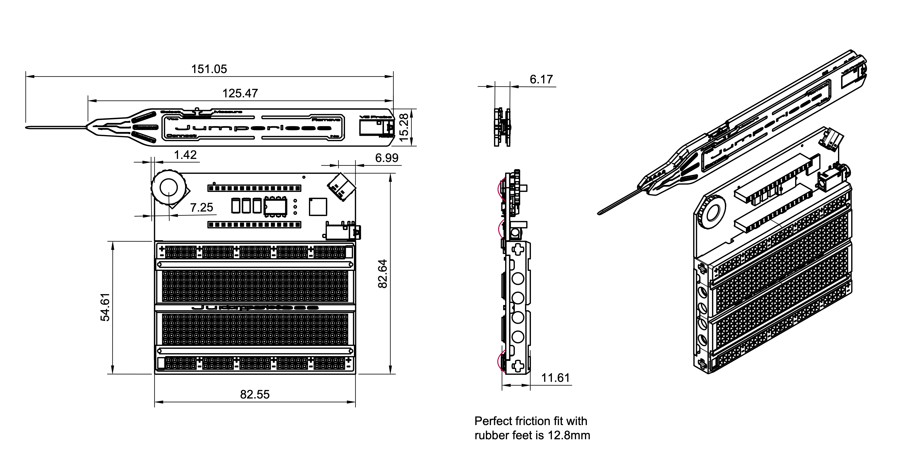

# 3D Printable Stand

I consider this an essential part of using a Jumperless and if they could fit in the box, I would've included them. So print a stand or ask someone to print it for you.

Spin the model below to have a look and switch between variants. Grab the **STL** to print right away, or the **STEP** if you'd rather tweak the design (and let me know about any improvements you make and I'll add it here):

<stl-viewer></stl-viewer>

[Here are the 3D models on Printables,](https://www.printables.com/model/1249365-jumperless-stand) if you prefer that for whatever reason.

These all should print fine without supports, the angles of the probe slot were designed so there aren't any flat overhangs, but you do you. (these work for the OG Jumperless too, I added a notch to accommodate the slightly wider OG probe.)

There's also a laser cut acrylic one. Turns out designing acrylic stuff that a human can assemble and stays together is hard and also I suck at it. This will fit together, but the order of operations is super weird and kinda needs to have some hot glue shoved into all the slotted parts to feel solid. But if you have a laser and want to try it, the files are [on GitHub](https://github.com/Architeuthis-Flux/JumperlessV5/tree/main/Jumperless23V50/Stands/Acrylic). Both stands are in [this Crowd Supply update](https://www.crowdsupply.com/architeuthis-flux/jumperless-v5/updates/time-to-get-excited).

## Rubber Feet

These [stick-on rubber feet](https://www.amazon.com/AmazonBasics-300-Piece-Adhesive-Rubber-Bumpers/dp/B087MG3G76) also make it a lot more solid on your desk (and having the different sizes lets you shim the angle by putting different ones on the front and back.) 

If you were wondering why there's an little square of sticky feet in your box under the FPC board, this is why. (the ones on the bottom of the Jumperless itself are 8x2.5mm, in case you want extras around for when you feel like doing any soldering on it and take them off.)

## Dimensions

If you want to take a swing at designing your own stand or something, here are the dimensions (in mm):

Or let your computer handle the measuring and just use [the 3D model](https://github.com/Architeuthis-Flux/JumperlessV5/blob/main/Jumperless23V50/3Dmodels/JumperlessAndProbe.3mf). The shell is [in the same repo](https://github.com/Architeuthis-Flux/JumperlessV5/tree/main/Jumperless23V50/Board%20Shell) if you want to change it.

I put holes on both sides of the breadboard shell to accept Legos and technic axles, in case you want to make a stand or something with that (both sides are holes, there's nothing sticking out on the other side). The other 3 holes on the sides are for cooling, the idea is to use the spring clips as cooling fins and let air flow in from the side and out through the breadboard holes. Those are both from [this Crowd Supply update](https://www.crowdsupply.com/architeuthis-flux/jumperless-v5/updates/good-news-everyone-things-are-happening).