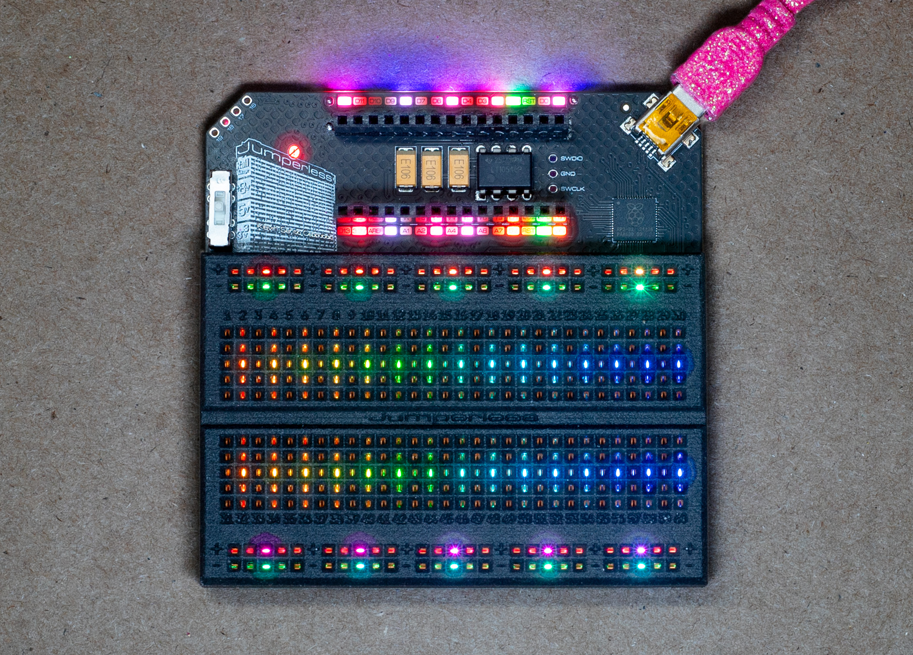
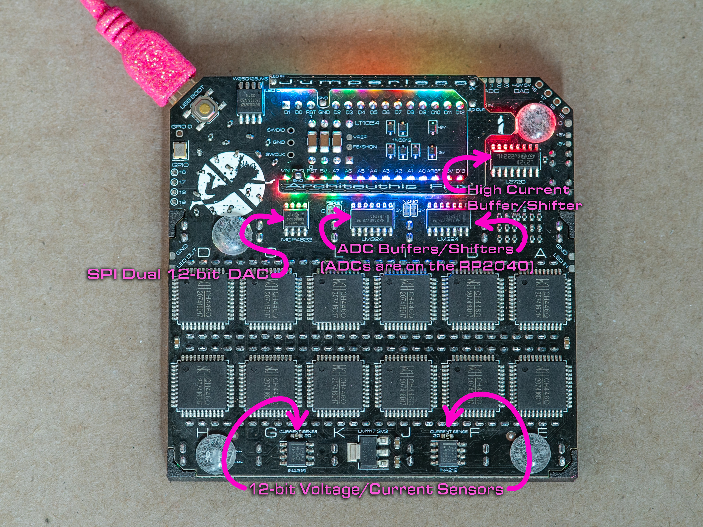

# OG Jumperless

The original Jumperless (the one with the Nano header across the top and a single LED under each row) runs the same JumperlOS firmware as the V5 now. Everything else in these docs is written for the V5.



## Getting the firmware

Every JumperlOS release has an OG build next to the V5 one, called `firmware_og_backport.1.x.x.x.uf2` (the version starts with a 1 instead of a 5). It's on the [JumperlOS releases page](https://github.com/Architeuthis-Flux/JumperlOS/releases), and it should also show up on the latest release in the [old Jumperless repo](https://github.com/Architeuthis-Flux/Jumperless/releases).

Hold the `USB BOOT` button (it's on the back, next to the USB port) while you plug it in, a drive called `RPI-RP2` shows up, drag the `.uf2` onto it. Open the first serial port in any terminal and type `?` to check the version.

!!! note
    The probe stuff on this page is newer than `1.7.11.0`, so until the next release you need a firmware built from the `dev` branch for it.



## What's different

| | V5 | OG |
|---|---|---|
| Rails | 4 rails you set from the firmware, -8V to +8V | a switch under the probe header, 3.3V / 5V / ±8V, the firmware can't see it |
| Probe | 2 buttons, a `Select` / `Measure` switch, sensed through pads | a needle and 1 button, sensed by a tone through the crossbar |
| LEDs | 5 per row (that's how it writes text on the breadboard) | 1 per row, so the terminal is where the words go |
| DACs | `DAC 0` and `DAC 1`, ±8V | `DAC 0` 0 to 4.096V, `DAC 1` about -6.9V to +7V |
| ADCs | 8, ±8V | `ADC 0` to `ADC 2` 0 to 5V, `ADC 3` ±8V |
| Routable GPIO | `GPIO 1` to `GPIO 8` plus UART | `GPIO 0` plus UART Tx / Rx |
| Click wheel, OLED | yes | no (so none of the wheel menus, and no idle-mode stuff) |
| MicroPython | 64K heap plus the PSRAM | 24K heap, no PSRAM, so keep scripts small |

The `node` names are the same on both, so `+ 1-5,10-gnd` in the terminal, the [MicroPython API](09.5-micropythonAPIreference.md), slots, and the [config file](06-config.md) all work the same. Anything about rail voltages, the click wheel, the OLED, or the special function pads just doesn't apply.

## The probe

The OG probe is a kit you solder up, [here's the guide](https://github.com/Architeuthis-Flux/Jumperless/blob/main/Probe_Guide.md). Plug it into the bottom 2 holes of the 4-hole header at the top left corner, labeled 18 and 19. If pressing the button puts the Jumperless in probe mode but doesn't light the LED or sense rows, the Button and Probe connections are swapped, just turn the connector around.

Keep the rail switch under that header on 3.3V or 5V whenever the probe is plugged in. On ±8V a rail tap puts 8V straight into the probe input and you can damage it.

There's one button, so the modes come from how long you hold it:

- **short press** = `connect` mode
- **long press** (hold it for 750ms) = `clear` mode

The LED on the probe lights while you're in a session, and the `logo` LED tells you which mode you're in:

- **pink** = `connect` mode (brighter once you're `holding` a row)
- **orange** = `clear` mode
- **blue** = it's asking you something, either which rows you meant or which voltage
- **slowly drifting color** = idle, not in a mode

(Same color code the old OG firmware used, minus the swirl. One LED cycling the whole rainbow every 3 seconds reads as a blinking light rather than a swirl, so idle drifts through a lap in about 26s instead. It's a bit less saturated than the rainbow too, though not by as much as you'd think, the `logo` LED shines up through the PCB and that filters out a lot of the color.)

## Connecting rows

Short press the button, the terminal says `connect nodes`. Tap a row and its LED comes on while you're `holding` it (if that row is already in a `net` the LED can drop back to the net's color, the `logo` still shows bright pink so you know it's held), then tap another row and they're connected and the whole `net` gets a color.

While you're holding a row:

- **short press** drops it and you can start over (with nothing held, a short press leaves `connect` mode)
- **long press** switches to `clear` mode

The probe finds the needle by sending a tone through the crossbar into each row in turn, and it needs the crossbar empty to do that, so the board's connections are all lifted for the length of the session and put back when you leave. Your circuit stops while you probe. (The V5 doesn't have this problem, its probe is sensed through pads.)

One more thing that falls out of that: a row that's tied to a rail through a part (a pull-up resistor to `5V`, an LED to `GND`) looks like the rail to the needle, not like a row.

## Rails

The rail strips on the OG are whatever the switch says (`+` is 3.3V, 5V or +8V and `-` is ground or -8V), and the firmware has no way to read that switch, so they aren't `node`s. What it *does* have are the internal supply nodes `3V3` and `5V`, and those are what a rail tap connects you to.

So when you tap a `+` rail while probing, it asks which one you want:

```jython
      3.3V   short press = 5V, long press = select
```

Both `+` rail strips light up in the color of the current pick (amber for `3V3`, red-orange for `5V`), **short press** flips it, **long press** selects it. Then tap the row you want it on.

It remembers your last answer and offers that first, until you reboot. Tapping a `-` rail just gives you `GND`, no questions.

**Why does it ask every time?** Because the switch is right there and you can flip it whenever, and the firmware would never know. Answering with the one that matches the switch means the rail strip and the rows you connect agree.

If you want something other than 3.3V or 5V, that's what the DACs are for. `DAC 0` does 0 to 4.096V and `DAC 1` does about -6.9V to +7V, and they're `node`s you connect to a row like anything else:

```jython
dac_set(DAC1, 2.5)
connect(DAC1, 12)
```

(Or `+ DAC1-12` in the terminal.) The DAC voltages get saved with the `slot`.

## Multiple rows

Real parts short rows together. Tap a row with a resistor in it and the needle sees both ends, so the firmware can't know which row you meant. When that happens all the rows it found light up pink, one brighter than the rest, and the terminal lists them. The pink wins over whatever color those rows already had, so it still reads if they're part of a `net` already:

```jython
  [5] 12   short press = next, long press = select
```

**short press** moves the bright one along, **long press** picks it and the session carries on with that row. Take the probe off the board first if you want, the chooser stays up until you pick something (or until you tap a different `row`, which starts over).

A press right after the needle lands opens the chooser too, you don't have to wait for the rows to light up. (Pressing at the same instant you touch down is different, the button shorts the probe tip while it's held so nothing can be sensed until you let go.)

The rail voltage question works the same way, poke the rail and then answer it with the probe off the board. (The firmware watches the row for about 45ms before it decides, because one pass of the tone doesn't reliably see both ends of a short. If a pair still comes up as a single row, lmk and I'll stretch that window.)

## Clearing rows

Long press the button (or long press from `connect` mode), the terminal says `clear nodes`. Tap a row and it gets disconnected from whatever it was bridged to. Same as the V5, it only removes that `node`'s own bridges, not the whole `net`. In `clear` mode a **short press** leaves, a **long press** goes back to `connect`.

A session times out on its own after 80s of nothing, and typing anything in the terminal ends it too.

## Measuring

To read a voltage (the OG probe has no `Measure` switch), connect one of the ADCs to the row (`ADC 3` is the ±8V one, the other 3 are 0 to 5V) and read it with `adc_get(3)` from MicroPython. Both INA219 current sensors are there too, `ina_get_current(0)` is the one in the crossbar's `I_P` / `I_N` path (connect those two `node`s in series with what you're measuring), `ina_get_current(1)` sits on the DAC output.
