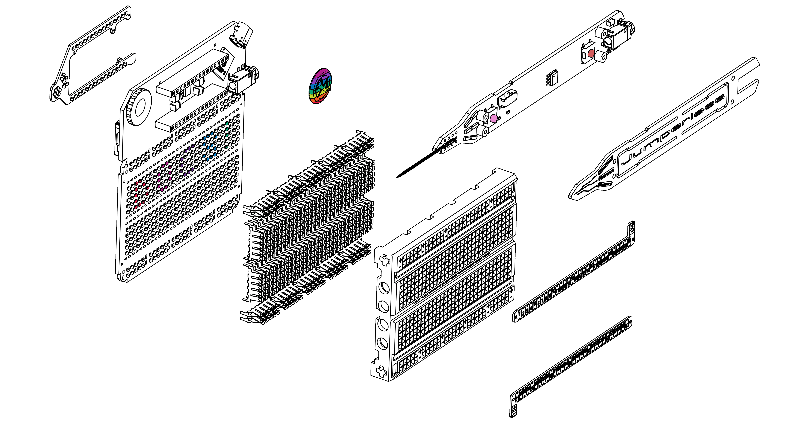

 
  
<iframe width="700" height="394" src="https://www.youtube.com/embed/fJTE7R_CV8w?si=YzBQzDnk0kS_qtsm" title="Jumperless Launch Video" frameborder="0" allow="accelerometer; autoplay; clipboard-write; encrypted-media; gyroscope; picture-in-picture; web-share" referrerpolicy="strict-origin-when-cross-origin" allowfullscreen></iframe>

 
  ---

# What is it?

Jumperless V5 lets you prototype like a nerdy wizard who can see electricity and conjure jumpers with a magic wand. It’s an Integrated Development Environment (IDE) for hardware, with an analog-by-nature RP2350B dev board, a drawer full of wires, and a workbench full of test equipment (including a power supply, a multimeter, an oscilloscope, a function generator, and a logic analyzer) all crammed inside a breadboard.

You can connect any point to any other using software-defined jumpers, so the four individually programmable ±8 V power supplies; ten GPIO; and seven management channels for voltage, current, and resistance can all be connected anywhere on the breadboard or the Arduino Nano header. RGB LEDs under each hole turn the breadboard itself into a display that provides real-time information about whatever’s happening in your circuit.

It's not just about being too lazy to plug in some jumpers. With software controlled wiring, the circuit *itself* is now [***scriptable***](08-micropython.md), which opens up a world of infinite crazy new things you could never do on a regular breadboard. Have a script try out every combination of parts until it does what you want (*à la* [evolvable hardware](https://evolvablehardware.org/)), automatically switch around audio effects on the fly, characterize some unknown chip with the part numbers sanded off, or don't bother with any of that and just [play Doom on it](https://www.youtube.com/watch?v=xWYWruUO0F4).

But more likely, you'll be using it to get circuits from your brain into hardware with so little friction it feels like you're just thinking them into existence. So yeah, wizard shit.

###**These are the docs where you will learn how to wield your new powers**

If you don't already have one,
## [Get the latest hardware revision, Jumperless V5 rev 7](https://jumperless.myshopify.com/products/jumperless-v5-rev-7)

Or if you want to save some money and get a refurbished one,
## [Jumperless V5 offcuts](https://jumperless.myshopify.com/products/jumperless-v5)

## [Get a Jumperless V5 on Crowd Supply](https://www.crowdsupply.com/architeuthis-flux/jumperless-v5)

---

## Getting Started

## Documentation Sections

- **[Basic Controls](01-basic-controls.md)** - Learn how to use the probe, click wheel, and slot system
- **[The App](03-app.md)** - For talking to your Jumperless, importing from Wokwi, and flashing Arduino sketches
- **[OLED](04-oled.md)** - Add a better display
- **[Arduino](05-arduino.md)** - UART passthrough and automatic flashing
- **[Configuration](06-config.md)** - Persistent settings
- **[Debugging](07-debugging.md)** - Crossbar, bridge, and net list views
- **[File Manager](08-file-manager.md)** - Filesystem access, YAML slot file editing, and text editor
- **[MicroPython](08-micropython.md)** - Use the onboard MicroPython interpreter
- **[MicroPython API Reference](09.5-micropythonAPIreference.md)** - All the Jumperless-specific hardware calls
- **[Odds and Ends](09.8-odds-and-ends.md)** - Stuff I couldn't think of a good category for
- **[3D Printable Stand](10-3d-stand.md)** - Print your own stand
- **[Glossary](99-glossary.md)** - Key terms including slots, nodes, bridges, and the W command

(You should turn off [Dark Reader](https://darkreader.org/) for this site if you have it, it messes up the sidebar colors)

---

## Find Me On The Internet

Join the [Discord](https://discord.gg/bvacV7r3FP) for pretty much instant answers to your questions

  
  
    
    
  

  

---

See what Zack Freedman had to say about it:

<iframe width="700" height="400" src="https://www.youtube.com/embed/DNlc44nA8Ms?si=l2-Neen_bIlJzXT3&amp;start=1238" title="Zack" frameborder="0" allow="accelerometer; autoplay; clipboard-write; encrypted-media; gyroscope; picture-in-picture; web-share" referrerpolicy="strict-origin-when-cross-origin" allowfullscreen></iframe>

Apparently he didn't find this site, which makes sense, he was an early backer and at the time, the QR code on the box didn't take you here.

---

Watch [Alex Glow](https://alexglow.com/) and [David Groom](https://exposed.ishotjr.com/) screw around with their Jumperlesses for a few hours:

<iframe width="700" height="400" src="https://www.youtube.com/embed/rdyEu2erOtA?si=TSrljZap7f1c5Otr&amp;start=1238" title="Day//Glo" frameborder="0" allow="accelerometer; autoplay; clipboard-write; encrypted-media; gyroscope; picture-in-picture; web-share" referrerpolicy="strict-origin-when-cross-origin" allowfullscreen></iframe>

This also serves as a cautionary tale for what happens if you don't skim these docs first (which is a completely valid approach, you do you.)

---

Me talking to [Ian Buckley](https://www.linkedin.com/in/ianmbuckley/) about Jumperless V5:

<iframe width="700" height="400" src="https://www.youtube.com/embed/3fBaQISUsXE?si=swtbu7diG0W7qPCH&amp;start=338" title="Electromaker" frameborder="0" allow="accelerometer; autoplay; clipboard-write; encrypted-media; gyroscope; picture-in-picture; web-share" referrerpolicy="strict-origin-when-cross-origin" allowfullscreen></iframe>

The hardware was so rudimentary at this point that I would barely even call the thing I was showing there a "V5", it was revision 1 and a *lot* has been done since then.

---

Chillin' with [Alex Lynd](https://alexlynd.com/) 

<iframe width="700" height="400" src="https://www.youtube.com/embed/ECoV4VeyLQs?si=c5hHgsb83PSDeGwz&amp;start=338" title="Alex Lynd" frameborder="0" allow="accelerometer; autoplay; clipboard-write; encrypted-media; gyroscope; picture-in-picture; web-share" referrerpolicy="strict-origin-when-cross-origin" allowfullscreen></iframe>

We're talking about an even earlier set of prototypes, this was shot at both Teardown 2024 and Hackaday Supercon 2024 so it's rev 1 and 2 shown here.

---

The OG Jumperless video:

<iframe width="700" height="400" src="https://www.youtube.com/embed/_k0aKM68Xl4?si=40r0wjM1PLCJcpvj&amp;start=338" title="OG Jumperless" frameborder="0" allow="accelerometer; autoplay; clipboard-write; encrypted-media; gyroscope; picture-in-picture; web-share" referrerpolicy="strict-origin-when-cross-origin" allowfullscreen></iframe>

Most of the stuff here is relevant as a subset of what Jumperless V5 does.

---

---

